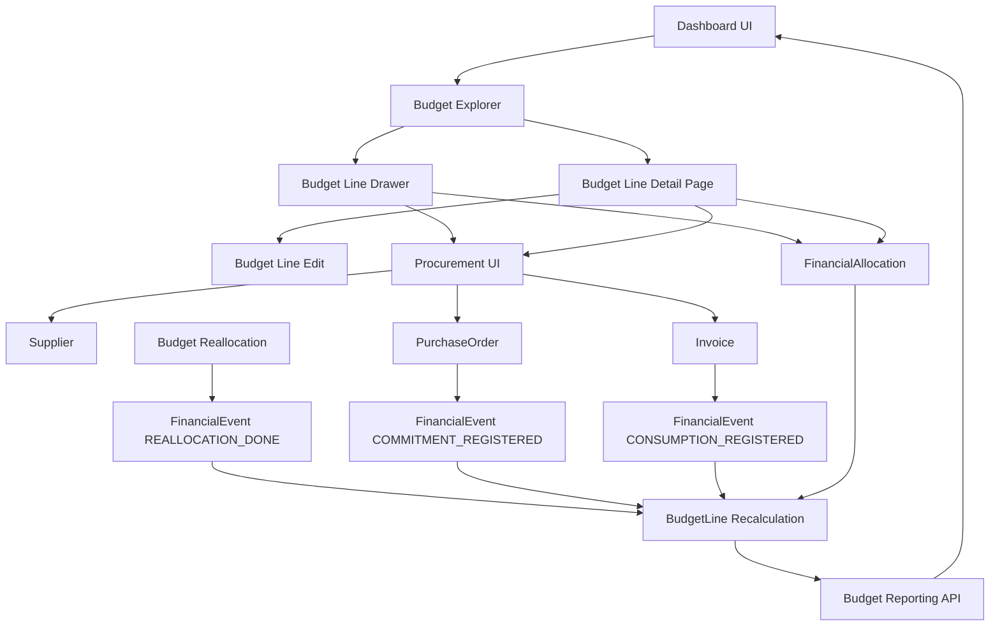
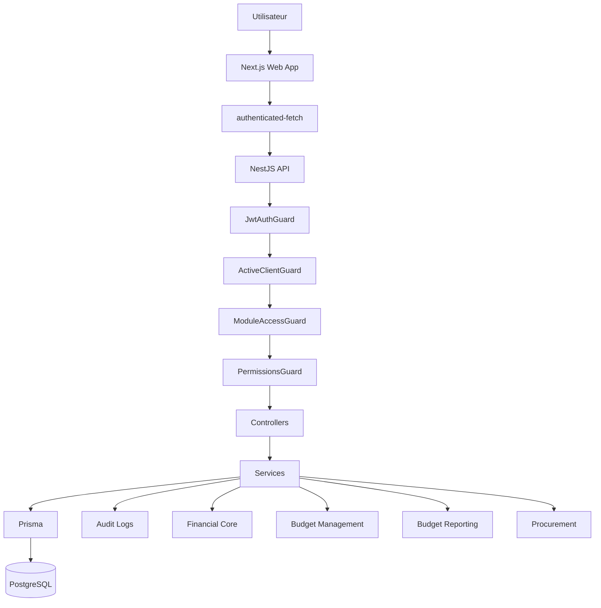

Voici le **schéma fonctionnel mis à jour**, aligné avec ton architecture actuelle (`apps/api`, `apps/web`, multi-client strict, guards, budget-management, financial-core, reporting, import, versioning, etc.). 

---

# Schéma fonctionnel global — version mise à jour

## 1. Vue d’ensemble produit

```text
┌───────────────────────────────────────────────────────────────────────┐
│                           STARIUM ORCHESTRA                           │
│        Cockpit SaaS de pilotage budgétaire, financier et support      │
└───────────────────────────────────────────────────────────────────────┘

                 ┌────────────────────────────────────┐
                 │         DASHBOARD / COCKPIT        │
                 │ KPI, alertes, synthèses, widgets   │
                 └────────────────┬───────────────────┘
                                  │ drill-down
                                  ▼
┌───────────────────────────────────────────────────────────────────────┐
│                         BUDGET EXPLORER UI                            │
│         Budget → Enveloppes → Lignes budgétaires (navigation)         │
└────────────────┬───────────────────────────────┬──────────────────────┘
                 │ clic ligne                    │ navigation dédiée
                 ▼                               ▼
     ┌──────────────────────────┐     ┌──────────────────────────────┐
     │ Budget Line Drawer       │     │ Budget Line Detail Page      │
     │ (action rapide)          │     │ (analyse complète)           │
     │                          │     │                              │
     │ - KPI ligne              │     │ - KPI complets               │
     │ - overview               │     │ - allocations                │
     │ - commandes / factures   │     │ - events financiers          │
     │ - allocations            │     │ - historique / audit         │
     │ - timeline (RFC-FE-026)  │     │ - (timeline page future)     │
     │ - quick create           │     │ - lecture DAF / DSI          │
     └──────────────┬───────────┘     └──────────────┬───────────────┘
                    │                                │
                    └──────────────┬─────────────────┘
                                   ▼
                    ┌──────────────────────────────┐
                    │        PROCUREMENT UI        │
                    │ suppliers / PO / invoices    │
                    │ recherche / filtres          │
                    └──────────────┬───────────────┘
                                   ▼
                    ┌──────────────────────────────┐
                    │      PROCUREMENT CORE        │
                    │ Supplier / PurchaseOrder /   │
                    │ Invoice                      │
                    └──────────────┬───────────────┘
                                   │ si budgetLineId
                                   ▼
                    ┌──────────────────────────────┐
                    │       FINANCIAL CORE         │
                    │ FinancialEvent               │
                    │ FinancialAllocation          │
                    │ recalcul BudgetLine          │
                    └──────────────┬───────────────┘
                                   ▼
                    ┌──────────────────────────────┐
                    │     BUDGET MANAGEMENT        │
                    │ Exercise / Budget / Envelope │
                    │ BudgetLine                   │
                    └──────────────┬───────────────┘
                                   ▼
                    ┌──────────────────────────────┐
                    │ REPORTING / DASHBOARD API    │
                    │ synthèses / KPI / alertes    │
                    └──────────────────────────────┘
```

---

## 2. Schéma d’architecture applicative

```text
apps/
├── api/   → NestJS API
│   ├── auth / guards / permissions
│   ├── modules/
│   │   ├── budget-management
│   │   ├── financial-core
│   │   ├── budget-reporting
│   │   ├── budget-reallocation
│   │   ├── budget-import
│   │   ├── budget-versioning
│   │   ├── procurement
│   │   └── ...
│   └── prisma / PostgreSQL
│
└── web/   → Next.js frontend
    ├── app/ (routes, layouts)
    ├── components/ (UI partagée)
    ├── features/budgets (dont `forecast/` — UI forecast & comparaison budgétaire, [RFC-FE-BUD-030](./RFC/RFC-FE-BUD-030%20%E2%80%94%20Forecast%20et%20Comparaison%20budg%C3%A9taire%20UI.md))
    ├── features/procurement
    ├── features/teams (`collaborators/`, `skills/`, `work-teams/`, `resource-time-entries/` — [RFC-FE-TEAM-002](./RFC/RFC-FE-TEAM-002%20%E2%80%94%20UI%20Collaborateurs.md), [RFC-FE-TEAM-003](./RFC/RFC-FE-TEAM-003%20%E2%80%94%20UI%20Comp%C3%A9tences.md), [RFC-FE-TEAM-004](./RFC/RFC-FE-TEAM-004%20%E2%80%94%20UI%20%C3%89quipes%20scopes%20managers.md) ; module Équipes métier = **Resource HUMAN** — [RFC-TEAM-020](./RFC/RFC-TEAM-020%20%E2%80%94%20Refonte%20%C3%89quipes%20Resource%20HUMAN.md))
    ├── providers/ (auth, active client, query)
    └── lib/ (authenticated-fetch, api, utils)
```

Cette structure est bien celle documentée dans ton architecture technique. 

---

## 3. Pipeline d’accès backend

```text
Utilisateur
   ↓
Frontend Next.js
   ↓
authenticated-fetch
   ↓
Authorization + X-Client-Id
   ↓
API NestJS
   ↓
JwtAuthGuard
   ↓
ActiveClientGuard
   ↓
ModuleAccessGuard
   ↓
PermissionsGuard
   ↓
Controller
   ↓
Service
   ↓
Prisma
   ↓
PostgreSQL
```

C’est le pipeline métier standard décrit dans l’architecture, avec client actif obligatoire pour les routes métier. 

### 3.1 Modèle des rôles (global vs client actif)

Le modèle d’accès distingue deux niveaux de rôle :

- **Rôle global plateforme** : `User.platformRole` (`PLATFORM_ADMIN` ou `null`).
- **Rôle de rattachement client** : `ClientUser.role` (`CLIENT_ADMIN` ou `CLIENT_USER`) pour un client donné.

Règles d’architecture :

- Les routes **plateforme** pour gérer les organisations (`GET|POST /api/clients`, `PATCH|DELETE /api/clients/:id`, `/api/clients/:clientId/users`, …), ainsi que `/api/platform/*` et `/api/modules`, reposent sur `platformRole` + `PlatformAdminGuard` — **sans** `X-Client-Id` / `ActiveClientGuard`.
- Les routes sous **`/api/clients/active/*`** (identifiants Microsoft OAuth du client actif, paramètres fiscaux « client actif », **`GET|PATCH /api/clients/active/budget-workflow-settings`** — overrides JSON sparse `Client.budgetWorkflowConfig` + merge défauts applicatifs, RBAC `budgets.read` / `budgets.update`, etc.) reposent sur **`X-Client-Id`** + `ActiveClientGuard` comme le reste du métier client-scopé.
- Les autres routes métier client-scopées reposent sur `X-Client-Id` + `ActiveClientGuard` (puis `ClientAdminGuard` ou `PermissionsGuard` selon la ressource).
- `PLATFORM_ADMIN` ne confère pas automatiquement un rôle `CLIENT_ADMIN` sur un client.
- `CLIENT_ADMIN` ne confère pas automatiquement toutes les permissions métier (`budgets.*`, `projects.*`, etc.).

### 3.2 Routes `/api/me` — compte, identités e-mail, défaut par client

Plusieurs routes sous **`/api/me/*`** concernent le **compte utilisateur** (JWT) et **ne reposent pas** sur `X-Client-Id` ni `ActiveClientGuard` : profil, mot de passe, 2FA, avatar, **`GET /api/me/clients`**, **`PATCH /api/me/default-client`**, ainsi que les routes **`/auth/mfa/*`** (TOTP verify, email OTP, **`POST /auth/mfa/recovery/verify`** — endpoint dédié codes de secours ; voir [RFC-SEC-001](RFC/RFC-SEC-001%20%E2%80%94%20MFA%20Hardening%20et%20Recovery%20Codes.md)). Le reset MFA par un admin passe par **`POST /api/platform/users/:userId/reset-mfa`** (`PlatformAdminGuard`, self-reset interdit).

Autres routes `/api/me/*` :

- **`GET|POST|PATCH|DELETE /api/me/email-identities`** — gestion des adresses e-mail déclarées par l’utilisateur (`UserEmailIdentity`, module `apps/api/src/modules/me/`).
- **`PATCH /api/me/clients/:clientId/default-email-identity`** — définit l’identité e-mail par défaut **pour ce rattachement** (`ClientUser`), avec validation que le `clientId` correspond bien à un `ClientUser` du JWT et que l’identité appartient au même utilisateur et est **active**.

Règles de données :

- Les adresses supplémentaires sont stockées au niveau **`User`** ; le défaut **par client** est sur **`ClientUser.defaultEmailIdentityId`** (jamais sur `Client`). La FK vers l’identité est en **`onDelete: Restrict`** ; suppression ou désactivation bloquée côté métier si l’identité est encore utilisée comme défaut.
- `GET /api/me/clients` expose pour chaque client `defaultEmailIdentityId` et un objet `defaultEmailIdentity` minimal (affichage).

Côté frontend, `apps/web/src/lib/api-client.ts` exclut ces chemins de l’envoi automatique de `X-Client-Id` ; les requêtes TanStack Query utilisent les clés `['me', 'clients']` et `['me', 'email-identities']` (scope utilisateur, pas besoin de `clientId` dans la clé). Les routes **CRUD plateforme** sous `/api/clients` (hors `/api/clients/active/`) sont également exclues du header ; en revanche **`/api/clients/active/*` envoie `X-Client-Id`** (aligné sur `ActiveClientGuard`).

---

## 4. Schéma de données métier

### 4.0 Utilisateur, rattachement client et identités e-mail

```text
User
  ├── email (connexion)
  └── UserEmailIdentity[]  (email, emailNormalized, displayName, replyToEmail, isVerified, isActive)

ClientUser
  ├── userId, clientId, role, status, isDefault
  └── defaultEmailIdentityId?  →  UserEmailIdentity (même user ; contrainte métier vérifiée en service)
```

L’unicité des adresses « triviales » est portée par **`emailNormalized`** avec **`@@unique([userId, emailNormalized])`**.

### 4.1 Structure budgétaire

```text
BudgetExercise
   └── Budget
         └── BudgetEnvelope
               └── BudgetLine
```

C’est le noyau de `budget-management`.

L’**historique décisionnel** par budget (journal `AuditLog` enrichi, filtres enveloppe / ligne, permission `budgets.read` uniquement) est exposé par **`GET /api/budgets/:budgetId/decision-history`** — voir [RFC-032 — Historisation décisions budgétaires](./RFC/RFC-032%20%E2%80%94%20Historisation%20d%C3%A9cisions%20budg%C3%A9taires.md).

Le **prévisionnel mensuel** par ligne (`BudgetLinePlanningMonth` indexé 1–12, champs `planningMode` / `planningTotalAmount` / `forecastAmount` sur `BudgetLine`) et le calcul d’**atterrissage** (consommé + engagé + prévision restante) sont décrits dans [RFC-023 — Budget Prévisionnel (Planning & Atterrissage)](./RFC/RFC-023%20%E2%80%94%20Budget%20Pr%C3%A9visionnel%20(Planning%20%26%20Atterrissage).md). La logique d’alignement des mois sur `BudgetExercise.startDate` est partagée via le package **`@starium-orchestra/budget-exercise-calendar`** (`packages/budget-exercise-calendar/`).

---

### 4.2 Noyau financier partagé

```text
BudgetLine
   ├── FinancialAllocation
   ├── FinancialEvent
   ├── PurchaseOrder
   └── Invoice
```

Avec la logique suivante :

* `PurchaseOrder` génère un `FinancialEvent` de type `COMMITMENT_REGISTERED`
* `Invoice` génère un `FinancialEvent` de type `CONSUMPTION_REGISTERED`
* `FinancialAllocation` porte les mouvements budgétaires internes
* `BudgetLine` est recalculée à partir des événements et allocations

Le document d’architecture confirme que `financial_allocations` et `financial_events` sont bien le noyau financier partagé réutilisable par plusieurs modules. 

---

### 4.3 Procurement Core

```text
Supplier
   ├── PurchaseOrder
   └── Invoice

PurchaseOrder
   ├── supplierId
   ├── budgetLineId?
   ├── invoices[]
   └── procurementAttachments[]   (RFC-034 Phase 1 — GED pièces, stockage S3/MinIO via API)

Invoice
   ├── supplierId
   ├── purchaseOrderId?
   ├── budgetLineId?
   └── procurementAttachments[]   (idem)

Plateforme (hors client actif)
   └── PlatformProcurementS3Settings   (singleton — endpoint S3 procurement, secret chiffré ; voir API.md)
```

---

## 5. Flux métier détaillés

### 5.1 Création d’une commande

```text
Utilisateur
   ↓
Drawer ou Procurement UI
   ↓
Choix fournisseur / quick-create
   ↓
POST /api/purchase-orders
   ↓
Create PurchaseOrder
   ↓
si budgetLineId présent
   ↓
Create FinancialEvent
type = COMMITMENT_REGISTERED
sourceType = PURCHASE_ORDER
   ↓
Recalcul BudgetLine
   ↓
Audit log
   ↓
Refresh UI
```

---

### 5.2 Création d’une facture

```text
Utilisateur
   ↓
Drawer ou Procurement UI
   ↓
Choix fournisseur / quick-create
   ↓
POST /api/invoices
   ↓
Create Invoice
   ↓
si budgetLineId présent
   ↓
Create FinancialEvent
type = CONSUMPTION_REGISTERED
sourceType = INVOICE
   ↓
Recalcul BudgetLine
   ↓
Audit log
   ↓
Refresh UI
```

---

### 5.3 Allocation budgétaire

```text
Utilisateur
   ↓
Drawer / détail ligne
   ↓
Création allocation
   ↓
FinancialAllocation
   ↓
Recalcul BudgetLine
   ↓
Impact forecast / remaining
```

---

### 5.4 Réallocation budgétaire

```text
Utilisateur
   ↓
POST /api/budget-reallocations
   ↓
Create BudgetReallocation
   ↓
Create 2 FinancialEvent REALLOCATION_DONE
   ↓
Recalcul des 2 BudgetLine
   ↓
Audit log
```

Le module `budget-reallocation` est bien explicitement prévu dans l’architecture consolidée. 

---

### 5.5 Suppression logique Procurement

```text
DELETE logique PurchaseOrder / Invoice
   ↓
Status = CANCELLED
   ↓
si budgetLineId présent
   ↓
Create FinancialEvent inverse (montant HT négatif)
   ↓
Recalcul BudgetLine
   ↓
Audit log
   ↓
Aucune suppression physique
```

Et pour `Supplier` :

```text
DELETE logique Supplier
   ↓
Status = ARCHIVED
   ↓
Audit log
   ↓
Aucune suppression physique
```

---

## 6. Schéma des écrans

### 6.1 Écrans existants / cibles

```text
/dashboard
   → cockpit global

/budgets
   → liste budgets

/budgets/[budgetId]
   → explorer budgets / enveloppes / lignes

/budget-envelopes/[id]
   → détail enveloppe

/budget-lines/[id]
   → détail complet ligne budgétaire

/budget-lines/[id]/edit
   → édition structurelle de la ligne

/procurement/suppliers
/procurement/purchase-orders
/procurement/invoices
   → gestion métier procurement

/teams/collaborators
/teams/collaborators/[collaboratorId]
   → référentiel collaborateurs (RFC-FE-TEAM-002)

/teams/skills
   → catalogue compétences client : catégories, skills, dialog porteurs (RFC-FE-TEAM-003)

/teams/structure → redirect vers /teams/structure/teams
/teams/structure/teams
/teams/structure/teams/[teamId]
/teams/structure/manager-scopes
   → équipes organisationnelles, membres, périmètres managers (RFC-FE-TEAM-004) ; permissions `teams.read` / `teams.update` / `teams.manage_scopes`

/teams/time-entries
   → temps réalisé (RFC-TEAM-009) ; `resources.read` / `resources.update` ; grille mensuelle sur **Resource** HUMAN (`resourceId` depuis `/api/me` ou `?resourceId=`) ; projets via **`GET /api/projects`** avec **`myProjectsOnly=true`** + filtre **statut** (UI, défaut en cours) ; types d’activité défaut via **`GET /api/activity-types?defaultsOnly=true`** ; validation / déverrouillage mois : **`/api/resource-timesheet-months/...`** (voir [API.md](API.md))

(Staffing planifié historique : ex. RFC-FE-TEAM-005 / TEAM-007 / TEAM-008 — routes `/teams/assignments`, `/projects/[projectId]/staffing` — **retiré** du produit.)
```

---

### 6.2 Rôle des écrans

```text
Edit page
   = modifier la structure

Drawer
   = agir vite

Detail page
   = comprendre / auditer

Dashboard
   = piloter globalement

Procurement pages
   = gérer fournisseurs / commandes / factures hors budget line
```

---

### 6.3 Budget Line Intelligence Drawer (web)

Implémenté dans `apps/web` — ouverture au clic sur une **ligne budgétaire** depuis l’explorer (`/budgets/[budgetId]`).

**Onglets** : Vue d’ensemble · Commandes · Factures · Allocations · **Timeline** · Infos DSI.

* **RFC-FE-026 (Timeline)** — frontend uniquement : fusion **strict multi-sources** (les 4 flux doivent réussir sinon erreur globale) :
  * `GET /api/budget-lines/:id/events`
  * `GET /api/budget-lines/:id/allocations`
  * `GET /api/budget-lines/:id/purchase-orders`
  * `GET /api/budget-lines/:id/invoices`  
  Clés React Query tenant-aware (`clientId`), normalisation dans `timeline-utils`, hook `useBudgetLineTimeline`.
* **RFC-034 Phase 1 (GED procurement)** — pièces jointes **commande** et **facture** : API `/api/purchase-orders/:id/attachments` et `/api/invoices/:id/attachments` (liste, upload multipart, download stream, archive) ; stockage S3-compatible (MinIO interne) ; configuration **`GET|PATCH /api/platform/procurement-s3-settings`** réservée **`PLATFORM_ADMIN`**. UI : panneau **Documents** en **création / édition** depuis la ligne budget, **fiches** `/procurement/purchase-orders/...` et `/procurement/invoices/...`, et complément **documents en attente** après création si besoin ; permissions `procurement.read` / `procurement.update`. Détail : [RFC-034](RFC/RFC-034%20%E2%80%94%20Documents%20et%20GED%20%E2%80%94%20Devis%20Commande%20Facture.md), [API.md](API.md).
* **UX panneau** : poignée en tête — à l’**ouverture**, le panneau est **déplié** (hauteur quasi plein viewport, sm+) ; clic sur la poignée pour réduire ou réagrandir jusqu’à `100dvh` ; réinitialisation à la fermeture.
* **Tableaux d’événements** (onglets Commandes / Factures) : `BudgetLineEventsTable` — dates `fr-FR`, badges type/source, montants signés pour engagements / consommations.

La page dédiée `/budget-lines/[id]` (RFC-FE-005) reste une cible produit distincte ; la timeline V1 n’exige pas cette route.

---

## 7. Schéma des modules backend

```text
Core plateforme
├── auth
├── clients
├── users
├── roles / permissions
├── audit-logs
└── notifications

Core budgétaire / financier
├── budget-management
├── financial-core
├── budget-reporting
├── budget-reallocation
├── budget-import
├── budget-versioning
└── procurement

Autres domaines
├── collaborators (RFC-TEAM-002 — référentiel métier)
├── skills (RFC-TEAM-003 catalogue ; RFC-TEAM-004 `CollaboratorSkill` — associations collaborateur ↔ compétence)
├── work-teams (RFC-TEAM-005 — `WorkTeam`, `WorkTeamMembership` sur `Resource` HUMAN, périmètres managers ; permissions `teams.*`)
├── activity-types (RFC-TEAM-006 — `ActivityType`, taxonomie des types d’activité ; permissions `activity_types.*`)
├── resource-time-entries (RFC-TEAM-009 — `ResourceTimeEntry`, temps réalisé ; permissions `resources.read` / `resources.update`)
├── projects
├── project-budget (RFC-PROJ-010 — liens Project ↔ BudgetLine)
├── microsoft (RFC-PROJ-INT-003 OAuth, RFC-PROJ-INT-004 client HTTP Graph)
├── contracts
├── licenses
├── applications
└── ...
```

**Module `projects` (MVP — RFC-PROJ-001)** : API `/api/projects` (+ tâches RFC-PROJ-011 avec liste paginée et **sans** `DELETE` tâche au MVP, **`GET|POST|PATCH|DELETE /api/projects/:projectId/task-buckets`** buckets planning `ProjectTaskBucket` + `bucketId` sur `ProjectTask`, **`GET /api/projects/:projectId/gantt`** tâches+jalons, **`/activities`**, risques (**RFC-PROJ-018** — `GET|POST|PATCH|DELETE /api/projects/:projectId/risks`), jalons, **fiche décisionnelle** `GET|PATCH /api/projects/:id/project-sheet`, **arbitrage legacy** `POST /api/projects/:id/arbitration`, **points projet** `GET|POST /api/projects/:projectId/reviews` et sous-routes RFC-PROJ-013 — types COPIL/COPRO/… et **POST_MORTEM** (REX, projet clos uniquement), pilotage calculé dans `projects-pilotage.service.ts`, sous-modules `project-sheet/` (fiche — RFC-PROJ-012 Project Sheet) et `project-reviews/` (RFC-PROJ-013), UI Next.js (`/projects`, détail projet avec onglet Points projet, **Planning Gantt** `/projects/[projectId]/planning` — RFC-PROJ-012 Gantt Tâches et Jalons, `apps/web/src/features/projects/components/project-gantt-panel.tsx`, **options par projet** `/projects/[projectId]/options` — RFC-PROJ-OPT-001, `apps/web/src/features/projects/options/` ; le chemin `/projects/options` sans id reste un **placeholder** module). Détail : [docs/modules/projects-mvp.md](modules/projects-mvp.md).

**Module `project-budget` (RFC-PROJ-010)** : API `/api/projects/:projectId/budget-links` (liste paginée) et `POST`, `/api/project-budget-links/:id` (`DELETE`), isolation `clientId`, invariants d’allocation sur les liens projet ↔ ligne budgétaire. Enregistré dans `app.module.ts` à côté de `ProjectsModule`.

**Module `work-teams` (RFC-TEAM-005 / RFC-TEAM-020)** : API `/api/work-teams` (CRUD équipes, `leadResourceId` — **Resource** `type = HUMAN`, `GET /work-teams/tree` — réponse `{ nodes }`, archive/restore), membres sous `/api/work-teams/:id/members` (**body `resourceId`**, pas `collaboratorId`), `/api/manager-scopes/:managerResourceId` (+ `preview` — périmètre exprimé sur des **Resource** HUMAN). Route inverse `GET /api/collaborators/:id/work-teams` reste côté **collaborators** pour la fiche métier annuaire ; le **référentiel module Équipes** pour composition d’équipes et rattachements est **`Resource` HUMAN** (temps réalisé : module `resource-time-entries`). Permissions `teams.read`, `teams.update`, `teams.manage_scopes` ; même pipeline guards que le reste du métier (`JwtAuthGuard`, `ActiveClientGuard`, `ModuleAccessGuard`, `PermissionsGuard`). Toutes les lectures/écritures filtrent par `clientId` du contexte client actif. Module Prisma `teams` activé par client via `ClientModule` (seed). Code : `apps/api/src/modules/work-teams/`.

**Module `activity-types` (RFC-TEAM-006)** : API `/api/activity-types` — liste paginée `{ items, total, limit, offset }`, CRUD, `PATCH …/archive` et `PATCH …/restore` (idempotents si l’enregistrement est déjà dans l’état cible). Permissions `activity_types.read`, `activity_types.manage` ; mêmes guards que ci-dessus. Modèle Prisma `ActivityType` + enum `ActivityTaxonomyKind` ; isolation stricte par `clientId` ; defaults par client via `ensureDefaultActivityTypes` (seed + `ClientsService.create`). Module Prisma `activity_types` activé par client via `ClientModule`. Code : `apps/api/src/modules/activity-types/`. Détail API : [docs/API.md](API.md) (section Équipes — taxonomie des activités).

**Module `resource-time-entries` (RFC-TEAM-009 — socle)** : API `/api/resource-time-entries` — liste paginée, CRUD, **`DELETE` suppression physique** avec entrée d’audit `resource_time_entry.deleted` ; entité Prisma **`ResourceTimeEntry`** (`resourceId` → **Resource** HUMAN, `workDate`, `durationHours`, `projectId?`, `activityTypeId?`, `status` workflow). Sous-routes **`/api/resource-timesheet-months/:resourceId/:yearMonth`** (lecture état mois, soumission, déverrouillage manager) — **`ResourceTimesheetMonth`**. Permissions **`resources.read`** (lecture) et **`resources.update`** (écriture sur entrées ; soumission mois) ; déverrouillage mois : **`collaborators.read`** sur la route dédiée ; audit sur create/update/delete. Isolation stricte par `clientId`. Le staffing planifié historique (`TeamResourceAssignment`, RFC-TEAM-007/008) a été **retiré** (table supprimée par migration `20260404213000_drop_team_resource_assignment`). Code : `apps/api/src/modules/resource-time-entries/`. Détail : [docs/API.md](API.md) (sections Équipes — temps réalisé et fiche temps mensuelle).

**Module `microsoft` (RFC-PROJ-INT-003 / RFC-PROJ-INT-004 / RFC-PROJ-INT-005)** : OAuth délégué Microsoft 365, jetons stockés chiffrés (`MicrosoftConnection`). **Transport Microsoft Graph** : `MicrosoftGraphService` ([RFC-PROJ-INT-004](RFC/RFC-PROJ-INT-004%20—%20Microsoft%20Graph%20Service.md)) — requêtes vers `https://graph.microsoft.com/v1.0`, Bearer via `MicrosoftOAuthService.ensureFreshAccessToken` (ex. `requestForConnection`) ; **pas d’endpoint générique « Graph »** côté API : le client appelle des routes métier qui appellent le service. **Lien projet Microsoft** ([RFC-PROJ-INT-007](RFC/RFC-PROJ-INT-007%20—%20Lien%20projet%20Microsoft.md), [RFC-PROJ-INT-008](RFC/RFC-PROJ-INT-008%20—%20Sync%20t%C3%A2ches%20vers%20Planner.md), [RFC-PROJ-INT-009](RFC/RFC-PROJ-INT-009%20—%20Sync%20documents%20vers%20Teams.md)) : `GET|PUT /api/projects/:projectId/microsoft-link` (champ `useMicrosoftPlannerBuckets` pour importer les buckets Planner à la place des buckets Starium — voir RFC-PROJ-OPT-001), `POST .../sync-tasks`, `POST .../sync-documents` — contrôleurs dans `microsoft/`, isolation `projectId` + client actif ; la sync documents importe `ProjectsModule` pour `ProjectDocumentContentService` (fichiers STARIUM sur disque). Routes publiques existantes : `/api/microsoft/auth/url`, `/api/microsoft/auth/callback` (sans JWT ; `clientId` issu du `state` signé validé), `/api/microsoft/connection` ; **configuration plateforme** `GET|PATCH /api/platform/microsoft-settings` (redirect URI, scopes, timeouts — `PlatformAdminGuard`) ; **identifiants d’app Azure par client Starium** `GET|PUT /api/clients/active/microsoft-oauth` (`projects.update`, client admin ou équivalent). Repli **environnement** si la DB est vide. UI client : **Administration client** → `/client/administration/microsoft-365` (accès aligné sur l’API : **client admin** ou **`projects.update`** avec module Projets activé) ; UI plateforme : `/admin/microsoft-settings` (un utilisateur non–platform-admin y est **redirigé** vers `/client/administration/microsoft-365`). Code : `apps/api/src/modules/microsoft/`, `apps/web/src/features/microsoft-365/`, `apps/web/src/app/(protected)/admin/microsoft-settings/`.

L’architecture consolidée décrit bien ce découpage modulaire côté NestJS. 

---

## 8. Schéma de responsabilité frontend / backend

```text
Frontend
- navigation
- affichage
- formulaires
- état loading / error / empty
- appel API

Backend
- validation métier
- contrôle clientId
- RBAC
- calcul fiscal
- création events / allocations
- recalcul budget line
- audit log
- persistance
```

Le document d’architecture insiste explicitement sur le fait que le frontend ne porte aucune logique métier critique et que le backend reste source de vérité. 

---

## 9. Schéma Mermaid global



---

## 10. Schéma Mermaid technique



---

## 11. Schéma ultra synthétique

```text
Dashboard
   ↓
Budget Explorer
   ↓
Budget Line
   ├── Drawer = agir
   ├── Detail page = comprendre
   ├── Edit page = modifier la structure
   └── Procurement = gérer le réel

Procurement / Allocations / Reallocation
   ↓
Financial Core
   ↓
BudgetLine recalculée
   ↓
Reporting / Dashboard
```

---

## 12. Conclusion fonctionnelle

Le fonctionnement cible mis à jour est donc :

* **Budget Management** structure le budget
* **Procurement** porte le réel métier (fournisseurs, commandes, factures)
* **Financial Core** reste la source unique de calcul
* **Budget Line** est l’objet central de lecture et de pilotage
* **Drawer** permet l’action rapide
* **Detail page** permet l’analyse complète
* **Dashboard / Reporting** fournissent la vision DG / DAF / DSI

Si tu veux, je peux maintenant te faire la **version diagramme premium**, propre pour Notion, Miro ou présentation CODIR, avec blocs plus lisibles et hiérarchie visuelle plus “executive”.
