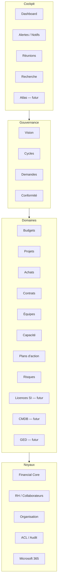
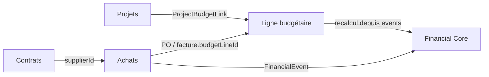
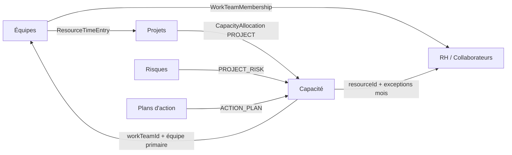
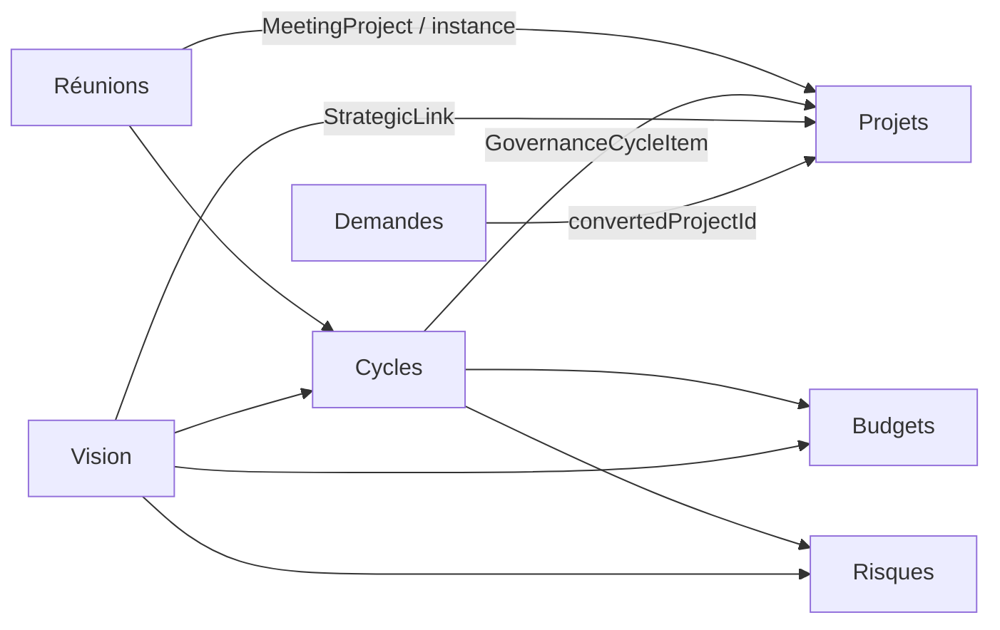

# Référence des liaisons inter-modules

**Source de vérité des ponts** entre modules Starium Orchestra. Recoupé sur Prisma, RFC et [ARCHITECTURE.md](./ARCHITECTURE.md).

| Artefact | Rôle |
| --- | --- |
| **Ce document** | Référence : patterns, graphes, catalogue des ponts (table Prisma, RFC, statut) |
| [liaisons/graphe-fonctionnel-modules.canvas.tsx](./liaisons/graphe-fonctionnel-modules.canvas.tsx) | Graphe interactif (Cursor Canvas), versionné ici |
| [liaisons/README.md](./liaisons/README.md) | Comment ouvrir le canvas dans l’IDE |

Les modules **ne s’appellent pas**. Un pont est toujours une table, une FK, un `sourceType`+`sourceId`, ou une lecture overlay. Isolation **client actif** sur chaque pont métier.

---

## 1. Quatre patterns de pont

| Pattern | Mécanisme | Exemple canonique |
| --- | --- | --- |
| **Table N:N** (`jonction`) | Table de liaison scopée client | `ProjectBudgetLink` (RFC-PROJ-010) |
| **FK consommateur** | Le module aval pointe le maître | `PurchaseOrder.budgetLineId` |
| **Polymorphe** | `sourceType` + `sourceId` | `FinancialEvent`, `CapacityAllocation`, `Alert` |
| **Overlay / noyau** | Lecture ou socle partagé, pas de copie métier | Réunions, Atlas, ACL, Financial Core |

**Argent** : un projet n’a **pas** de `budgetId`. Il pointe des **lignes** via `ProjectBudgetLink`. Aucun `FinancialEvent` sur ce lien. L’argent bouge si un PO / une facture tombe sur la même ligne.

**Capacité** : centre = `WorkTeam` ; personnes = `Resource` HUMAN. `CapacityAllocation` (PROJECT / PROJECT_RISK / ACTION_PLAN / MANUAL). Pas de lien Capacity → `OrgUnit` (l’orga passe par HUMAN / équipe).

**Alertes / notifs** (RFC-038) : `Alert.entityType` + `entityId` (signal) ; `Notification` = fan-out cloche par `userId`. Socle transverse ; triggers live = budget, projet, risque, contrat, vision, intake, réunions.

---

## 2. Couches

---

## 3. Graphes de flux (live)

### 3.1 Argent — budget × projet × achats

Pas de `FinancialEvent` sur `ProjectBudgetLink`. Facture dénoue l’engagement PO.

### 3.2 Capacité × équipes × RH

Timesheet ≠ allocation capa ≠ événement financier.

### 3.3 Gouvernance

---

## 4. Catalogue des ponts

Statuts : **live** = code + usage ; **partial** = FK/socle sans tout le parcours ; **gap** = enum/FK prêts, pas branché ; **future** = vision / RFC non livrée.

### 4.1 Ponts métier live

| Id | De | Vers | Pont | Table / contrat | RFC |
| --- | --- | --- | --- | --- | --- |
| `intake-project` | Demandes | Projets | FK | `ProjectRequest.convertedProjectId` | RFC-PROJ-INTAKE-001 |
| `vision-project` | Vision | Projets | Poly | `StrategicLink (PROJECT)` | RFC-STRAT-001 |
| `vision-budget` | Vision | Budgets | Poly | `StrategicLink (BUDGET \| BUDGET_LINE)` | RFC-STRAT-001 |
| `vision-cycle` | Vision | Cycles | Poly | `StrategicLink (GOVERNANCE_CYCLE)` | RFC-STRAT-001 |
| `vision-risk` | Vision | Risques | Poly | `StrategicLink (RISK)` | RFC-STRAT-001 |
| `cycle-project` | Cycles | Projets | FK | `GovernanceCycleItem.projectId` | RFC-PROJ-CYCLE-001 |
| `cycle-budget` | Cycles | Budgets | N:N | `GovernanceCycleItem` + `BudgetGovernanceDecision` | RFC-PROJ-CYCLE-001 |
| `cycle-risk` | Cycles | Risques | FK | `GovernanceCycleItem.riskId` | RFC-PROJ-CYCLE-001 |
| `cycle-objective` | Cycles | Vision | FK | `GovernanceCycleItem.strategicObjectiveId` | RFC-PROJ-CYCLE-001 |
| `meet-project` | Réunions | Projets | Overlay | `MeetingProject` (+ `ProjectReview`) | RFC-MEET-001 |
| `meet-cycle` | Réunions | Cycles | Overlay | `Meeting.governanceCycleInstanceId` | RFC-MEET-001 |
| `meet-risk` | Réunions | Risques | Overlay | `MeetingBlocker.riskId` | RFC-MEET-001 |
| `meet-attendee` | Réunions | RH | FK | `MeetingAttendee.resourceId` | RFC-MEET-001 |
| `compliance-risk` | Conformité | Risques | FK | `ProjectRisk.complianceRequirementId` | RFC-PROJ-RISK-001 |
| `project-budget` | Projets | Budgets | N:N | `ProjectBudgetLink` | RFC-PROJ-010 |
| `scenario-budget` | Projets | Budgets | FK | `ProjectScenarioFinancialLine` | RFC-PROJ-SC-002 |
| `scenario-resource` | Projets | RH | FK | `ProjectScenarioResourcePlan` | RFC-PROJ-SC-003 |
| `scenario-capa` | Projets | Capacité | FK | `ProjectScenarioCapacitySnapshot` | RFC-PROJ-SC-005 |
| `po-line` | Achats | Budgets | FK | `PurchaseOrder.budgetLineId` · `Invoice.budgetLineId` | RFC-025 / RFC-034 |
| `po-event` | Achats | Financial Core | Poly | `FinancialEvent (PURCHASE_ORDER \| INVOICE)` | ARCHITECTURE §4.2 |
| `budget-event` | Budgets | Financial Core | Noyau | `FinancialAllocation` · `BudgetReallocation` · `landingAmount` | RFC-017 / RFC-BUD-040 |
| `budget-axes` | Budgets | Organisation | N:N | `BudgetLineCostCenterSplit` · `AnalyticalLedgerAccount` | RFC-021 |
| `contract-supplier` | Contrats | Achats | FK | `SupplierContract.supplierId` | RFC-036 |
| `project-risk` | Projets | Risques | FK | `ProjectRisk.projectId?` | RFC-PROJ-RISK-001 |
| `project-capa` | Projets | Capacité | Poly | `CapacityAllocation (PROJECT)` | RFC-CAPA-001 |
| `risk-capa` | Risques | Capacité | Poly | `CapacityAllocation (PROJECT_RISK)` | RFC-CAPA-001 |
| `task-assignee` | Projets | RH | FK | `ProjectTaskAssignee` · `responsibleResourceId` | RFC-PROJ-011 |
| `time-project` | Équipes | Projets | FK | `ResourceTimeEntry.projectId` | RFC-TEAM-009 |
| `team-resource` | Équipes | RH | FK | `WorkTeamMembership.resourceId` | RFC-TEAM-020 |
| `capa-resource` | Capacité | RH | FK | `CapacityAllocation.resourceId` · `ResourceCapacityException` | RFC-CAPA-001 |
| `capa-team` | Capacité | Équipes | FK | `CapacityAllocation.workTeamId` · `primaryCapacityWorkTeamId` | RFC-CAPA-001 |
| `team-vision` | Équipes | Vision | FK | `WorkTeam.strategicDirectionId` | RFC-TEAM-005 |
| `plan-project` | Plans d'action | Projets | FK | `ProjectTask.projectId` + `actionPlanId` | RFC-PROJ-011 / RFC-PLA-001 |
| `plan-capa` | Plans d'action | Capacité | Poly | `CapacityAllocation (ACTION_PLAN)` | RFC-CAPA-001 |
| `ms-project` | Microsoft 365 | Projets | Overlay | `ProjectMicrosoftLink` + syncs | RFC-PROJ-INT-007→010 |
| `owner-org` | Organisation | Projets | Overlay | `ownerOrgUnitId` · `stewardResourceId` (idem budget, fournisseur, contrat, objectif) | RFC-ORG-003 / 004 |
| `search-poly` | Recherche | Projets | Overlay | `searchText` (adapters projet / budget) | RFC-CORE-SEARCH-001 |
| `acl-all` | ACL / Audit | Projets | Noyau | `ResourceAcl` · `AuditLog` (pipeline guards, tous modules métier) | RFC-ACL-013 / RFC-013-1 |
| `org-human` | Organisation | RH | FK | `ClientUser.resourceId` | RFC-ORG-002 |
| `parent-project` | Projets | Dashboard | FK | `Project.parentProjectId` | RFC-PROJ-019 |
| `directory-ad` | Microsoft 365 | RH | Overlay | `DirectoryConnection` | RFC-TEAM-001 |

### 4.2 Alertes / notifications (RFC-038) — tous les modules

`Alert` / `Notification` sont polymorphes (`entityType` + `entityId`). La cloche consomme **uniquement** `/api/notifications`.

| Cible | Statut | `entityType` réel ou prévu |
| --- | --- | --- |
| Dashboard | live | Panel `/dashboard` + cloche |
| Réunions | live | `project_review` |
| Vision | live | `strategic_direction_strategy` · `AlertType.STRATEGIC_VISION` |
| Demandes | live | `project_request` |
| Budgets | live | `budget_line` (overrun / near_limit) |
| Projets | live | `project` · `project_milestone` |
| Risques | live | `project_risk` |
| Contrats | live | `supplier_contract` |
| Recherche, Cycles, Conformité, Achats, Équipes, Capacité, Plans, Financial, RH, Org, ACL, M365, Licences (sièges plateforme) | partial | Socle prêt, pas de règle métier dédiée |
| Atlas, CMDB, GED | future | Module absent ou overlay prévu |

### 4.3 Partiels, trous, futur

| Id | De | Vers | Statut | Pont | RFC |
| --- | --- | --- | --- | --- | --- |
| `task-line` | Projets | Budgets | partial | `ProjectTask.budgetLineId` · `ProjectActivity.budgetLineId` — pas d’event auto | RFC-PROJ-011 |
| `docs-project` | Projets | GED | partial | `ProjectDocument` (silo) | RFC-PROJ-DOC-001 |
| `fut-license-resource` | Licences SI | RH | partial | `ResourceType.LICENSE` ≠ module RFC-037 | RFC-RES-001 vs RFC-037 |
| `fut-cmdb-resource` | CMDB | RH | partial | `ResourceType.MATERIAL` ≠ inventaire IT | RFC-RES-001 |
| `ui-line-projects` | Budgets | Projets | gap | Vue inverse `ProjectBudgetLink` (écran ligne) | [RFC-PROJ-010-B](../RFC/RFC-PROJ-010-B%20%E2%80%94%20Vue%20inverse%20BudgetLine%20projets%20et%20KPI%20cockpit.md) |
| `gap-project-event` | Projets | Financial Core | gap | `FinancialSourceType.PROJECT` (enum) | RFC-PROJ-010 §6 |
| `gap-contract-budget` | Contrats | Budgets | gap | `FinancialSourceType.CONTRACT` (enum) | RFC-037 |
| `gap-contract-project` | Contrats | Projets | gap | Pas de `projectId` sur `SupplierContract` | RFC-037 |
| `gap-time-event` | Équipes | Financial Core | future | Timesheet × `dailyRate` | RFC-RES-002 (à écrire) |
| `gap-res-assign` | RH | Projets | future | `TEAM_ASSIGNMENT` retiré | RFC-RES-002 |
| `fut-license-*` | Licences SI | Contrats / Budgets / Projets / CMDB | future | `License.contractId?` etc. | RFC-037 draft |
| `fut-quotation` | Achats | GED | future | `SupplierQuotation` | RFC-034 phase 2 |
| `fut-ged-project` | GED | Projets | future | Document transverse | VISION |
| `fut-cmdb-budget` | CMDB | Budgets | future | `APPLICATION \| ASSET` (enum) | VISION |
| `fut-cmdb-project` | CMDB | Projets | future | — | VISION |
| `fut-timeline` | Dashboard | Financial Core | future | Timeline multi-domaines | RFC-032 hors scope |
| `fut-proj-020` | Projets | Dashboard | future | Roll-up parent / enfants | RFC-PROJ-020 |
| `fut-axes-po` | Achats | Organisation | future | Splits au-delà de la ligne | RFC-021 suite |
| `fut-evidence-ged` | Conformité | GED | future | `ComplianceEvidence.fileId` | module compliance |
| `fut-ms-lot5` | Microsoft 365 | GED | future | Provisioning Planner / dossier | RFC-PROJ-INT-010 lot 5 |
| `fut-finance` | Financial Core | Budgets | future | Orchestra Finance (DAF) | VISION |
| `fut-hr` | RH | Capacité | future | `CapacitySource.SIRH` | VISION · RFC-CAPA-001 |
| `atlas-*` | Atlas | Projets / Org / CMDB | future | Overlay, ne duplique pas | Prototype Atlas |

---

## 5. Règles pour un nouveau pont

1. Lire cette référence **avant** d’ajouter une FK « pratique » dans un autre module.
2. Choisir un des 4 patterns ; ne pas inventer un 5ᵉ (pas d’appel synchrone module → module).
3. `clientId` dérivé du scope, jamais du payload.
4. Exposer les **libellés** API (`name`, `title`, `code`) : jamais un ID en UI.
5. Mettre à jour **ce fichier** + le canvas `docs/liaisons/graphe-fonctionnel-modules.canvas.tsx` dans le même changement.
6. Audit log si mutation sensible.

---

## 6. Dualités à ne pas fusionner

| Ne pas confondre | Réalité |
| --- | --- |
| `Resource` HUMAN vs `Collaborator` | Memberships / capa = HUMAN. Compétences encore sur `Collaborator` (TEAM-002/004). UI membres = `/client/members`. |
| `ResourceType.LICENSE` vs module Licences SI | Catalogue projet vs cycle de vie parc + contrats (RFC-037). |
| `ResourceType.MATERIAL` vs CMDB | Référentiel projet vs inventaire applications / infra. |
| Alert vs Notification | Signal tenant vs ligne cloche par utilisateur. |
| `ProjectBudgetLink` vs `FinancialEvent` | Affectation d’enveloppe vs mouvement d’argent. |
| Timesheet vs `CapacityAllocation` | Réalisé vs plan J/H. |
