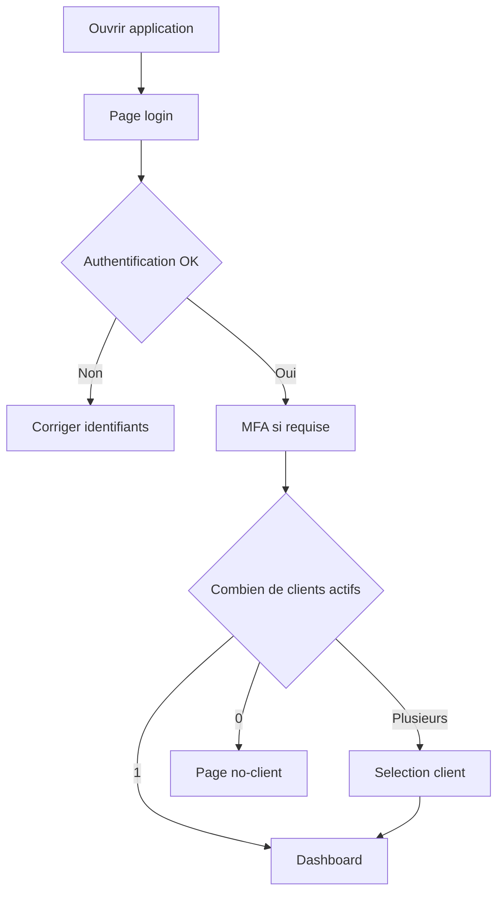

# Manuel utilisateur — 00 Démarrage

## 1) Ce que tu vas faire ici

Ce guide explique le démarrage réel utilisateur:

- se connecter;
- passer la MFA;
- sélectionner le client actif;
- comprendre pourquoi certains menus apparaissent ou non.

---

## 2) Schéma du parcours d'entrée

---

## 3) Connexion pas à pas

## 3.1 Connexion email/mot de passe

1. Aller sur `/login`.
2. Saisir email puis mot de passe.
3. Cliquer `Se connecter`.
4. Si un challenge MFA s'affiche, passer à la section MFA.

## 3.2 Connexion Microsoft

1. Aller sur `/login`.
2. Cliquer `Connexion Microsoft`.
3. Valider le compte Microsoft.
4. Revenir automatiquement dans l'app.
5. Finaliser la MFA si demandée.

## 3.3 MFA (TOTP, email, recovery)

Ordre recommandé:

1. TOTP.
2. Fallback email si TOTP indisponible.
3. Recovery code en dernier recours.

Option utile: cocher "faire confiance à cet appareil" pour limiter les challenges récurrents.

---

## 4) Sélection du client actif

Le client actif détermine **toutes** les données métiers affichées.

## Procédure

1. Après login, si plusieurs clients sont actifs, la page `/select-client` apparaît.
2. Cliquer sur la carte du client à utiliser.
3. Vérifier la redirection vers `/dashboard`.
4. Contrôler en haut de page que le client affiché est le bon.

## Cas particuliers

- Aucun client actif: redirection `/no-client`.
- `PLATFORM_ADMIN`: accès admin possible même sans client actif.

---

## 5) Navigation et visibilité des menus

## Principe

Un menu apparaît seulement si la combinaison suivante est valide:

- rôle plateforme;
- rôle client actif;
- permissions;
- module activé.

## Vérification rapide si menu absent

1. Vérifier client actif.
2. Vérifier rôle (`CLIENT_ADMIN` vs `CLIENT_USER`).
3. Vérifier permissions associées.
4. Vérifier activation du module.

---

## 6) Lecture des rôles

- `PLATFORM_ADMIN`: admin globale (`/admin/*`).
- `CLIENT_ADMIN`: admin du client actif (`/client/*`).
- `CLIENT_USER`: usage métier selon permissions.

Exemples de permissions:

- `projects.read`
- `budgets.update`
- `procurement.create`

---

## 7) Mini check de prise en main (10 minutes)

1. Login.
2. Sélection client actif.
3. Ouvrir un module métier (ex: Projets).
4. Revenir dashboard.
5. Ouvrir compte utilisateur (`/account`).
6. Vérifier que les menus affichés correspondent à ton rôle.

---

## 8) Règle d'affichage des données

Dans tous les écrans, les listes/sélecteurs doivent montrer une valeur lisible (`nom`, `code`, `titre`, `label`) et jamais un ID brut.

---

## 9) Cartographie des écrans de démarrage

| Route | Utilité | Statut |
|---|---|---|
| `/login` | Entrée session | Implémenté |
| `/select-client` | Choix client actif | Implémenté |
| `/no-client` | Blocage sans rattachement actif | Implémenté |
| `/dashboard` | Accueil post-login | Partiel |
| `/account` | Profil et préférences | Implémenté |

---

## 10) Références

- `docs/FRONTEND_ARCHITECTURE.md`
- `docs/ARCHITECTURE.md`
