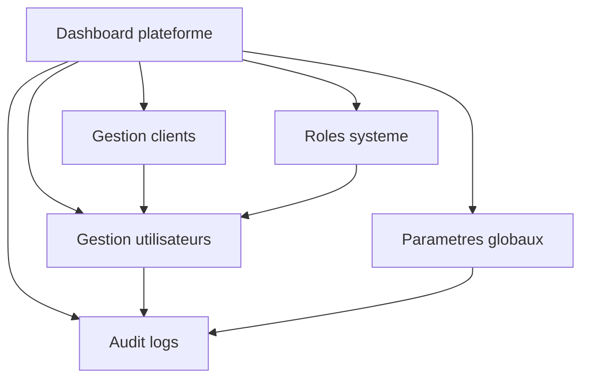

# Manuel utilisateur — 10 Administration plateforme

## 1) Public cible

Ce guide s'adresse aux utilisateurs `PLATFORM_ADMIN`.

---

## 2) Schéma d'administration plateforme

---

## 3) Où cliquer pour créer un client

### Route

- `/admin/clients`

### Procédure

1. Sidebar: cliquer `Platform` puis `Clients`.
2. Cliquer `Nouveau client`.
3. Remplir les champs obligatoires.
4. Cliquer `Créer`.
5. Vérifier la présence du client dans la liste.
6. Ouvrir le client pour compléter les informations.

### Pourquoi c'est important

Sans client, aucun rattachement utilisateur métier n'est possible.

---

## 4) Où cliquer pour rattacher/gérer un utilisateur

### Route

- `/admin/users`

### Procédure

1. Ouvrir `Users`.
2. Rechercher l'utilisateur (email/nom).
3. Ouvrir sa fiche.
4. Ajouter ou modifier rattachements client.
5. Si besoin, cliquer action `Reset MFA`.
6. Sauvegarder.

### Résultat attendu

L'utilisateur voit les menus liés à son nouveau rattachement après refresh/reconnexion.

---

## 5) Où cliquer pour créer un rôle système

### Route

- `/admin/system-roles`

### Procédure

1. Ouvrir `System roles`.
2. Cliquer `Nouveau rôle`.
3. Saisir nom + description.
4. Cocher permissions.
5. Cliquer `Enregistrer`.
6. Vérifier apparition en liste.

### Attention

Un rôle système protégé peut être non éditable/supprimable.

---

## 6) Audit — comment investiguer

### Route

- `/admin/audit`

### Procédure

1. Ouvrir `Audit`.
2. Filtrer par période/action si disponible.
3. Contrôler:
   - acteur;
   - action;
   - cible;
   - timestamp.
4. Corréler avec l'incident signalé.

### Cas typiques

- qui a changé un rôle;
- qui a modifié un utilisateur;
- quand un paramètre global a été modifié.

---

## 7) Paramètres globaux — mode opératoire

### Routes

- `/admin/ui-badges`
- `/admin/microsoft-settings`
- `/admin/procurement-storage`
- `/admin/upload-settings`
- `/admin/snapshot-occasion-types`

### Procédure standard

1. Ouvrir l'écran cible.
2. Modifier un seul paramètre à la fois.
3. Enregistrer.
4. Vérifier l'effet fonctionnel immédiat.
5. Contrôler la trace en audit.

---

## 8) Scénario prêt à l'emploi: onboarding d'un nouveau client

1. Créer client (`/admin/clients`).
2. Créer/identifier utilisateurs (`/admin/users`).
3. Affecter rattachements.
4. Vérifier rôles système nécessaires (`/admin/system-roles`).
5. Contrôler audit (`/admin/audit`).

---

## 9) Erreurs fréquentes

- Accès refusé sur `/admin/*`: utilisateur non `PLATFORM_ADMIN`.
- Utilisateur créé mais pas opérationnel: rattachement client absent/inactif.
- Droit inattendu: rôle/permissions mal configurés.

---

## 10) Références

- `docs/API.md`
- `docs/default-profiles.md`
