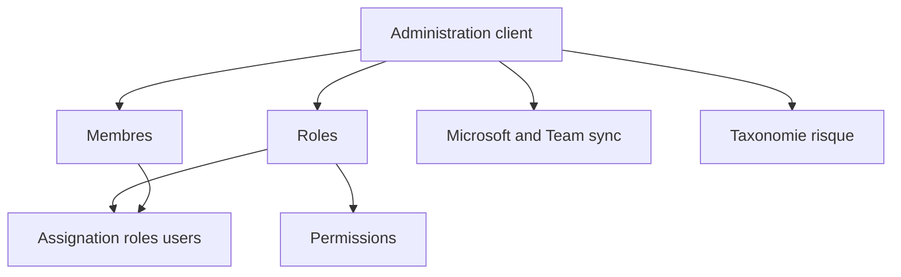

# Manuel utilisateur — 20 Administration client

## 1) Public cible

Ce guide s'adresse aux `CLIENT_ADMIN`.

---

## 2) Schéma RBAC client

---

## 3) Démarrer dans le hub client

### Route

- `/client/administration`

### Ce que tu fais ici

- choisir le sous-domaine à administrer;
- vérifier que tu es sur le bon client actif;
- lancer membres, rôles, intégrations ou taxonomies.

---

## 4) Membres — où cliquer pour donner des accès

### Route

- `/client/members`

### Procédure

1. Ouvrir `Membres`.
2. Cliquer `Ajouter membre` si nécessaire.
3. Ouvrir la ligne du membre.
4. Cliquer `Rôles` / `Gérer les rôles`.
5. Cocher les rôles voulus.
6. Enregistrer.

### Résultat

Le membre reçoit les permissions des rôles attribués.

---

## 5) Rôles — créer un profil métier client

### Routes

- `/client/roles`
- `/client/roles/new`
- `/client/roles/[id]`

### Procédure

1. Ouvrir `/client/roles`.
2. Cliquer `Nouveau rôle`.
3. Saisir nom et description métier.
4. Enregistrer.
5. Ouvrir le rôle créé.
6. Cocher les permissions.
7. Enregistrer.
8. Revenir à `Membres` pour l'assigner.

### Bon naming

Utiliser des noms explicites: `Chef de projet client`, `Lecteur budget`, `Acheteur`.

---

## 6) Permissions visibles et modules actifs

Si une permission n'est pas affichée:

- soit le module est désactivé;
- soit cette permission n'existe pas dans le périmètre client actif.

---

## 7) Paramétrages client avancés

### Microsoft 365

- Route: `/client/administration/microsoft-365`
- But: configurer l'intégration Microsoft du client.

### Team sync

- Route: `/client/administration/team-sync`
- But: gérer synchronisation annuaire/équipes.

### Taxonomie risque

- Route: `/client/administration/risk-taxonomy`
- But: structurer domaines/types de risques.

### Badges client

- Route: `/client/administration/badges`
- But: personnaliser vocabulaire visuel local.

---

## 8) Cas d'usage complet: créer un rôle puis l'affecter

1. Créer rôle dans `/client/roles/new`.
2. Ajouter permissions dans `/client/roles/[id]`.
3. Ouvrir `/client/members`.
4. Assigner rôle à un utilisateur test.
5. Demander reconnexion de l'utilisateur.
6. Vérifier menus/actions visibles.

---

## 9) Erreurs fréquentes

- Suppression impossible d'un rôle: rôle système ou rôle encore assigné.
- Permission manquante dans l'UI: module désactivé.
- Changement non visible: session utilisateur non rafraîchie.

---

## 10) Références

- `docs/modules/client-rbac.md`
- `docs/API.md`
