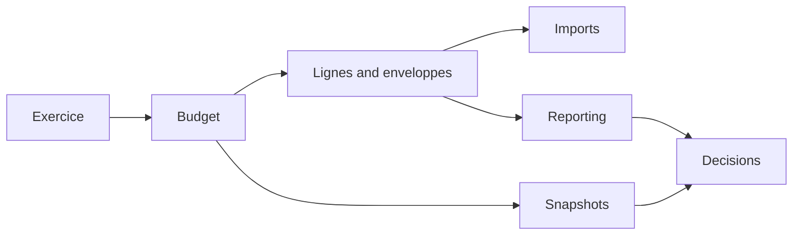
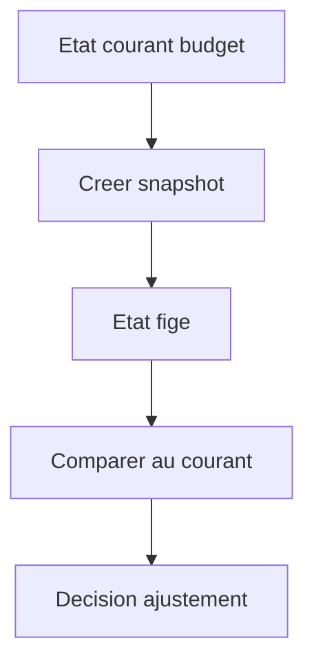

# Manuel utilisateur — 30 Budgets

## 1) À quoi sert ce module

Piloter un budget de la planification à l'arbitrage:

- créer exercice et budget;
- gérer enveloppes/lignes;
- importer des données;
- comparer versions figées (snapshots);
- préparer reporting décisionnel.

---

## 2) Schéma du cycle budgétaire

---

## 3) Créer un budget (clic par clic)

1. Ouvrir `/budgets`.
2. Cliquer `Nouveau budget`.
3. Renseigner nom, exercice, paramètres principaux.
4. Cliquer `Créer`.
5. Ouvrir le budget créé.

---

## 4) Cockpit budget — lecture et action

### Route

- `/budgets/[budgetId]`

### Ce que tu y fais

- lire KPI;
- filtrer périmètre;
- créer/éditer lignes et enveloppes;
- ajouter commentaires;
- analyser détail d'une ligne.

### Routine hebdo recommandée

1. Vérifier KPI globaux.
2. Filtrer les postes en dérive.
3. Corriger les lignes concernées.
4. Documenter les décisions en commentaire.

---

## 5) Enveloppes et lignes

### Routes

- `/budgets/[budgetId]/envelopes/new`
- `/budget-envelopes/[envelopeId]`
- `/budgets/[budgetId]/lines/new`
- `/budget-lines/[lineId]/edit`

### Procédure de création d'une ligne

1. Depuis le cockpit, cliquer `Nouvelle ligne`.
2. Choisir enveloppe / nature / centre de coûts.
3. Saisir montants prévisionnels.
4. Enregistrer.
5. Vérifier l'impact dans les agrégats.

---

## 6) Imports

### Routes

- `/budgets/imports`
- `/budgets/[budgetId]/import`

### Procédure

1. Charger fichier.
2. Mapper colonnes.
3. Vérifier preview.
4. Lancer import.
5. Contrôler anomalies.

---

## 7) Snapshots et comparaison

### Routes

- `/budgets/[budgetId]/snapshots`
- `/budgets/[budgetId]/snapshots/[snapshotId]`
- `/budgets/[budgetId]/reporting`

### Procédure snapshot

1. Ouvrir `Snapshots`.
2. Cliquer `Créer snapshot`.
3. Nommer occasion/date.
4. Enregistrer.
5. Ouvrir snapshot pour lecture figée.

### Schéma d'analyse

---

## 8) Présentation comité budget (mode opératoire)

1. Ouvrir cockpit budget.
2. Préparer vue KPI.
3. Ouvrir reporting écarts.
4. Montrer snapshot de référence.
5. Conclure sur actions correctives.

---

## 9) Écrans partiels

- `/budgets/[budgetId]/lines` (placeholder)
- `/budgets/[budgetId]/versions` (placeholder)
- `/budgets/[budgetId]/reallocations` (placeholder)

---

## 10) Références

- `docs/modules/budget-frontend.md`
- `docs/modules/budget-cockpit.md`
