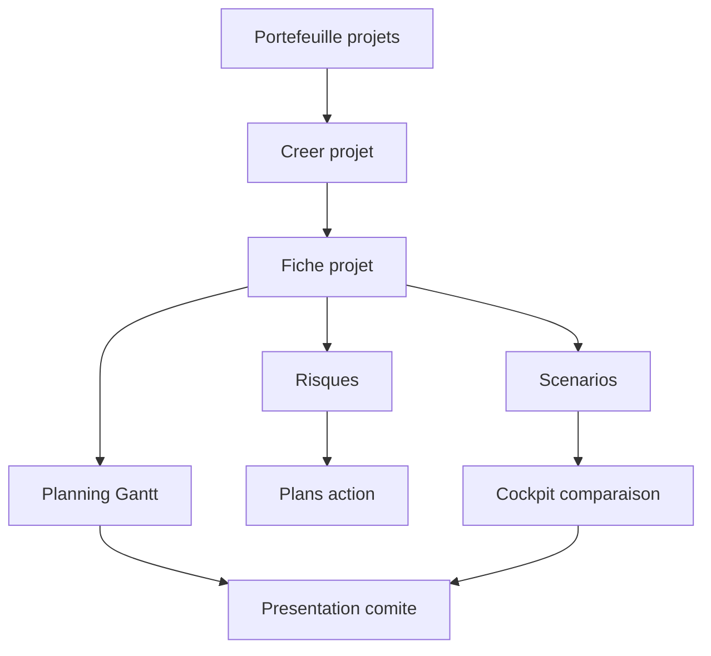
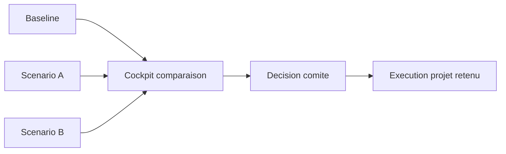
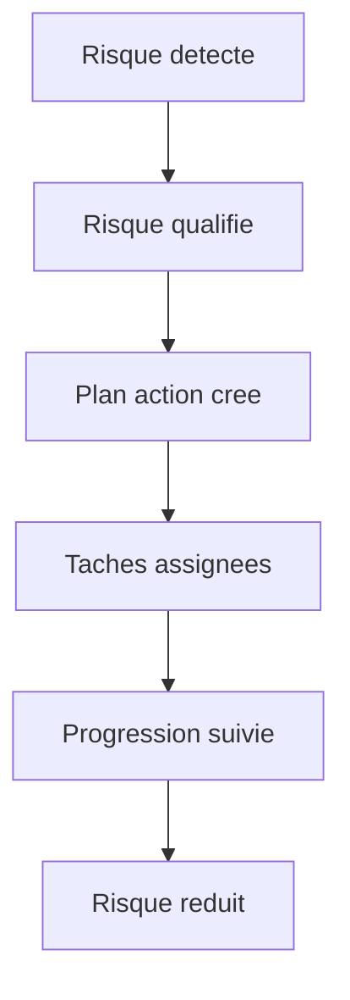

# Manuel utilisateur — 40 Projets, risques, plans d'action

## 1) À quoi sert ce module

Le module Projets sert à piloter un projet de bout en bout:

- cadrer le projet (fiche);
- planifier (tâches, jalons, Gantt);
- anticiper (risques);
- exécuter les corrections (plans d'action);
- arbitrer avec ou sans scénarios.

---

## 2) Pré-requis

- Connexion active.
- Client actif sélectionné.
- Permissions:
  - `projects.read` pour consulter;
  - `projects.create` pour créer;
  - `projects.update` pour modifier (planning, risques, scénarios, actions).

---

## 3) Vue d'ensemble des parcours (schéma)

---

## 4) Créer un projet — procédure exacte

### Route

- `/projects` puis `/projects/new`

### Clic par clic

1. Sidebar: cliquer `Projets` puis `Portefeuille projet`.
2. En haut à droite de la liste, cliquer `Nouveau projet`.
3. Dans le formulaire:
   - saisir `Nom projet`;
   - sélectionner `Type`;
   - sélectionner `Statut initial`;
   - sélectionner `Priorité`;
   - saisir les dates prévues.
4. Dans `Responsable`:
   - choisir un utilisateur du client actif, **ou**
   - renseigner une identité libre (interne/externe).
5. Ajouter catégorie/tags si disponibles.
6. Cliquer `Créer`.
7. Vérifier que la fiche projet s'ouvre.

### Contrôle immédiat

- Le projet apparaît dans `/projects`.
- Le projet est ouvrable.
- L'onglet `Planning` est accessible.

---

## 5) Projet sans scénario vs avec scénario

## 5.1 Mode 1 — Pilotage direct (sans scénario)

### Principe

Tu pilotes directement la baseline du projet.

### Quand l'utiliser

- projet simple;
- décision déjà prise;
- faible incertitude.

### Procédure

1. Créer le projet.
2. Aller dans `Planning`.
3. Construire tâches + jalons.
4. Aller dans `Risques`.
5. Créer les risques majeurs.
6. Ouvrir `/action-plans` et créer les actions de traitement.

## 5.2 Mode 2 — Pilotage par variantes (avec scénario)

### Principe

Tu compares plusieurs hypothèses avant de valider une trajectoire.

### Quand l'utiliser

- arbitrage COPIL/CODIR;
- tension charge/délai;
- fort risque.

### Procédure

1. Ouvrir `/projects/[projectId]/scenarios`.
2. Cliquer `Créer un scénario`.
3. Nommer clairement le scénario (ex: `Scenario acceleré`, `Scenario prudent`).
4. Ouvrir `/projects/[projectId]/scenarios/[scenarioId]`.
5. Ajuster paramètres de la variante.
6. Créer au moins une deuxième variante.
7. Ouvrir `/projects/[projectId]/scenarios/cockpit`.
8. Comparer baseline vs scénario.
9. Décider et retenir le scénario gagnant.

### Schéma d'arbitrage

---

## 6) Fiche projet — quoi modifier et pourquoi

### Route

- `/projects/[projectId]`

### Fonctions clés

- **Statut**: indique la phase réelle du projet.
- **Priorité/Criticité**: ordonne le traitement en portefeuille.
- **Tags/Catégorie**: facilite filtres et reporting.
- **Signaux santé**: détecte dérives (planning, risques, blocage).

### Procédure de mise à jour hebdo (recommandée)

1. Ouvrir la fiche projet.
2. Mettre à jour statut réel.
3. Vérifier indicateurs de santé.
4. Corriger les champs en alerte.
5. Passer sur planning + risques.
6. Sauvegarder.

---

## 7) Faire des diagrammes de présentation

## 7.1 Diagramme Gantt (présentation planning)

### Route

- `/projects/[projectId]/planning`

### Procédure

1. Ouvrir le projet.
2. Cliquer `Planning`.
3. Basculer sur vue `Gantt`.
4. Vérifier que toutes les tâches clés ont date début/fin.
5. Filtrer le périmètre à présenter (ex: stream, équipe, statut).
6. Positionner l'échelle temporelle utile (court/moyen terme).
7. Prendre capture pour support comité.

### Utilisation en réunion

- Vue 1: planning global.
- Vue 2: jalons critiques.
- Vue 3: fenêtre `30/60/90` jours.

## 7.2 Diagramme comparatif scénarios

### Route

- `/projects/[projectId]/scenarios/cockpit`

### Procédure

1. Préparer baseline + 1..N scénarios.
2. Sélectionner paire à comparer.
3. Lire écarts de charge, délai, risque.
4. Noter gains/coûts de chaque option.
5. Conclure par une recommandation explicite.

## 7.3 Slide portefeuille (macro)

### Route

- `/projects`

### Procédure

1. Filtrer le portefeuille du comité.
2. Trier par criticité ou date cible.
3. Afficher uniquement colonnes utiles (nom, statut, criticité, échéance).
4. Capturer la liste comme slide d'ouverture.

## 7.4 Présentation comité CODIR (mode diaporama)

### Route

- `/projects/committee/codir`

### Objectif

Présenter un projet en mode comité avec un set de widgets thématisés, reconfigurables, sans sortir de l’interface.

### Widgets (lot V1)

- Le panneau projet expose 15 widgets au total:
  - 9 widgets existants migrés (`metrics`, `planningTimeline`, `signals`, `nextPoints`, `decisionsTaken`, `decisionsPending`, `actionItems`, `warnings`, `tags`);
  - 6 nouveaux widgets (`milestoneStatusSplit`, `milestonesDueSoon`, `reviewsStatusSplit`, `reviewsCadence30d`, `actionItemsAging`, `ownershipCoverage`).
- Les nouveaux widgets sont masqués par défaut.
- Thèmes affichés dans la configuration: `execution`, `governance`, `ownership`.

### Procédure opératoire

1. Ouvrir `/projects/committee/codir`.
2. Naviguer jusqu’au projet à présenter.
3. Cliquer `Configurer`.
4. Activer uniquement les widgets utiles au comité.
5. Réordonner les widgets par glisser-déposer.
6. Cliquer `Enregistrer`.

### Comportement de persistance

- La configuration est sauvegardée localement par projet (`order` + `hidden`).
- Les layouts existants restent compatibles: les nouveaux widgets sont ajoutés sans casser les préférences déjà enregistrées.
- Le widget `planningTimeline` s’affiche sur toute la largeur (2 colonnes).

---

## 8) Risques — utilisation opérationnelle

### Routes

- `/projects/[projectId]/risks`
- `/risks`

### Créer un risque depuis le projet

1. Dans la fiche projet, cliquer onglet `Risques`.
2. Cliquer `Nouveau risque`.
3. Saisir:
   - titre;
   - probabilité;
   - impact;
   - propriétaire;
   - statut.
4. Enregistrer.

### Créer un risque depuis le registre global

1. Ouvrir `/risks`.
2. Cliquer `Nouveau risque`.
3. Sélectionner projet de rattachement.
4. Compléter et enregistrer.

### Bon usage

Un risque non traité doit déclencher un plan d'action concret.

---

## 9) Plans d'action — utilisation opérationnelle

### Routes

- `/action-plans`
- `/action-plans/[actionPlanId]`

### Créer un plan

1. Ouvrir `/action-plans`.
2. Cliquer `Nouveau plan`.
3. Renseigner titre, objectif, échéance, projet.
4. Enregistrer.

### Créer les tâches du plan

1. Ouvrir le plan.
2. Cliquer `Ajouter une tâche`.
3. Saisir responsable, date cible, statut.
4. Enregistrer et répéter.

### Schéma chaîne risque vers action

---

## 10) Scénarios de travail prêts à l'emploi

## 10.1 Cas "Projet simple"

- Créer projet.
- Planifier 5-10 tâches.
- Suivre sans scénario.
- Ajouter 1 plan d'action si un risque passe en critique.

## 10.2 Cas "Projet à arbitrage"

- Créer projet baseline.
- Créer 2 scénarios (`Prudent`, `Accéléré`).
- Comparer dans cockpit.
- Décider en comité.
- Exécuter le scénario retenu.

## 10.3 Cas "Comité mensuel"

- Export visuel portefeuille (`/projects`).
- Export visuel Gantt projet prioritaire.
- Export visuel cockpit scénario si arbitrage.
- Présenter: état, risques, décisions, actions.

---

## 11) Problèmes fréquents

- **Bouton créer absent**: pas de permission `projects.create`.
- **Modification refusée**: pas de `projects.update`.
- **Scénarios invisibles**: route non autorisée par droits/module.
- **Gantt vide**: tâches non datées.
- **Accès refusé**: mauvais client actif.
- **Widget non visible en CODIR**: ouvrir `Configurer`, vérifier qu’il n’est pas masqué, puis `Enregistrer`.

---

## 12) Références

- `docs/modules/projects-mvp.md`
- `docs/modules/portfolio-gantt-ui.md`
- `docs/API.md`
