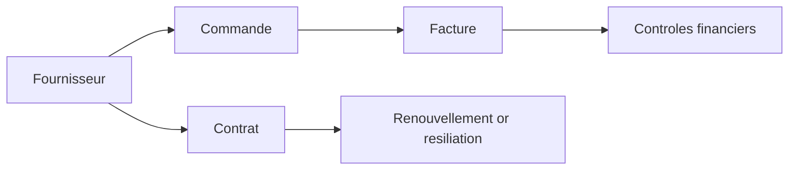

# Manuel utilisateur — 50 Fournisseurs, commandes, factures, contrats

## 1) À quoi sert ce module

Piloter la chaîne achat:

- fournisseurs;
- commandes;
- factures;
- contrats;
- documents associés.

---

## 2) Schéma du cycle procurement

---

## 3) Créer un fournisseur (clic par clic)

### Route

- `/suppliers`

### Procédure

1. Ouvrir `Suppliers`.
2. Cliquer `Nouveau fournisseur`.
3. Renseigner nom, catégorie, infos clés.
4. Ajouter logo si nécessaire.
5. Enregistrer.
6. Ouvrir la fiche fournisseur.

---

## 4) Gérer les contacts fournisseur

### Route

- `/suppliers/contacts`

### Procédure

1. Cliquer `Nouveau contact`.
2. Saisir nom, email, téléphone.
3. Sélectionner le fournisseur.
4. Cocher `Contact principal` si nécessaire.
5. Enregistrer.

---

## 5) Commandes d'achat

### Routes

- `/suppliers/purchase-orders`
- `/suppliers/purchase-orders/[id]`

### Procédure

1. Ouvrir la liste des commandes.
2. Cliquer `Nouvelle commande`.
3. Sélectionner fournisseur.
4. Renseigner référence, libellé, montants.
5. Enregistrer.
6. Ouvrir le détail.
7. Ajouter les pièces jointes.

---

## 6) Factures

### Routes

- `/suppliers/invoices`
- `/suppliers/invoices/[id]`

### Procédure

1. Ouvrir `Invoices`.
2. Cliquer `Nouvelle facture`.
3. Choisir fournisseur/commande si applicable.
4. Renseigner numéro, date, montant.
5. Enregistrer.
6. Vérifier statut.
7. Joindre justificatifs.

---

## 7) Contrats

### Routes

- `/contracts`
- `/contracts/[id]`
- `/contracts/kind-types`

### Créer un contrat

1. Ouvrir `/contracts`.
2. Cliquer `Nouveau contrat`.
3. Choisir fournisseur + type de contrat.
4. Saisir dates, statut, paramètres.
5. Enregistrer.
6. Ajouter documents contractuels.

### Gérer les types

Depuis `/contracts/kind-types`:

1. Créer un type métier.
2. Activer/désactiver.
3. Réutiliser dans les formulaires de contrat.

---

## 8) Présentation achats en comité

1. Vue macro: `/suppliers/dashboard`.
2. Focus commandes: `/suppliers/purchase-orders`.
3. Focus factures: `/suppliers/invoices`.
4. Focus contrats à risque: `/contracts` filtré par statut/date.

---

## 9) Erreurs fréquentes

- Contrat non visible: mauvais client actif.
- Création impossible: permission procurement manquante.
- Incohérence de suivi: commande/facture sans pièces justificatives.

---

## 10) Références

- `docs/API.md`
- `docs/RFC/RFC-FE-028 — Supplier UX.md`
