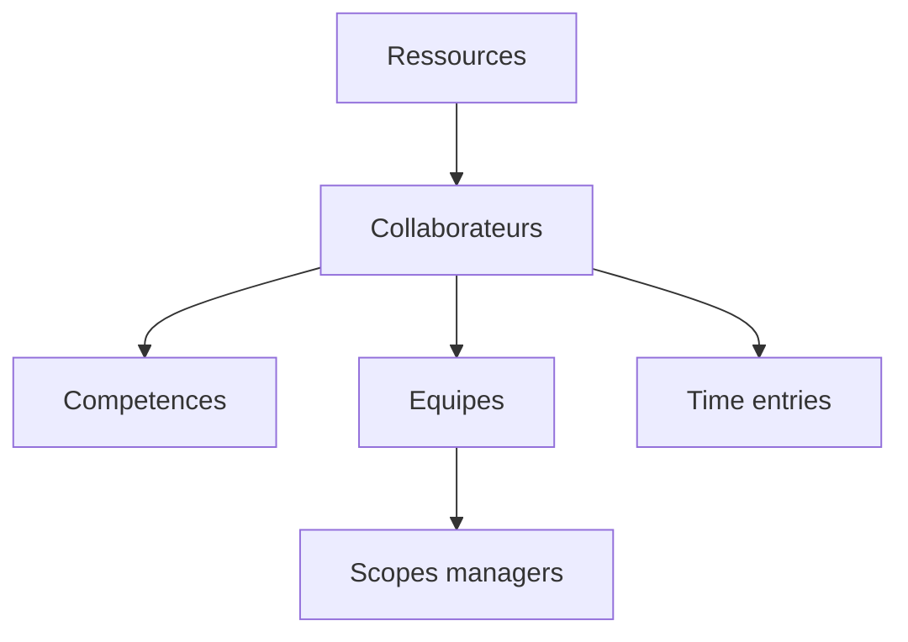

# Manuel utilisateur — 60 Ressources et équipes

## 1) À quoi sert ce module

Organiser les ressources humaines et la capacité opérationnelle:

- référentiel ressources;
- collaborateurs;
- compétences;
- structure d'équipe;
- feuilles de temps.

---

## 2) Schéma de pilotage équipe

---

## 3) Créer une ressource

### Route

- `/resources` puis `/resources/new`

### Procédure

1. Ouvrir `Resources`.
2. Cliquer `Nouvelle ressource`.
3. Remplir les informations de base.
4. Enregistrer.
5. Ouvrir la fiche `/resources/[id]` pour compléter.

---

## 4) Collaborateurs — création et suivi

### Routes

- `/teams/collaborators`
- `/teams/collaborators/[collaboratorId]`

### Procédure

1. Ouvrir `Collaborators`.
2. Cliquer `Nouveau collaborateur`.
3. Renseigner identité, rattachement, attributs.
4. Enregistrer.
5. Ouvrir la fiche et vérifier compétences/rôle.

---

## 5) Compétences

### Route

- `/teams/skills`

### Procédure

1. Ouvrir le catalogue.
2. Ajouter ou modifier une compétence.
3. Associer la compétence aux collaborateurs concernés.

---

## 6) Structure d'équipes

### Routes

- `/teams/structure/teams`
- `/teams/structure/teams/[teamId]`

### Procédure

1. Ouvrir `Teams`.
2. Cliquer `Nouvelle équipe`.
3. Définir nom + rattachements.
4. Ajouter membres.
5. Sauvegarder.
6. Archiver/restaurer selon cycle de vie.

---

## 7) Périmètres manager

### Route

- `/teams/structure/manager-scopes`

### Procédure

1. Sélectionner manager.
2. Définir mode de scope.
3. Choisir équipes racines.
4. Vérifier prévisualisation du périmètre.
5. Enregistrer.

---

## 8) Feuilles de temps (time entries)

### Routes

- `/teams/time-entries`
- `/teams/time-entries/options`

### Saisie mensuelle

1. Ouvrir le mois.
2. Saisir les temps par jour/projet.
3. Vérifier les totaux.
4. `Sauvegarder brouillon`.
5. `Soumettre`.

### Côté manager

1. Ouvrir la période.
2. Contrôler cohérence.
3. Déverrouiller si correction requise.

---

## 9) Scénario de fonctionnement mensuel

1. Mettre à jour structure d'équipes.
2. Vérifier scopes managers.
3. Saisir les temps.
4. Revue manager.
5. Verrouiller et clôturer.

---

## 10) Références

- `docs/API.md`
- `docs/ARCHITECTURE.md`
