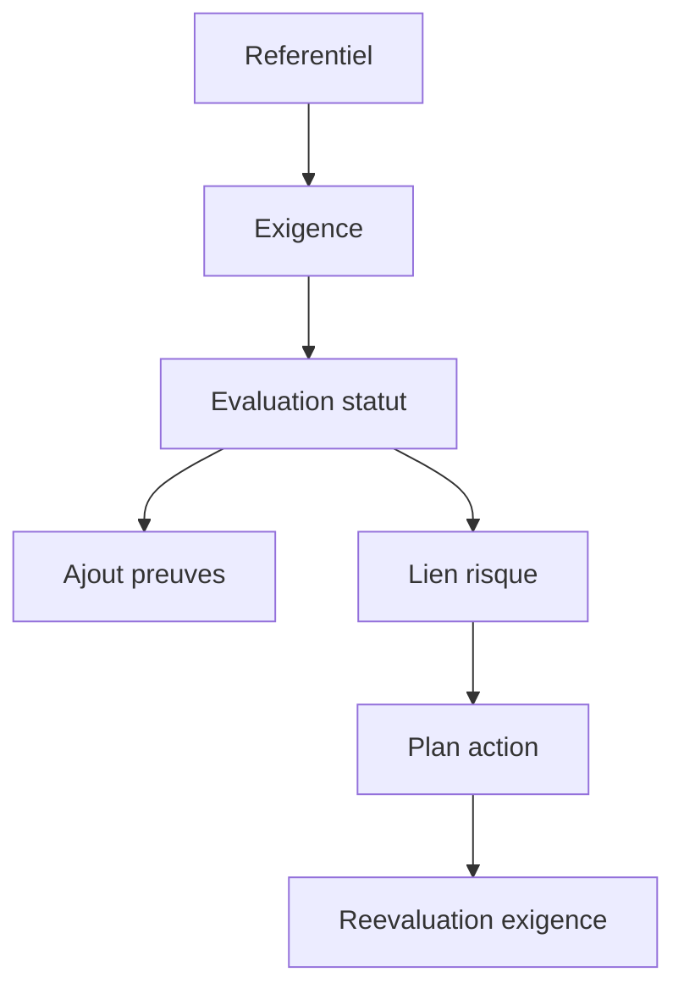

# Manuel utilisateur — 70 Conformité

## 1) À quoi sert ce module

Piloter l'état de conformité de ton client:

- suivre les référentiels;
- traiter les exigences;
- joindre des preuves;
- lier les risques et actions de correction.

---

## 2) Schéma du traitement conformité

---

## 3) Dashboard conformité

### Route

- `/compliance/dashboard`

### Procédure

1. Ouvrir dashboard.
2. Identifier:
   - non conformes;
   - non évaluées;
   - risques associés.
3. Prioriser les exigences critiques.

---

## 4) Référentiels

### Route

- `/compliance/frameworks`

### Procédure

1. Ouvrir frameworks.
2. Vérifier les référentiels actifs.
3. Ouvrir le référentiel cible.

---

## 5) Exigences — travail quotidien

### Routes

- `/compliance/requirements`
- `/compliance/requirements/[id]`

### Procédure

1. Ouvrir la liste des exigences.
2. Filtrer sur statut `NON_CONFORME` ou `NON_EVALUE`.
3. Ouvrir une exigence.
4. Mettre à jour le statut.
5. Ajouter commentaire d'analyse.
6. Joindre les preuves.
7. Lier risque/plan d'action si écart.
8. Enregistrer.

---

## 6) Préparer une présentation conformité

1. Dashboard global (`/compliance/dashboard`).
2. Liste des exigences non conformes.
3. Focus sur 3 écarts majeurs.
4. Preuves disponibles vs manquantes.
5. Plan de correction et échéance.

---

## 7) Erreurs fréquentes

- Exigence non mise à jour: absence de droit d'édition.
- Preuve non exploitée: document sans contexte/date.
- Statut incohérent: pas de lien avec risque ou action corrective.

---

## 8) Références

- `docs/API.md`
