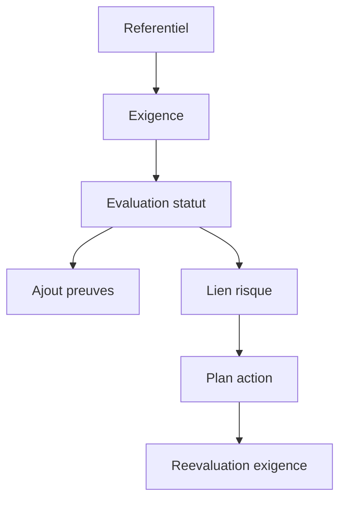

# Manuel utilisateur — 70 Conformité

## 1) À quoi sert ce module

Piloter l'état de conformité du client actif :

- activer des référentiels (catalogue plateforme) ;
- lister et **évaluer** les exigences ;
- joindre des preuves (URL ou observation) ;
- traiter un écart via un **risque projet** lié ;
- lire des KPI honnêtes (taux = conformes / applicables).

Starium **ne certifie pas**. Les campagnes d’audit et le dossier d’audit ZIP sont hors périmètre V1 (voir RFC-COMP-002).

---

## 2) Schéma du traitement conformité

```mermaid
flowchart TD
framework[Referentiel] --> requirement[Exigence]
requirement --> evaluation[Evaluation statut]
evaluation --> evidence[Ajout preuves]
evaluation --> risk[Lien risque]
risk --> action[Plan action]
action --> reevaluation[Reevaluation exigence]
```

---

## 3) Dashboard conformité

### Route

- `/compliance/dashboard`

### Procédure

1. Ouvrir le dashboard.
2. Lire le bandeau KPI :
   - **Taux de conformité** = conformes / **applicables** (`A` = total − non applicables − non évaluées). Si `A = 0` → **Non calculable** (pas 100 %).
   - Écarts ouverts = partiels + non conformes.
3. Prioriser les non évaluées et les non conformes.

---

## 4) Référentiels

### Route

- `/compliance/frameworks`

### Procédure

1. Ouvrir les référentiels du client.
2. Activer un cadre depuis le catalogue plateforme si besoin (`compliance.create`).
3. Vérifier les référentiels actifs avant d’évaluer.

---

## 5) Exigences — évaluer via la modale (parcours quotidien)

### Route

- `/compliance/requirements`

### Droits

| Action | Permission |
| --- | --- |
| Voir liste / détail / KPI | `compliance.read` |
| Enregistrer évaluation, N/A, preuves | `compliance.update` |
| Créer un risque lié | `projects.update` |

Sans `compliance.update`, la modale reste en **lecture seule**.

### Procédure — évaluer

1. Ouvrir `/compliance/requirements`.
2. Filtrer (statut, référentiel, recherche).
3. Cliquer une ligne → **modale détail**.
4. Si badge **À réexaminer** : dernière évaluation &gt; 12 mois — reprendre l’analyse.
5. Choisir le **statut** (conforme / partiellement conforme / non conforme / non applicable).
6. Saisir un **commentaire d’analyse** (obligatoire).
7. Optionnel : date de revue.
8. **Preuve avant conforme** : pour passer en *conforme*, ajouter d’abord au moins une preuve (URL ou observation structurée), puis Enregistrer.
9. Cliquer **Enregistrer l’évaluation**.

### Procédure — ajouter une preuve

1. Dans la modale, section Preuves.
2. Type : **URL** (lien) ou **Observation** (constat textuel sans URL).
3. Titre + champs conditionnels → **Ajouter la preuve**.
4. La liste et le compteur se rafraîchissent.

### Procédure — N/A

1. Statut **Non applicable**.
2. Motiver dans le commentaire (sinon refus serveur).
3. Enregistrer — l’exigence sort du dénominateur `A`.

### Procédure — créer un risque lié (écart)

Visible seulement si statut **partiellement conforme** ou **non conforme** **et** `projects.update`.

1. Cliquer **Créer un risque lié**.
2. Dialog EBIOS (scope client) : choisir le projet, compléter le risque (titre prérempli avec code + titre d’exigence).
3. Enregistrer → risque créé avec lien `complianceRequirementId`.
4. Fermer un risque **ne** remet **pas** l’exigence en conforme automatiquement.

Sans `projects.update` : hint discret — pas de bouton.

### Ancienne page détail

- `/compliance/requirements/[id]` peut encore exister ; le parcours recommandé V1 est la **modale** depuis la liste.

---

## 6) Préparer une présentation conformité

1. Dashboard (`/compliance/dashboard`) — taux sur `A`, écarts, risques critiques liés.
2. Liste filtrée non conformes / partiels.
3. Focus sur 3 écarts majeurs (modale + preuves + risque lié).
4. Preuves manquantes vs présentes.
5. Plan de correction et échéance de revue.

---

## 7) Erreurs fréquentes

| Symptôme | Cause probable |
| --- | --- |
| Impossible d’enregistrer | Pas de `compliance.update` ou commentaire vide |
| Conforme refusé | Aucune preuve / observation liée à l’exigence |
| N/A refusé | Commentaire manquant |
| Pas de CTA risque | Statut ≠ écart, ou pas de `projects.update` |
| « Non calculable » | Aucune exigence applicable (`A = 0`) |

---

## 8) Références

- [RFC-COMP-001-A](./RFC/RFC-COMP-001-A%20—%20Évaluation%20opérationnelle%20(V1).md)
- `docs/API.md` — section évaluation opérationnelle `/api/compliance`
- Cible produit longue : [RFC-COMP-001](./RFC/RFC-COMP-001%20—%20Pilotage%20de%20la%20conformité.md)
