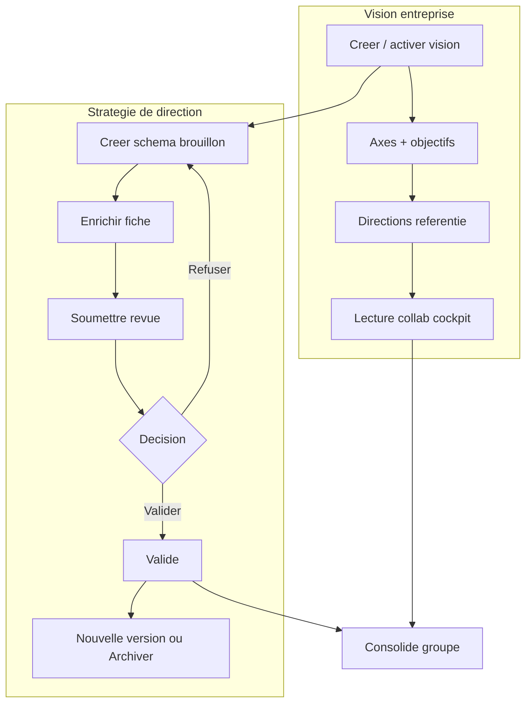

# Manuel utilisateur — 80 Vision stratégique & Stratégie de direction

## 1) À quoi servent ces modules

Deux niveaux distincts, à ne pas confondre :

| Niveau | Menu | Route | Rôle métier |
| --- | --- | --- | --- |
| **Vision entreprise** | Vision stratégique › Vision stratégique | `/strategic-vision` | Ambition groupe, axes, objectifs, KPI d’alignement |
| **Schéma de direction** | Vision stratégique › Stratégie | `/strategic-direction-strategy` | Stratégie opérationnelle d’une direction (chantiers, OKR, alignement axes groupe, circuit CODIR) |

Le **consolidé groupe** (`/strategic-direction-strategy?view=consolide`) agrège les schémas pour une lecture CODIR transversale.

---

## 2) Pré-requis

- Connexion + **client actif**.
- Permissions typiques :

| Action | Permission |
| --- | --- |
| Lire la vision | `strategic_vision.read` |
| Créer une vision | `strategic_vision.create` |
| Modifier vision / axes / objectifs | `strategic_vision.update` |
| Gérer le référentiel directions | `strategic_vision.update` **ou** `strategic_vision.manage_directions` |
| Lire les schémas / consolidé | `strategic_direction_strategy.read` |
| Créer un schéma (global) | `strategic_direction_strategy.create` |
| Modifier un schéma (global) | `strategic_direction_strategy.update` |
| Valider / refuser (revue) | `strategic_direction_strategy.review` |

**Exception sponsor** : si vous êtes **sponsor** de la direction (ressource RH liée à votre compte = sponsor de la fiche direction), vous pouvez **créer / modifier / soumettre / adapter (nouvelle version) / archiver** le schéma **de votre direction** avec seulement `…read` — sans `create`/`update` global.

Options circuit (CLIENT_ADMIN) : `/strategic-direction-strategy?options=1` (ou menu **Option**).

---

## 3) Vue d’ensemble des parcours

---

## 4) Vision entreprise — créer / modifier / « valider »

La vision n’a **pas** de circuit CODIR type brouillon → revue → validé.  
Le cycle de vie est : **brouillon / active / archivée** (+ `isActive` pour la vision de référence).

### 4.1 Créer une vision

**Route** : `/strategic-vision`

1. Sidebar : **Vision stratégique** › **Vision stratégique**.
2. Ouvrir **Versions de vision** (actions en-tête / workflow).
3. Cliquer **Nouvelle vision**.
4. Saisir titre, statement / ambition, horizon (libellés métier).
5. Valider la création.
6. Si besoin : dans la liste des versions, **Activer** cette vision pour en faire la **vision active** du client.

Contrôle : badge statut **Active** sur le cockpit ; les écrans Stratégie s’alignent sur cette vision de référence.

### 4.2 Modifier la vision active

1. **Versions de vision** › **Modifier** (permission `strategic_vision.update`).
2. Ou éditer axes / objectifs depuis les onglets (mode édition si disponible).

Onglets cockpit :

| Onglet | Contenu |
| --- | --- |
| Vue d’ensemble | Synthèse KPI / santé |
| Axes stratégiques | Priorités groupe |
| Objectifs | Objectifs + rattachement direction |
| Alignement | Liens projets ↔ objectifs |
| Alertes | Désalignements / risques signalés |
| Historique | Placeholder V1 (pas d’historique détaillé backend) |

### 4.3 Gérer le référentiel Directions

Les **directions** sont le référentiel organisationnel (SI, RH, Finance…) — **pas** encore le schéma stratégique.

1. Sur `/strategic-vision`, **Gérer les directions**.
2. Créer / éditer : code (sigle), nom, description, sponsor, ton, parent, ETP / budget si renseignés.
3. Afficher toujours le **nom / code**, jamais un ID technique.

Sans direction créée, impossible de créer un schéma de stratégie utile.

### 4.4 Archiver une vision

1. **Versions de vision** › **Archiver** sur la cible.
2. Confirmer : titre préfixé `ARCHIVE · …` + objectifs non archivés passés en **Archivé**.

---

## 5) Stratégie de direction — créer / enrichir / valider

### 5.1 Statuts (libellés UI)

| Statut API | Libellé | Édition contenu | Action typique |
| --- | --- | --- | --- |
| `DRAFT` | Brouillon | Oui | Enrichir + **Soumettre pour validation** |
| `SUBMITTED` | En revue | **Non** (gelé) | Validateur : **Décider** |
| `APPROVED` | Validé | Non | **Nouvelle version** ou **Archiver** |
| `REJECTED` | Refusée | Oui | Corriger + resoumettre |
| `ARCHIVED` | Archivée | Non | Lecture seule ; nouveau schéma possible pour la même direction |

### 5.2 Créer un schéma

**Route** : `/strategic-direction-strategy` puis `/strategic-direction-strategy/new`

1. Menu **Vision stratégique** › **Stratégie** (portefeuille cartes).
2. CTA **Ajouter / Nouvelle stratégie** (si `canCreateStrategy` ou permission `create`), ou carte dashed de la direction.
3. Choisir **Direction** (libellé) + **Vision alignée** (vision active proposée par défaut).
4. Saisir **Titre**, **Ambition**, **Contexte / périmètre**, **Horizon** (sinon reprise de l’horizon vision).
5. **Créer** → ouverture de la fiche `/strategic-direction-strategy/[id]` en **Brouillon**.

Sponsor : seules les directions dont vous êtes sponsor (sans schéma actif) apparaissent si vous n’avez pas `create` global.

### 5.3 Enrichir la fiche (brouillon / refusée uniquement)

Sur la fiche schéma :

1. **Hero** : cliquer ambition / périmètre pour éditer (si droits).
2. **Bande KPI** : ajouter / éditer / réordonner (glisser-déposer).
3. Sous-onglets :
   - **Axes stratégiques** — lanes + timeline chantiers + blocs texte / image / document ;
   - **Objectifs** — OKR (cible / actuel / progression) ; action « Afficher en bande KPI » ;
   - **Alignement** — sélection des axes **groupe** + contributions / maturité ;
   - **Alertes** — règles calculées API + risques ;
   - **Historique** — versions / revues.
4. En-tête utile : **Partager** (lien), **Export PDF** (impression 1 page), crayon direction (si droit référentiel).

Tant que statut = **En revue**, **Validé** ou **Archivée** : pas d’édition de contenu (CTA version/archive selon cas).

### 5.4 Soumettre pour validation (« Nouvelle revue »)

1. Fiche en **Brouillon** ou **Refusée**.
2. Bouton **Nouvelle revue** (ou entrée circuit).
3. Choisir le validateur si l’option client le permet (libellé nom/email, pas d’ID).
4. Confirmer **Soumettre pour validation**.
5. Statut → **En revue** ; contenu **gelé**.

Auto-validation du soumissionnaire : **interdite par défaut**. Activable uniquement via Options (`allowSelfValidation`) par un CLIENT_ADMIN.

### 5.5 Valider ou refuser (rôle revue)

Prérequis : permission `strategic_direction_strategy.review` (+ éventuelle liste de validateurs autorisés côté Options).

1. Ouvrir le schéma **En revue**.
2. Bannière **En revue — contenu gelé** › **Décider**, ou **Nouvelle revue**.
3. **Valider** → statut **Validé** ; ou **Refuser** (+ motif) → **Refusée** (rééditable).

### 5.6 Après validation : nouvelle version / archiver

| Besoin | Action |
| --- | --- |
| Faire évoluer un schéma validé | **Nouvelle version** → nouveau brouillon éditable (raison d’archive de l’ancienne version si demandée) |
| Retirer le schéma sans successeur immédiat | **Archiver** → lecture seule ; on pourra recréer un schéma pour la même direction + vision |

### 5.7 Options de circuit (CLIENT_ADMIN)

`/strategic-direction-strategy?options=1` :

- validateur par défaut ;
- autoriser le soumissionnaire à choisir le validateur ;
- **autoriser l’auto-validation** ;
- switches validateurs autorisés (fin de liste, libellés métier).

---

## 6) Lecture par les collaborateurs

### 6.1 Qui peut lire quoi

Avec `strategic_vision.read` et/ou `strategic_direction_strategy.read` (selon entrée de menu) :

- **pas besoin** de `update` / `create` / `review` pour consulter ;
- les CTA d’écriture sont masqués ou inactifs ;
- données **scopées au client actif** uniquement.

### 6.2 Lire la vision entreprise

1. `/strategic-vision`.
2. Parcourir les onglets (vue d’ensemble → axes → objectifs → alignement → alertes).
3. Filtrer les objectifs par **direction** (libellés) si proposé.
4. Consulter les KPI / alertes — **données API**, jamais de graphiques inventés : empty si insuffisant.

### 6.3 Lire un schéma de direction

1. `/strategic-direction-strategy` — grille de cartes (sigle, score, statut, horizon, revue).
2. Recherche par nom / code / sponsor.
3. Clic carte → fiche schéma (hero, KPI, sous-onglets) en **lecture seule** si hors droits d’édition ou hors statut éditable.
4. **Partager** : copier le lien / Web Share pour un collègue déjà habilité sur le client.
5. **Export PDF** : impression navigateur (mise en page 1 page).

### 6.4 Lire le consolidé groupe

1. Portefeuille › basculer vue **Consolidé** (`?view=consolide`).
2. KPI groupe, matrice directions × axes, heatmap maturité, timeline, portefeuille chantiers, signaux de recouvrement.
3. Comparateur 2 directions si exposé (libellés directions).

Empty / skeleton si données insuffisantes — normal.

### 6.5 Bonnes pratiques collab

- Toujours vérifier le **client actif** (multi-DSI).
- Distinguer **Vision** (groupe) vs **Stratégie** (direction).
- Ne pas demander d’éditer un schéma **En revue** : attendre la décision ou une **Nouvelle version** après validation.
- Sponsor : vous pilotez **votre** direction ; le consolidé reste une vue transverse lecture.

---

## 7) Cas d’usage types

### CU1 — DSI / admin : poser la vision annuelle

1. Créer + activer la vision.
2. Créer axes + objectifs.
3. Créer le référentiel directions + sponsors.
4. Demander à chaque sponsor de créer son schéma.

### CU2 — Sponsor direction : produire le schéma

1. Créer le schéma de sa direction.
2. Remplir ambition, chantiers, OKR, alignement axes groupe.
3. Soumettre pour validation.
4. Après validation : communiquer le lien ; exporter PDF pour CODIR.

### CU3 — Membre CODIR (revue)

1. Recevoir le lien / ouvrir le portefeuille (filtre statut **En revue**).
2. Relire fiche + consolidé.
3. **Valider** ou **Refuser**.

### CU4 — Collaborateur métier (lecture seule)

1. Ouvrir Vision pour le cadre groupe.
2. Ouvrir Stratégie › sa direction (ou consolidé).
3. Aucune action d’écriture attendue.

---

## 8) Contrôles immédiats / dépannage express

| Symptôme | Cause fréquente |
| --- | --- |
| Menu Vision / Stratégie absent | Permission `read` manquante ou module non visible pour le rôle |
| Pas de CTA créer schéma | Pas `create` global **et** pas sponsor de direction libre |
| Impossible d’éditer | Statut En revue / Validé / Archivée, ou pas `update` / pas sponsor |
| Pas de bouton Décider | Pas `review`, ou pas dans les validateurs autorisés Options |
| Auto-validation refusée | Option `allowSelfValidation` désactivée (défaut) |
| Carte direction vide / pas de score | Pas de schéma actif, ou métriques API insuffisantes → empty attendu |
| Données d’un autre client | Mauvais client actif — basculer via le sélecteur |

---

## 9) Routes utiles

| Écran | Route |
| --- | --- |
| Cockpit vision | `/strategic-vision` |
| Portefeuille schémas | `/strategic-direction-strategy` |
| Consolidé | `/strategic-direction-strategy?view=consolide` |
| Options circuit | `/strategic-direction-strategy?options=1` |
| Création schéma | `/strategic-direction-strategy/new` |
| Fiche schéma | `/strategic-direction-strategy/[id]` |

---

## 10) Références

- RFC vision : `docs/RFC/RFC-STRAT-001` … `RFC-STRAT-009`
- RFC stratégie direction + validation : `docs/RFC/RFC-STRAT-006`
- RFC portefeuille / schéma / consolidé (fidélité mock) : `docs/RFC/RFC-STRAT-011`
- Index manuel : `docs/MANUEL-UTILISATEUR.md`
