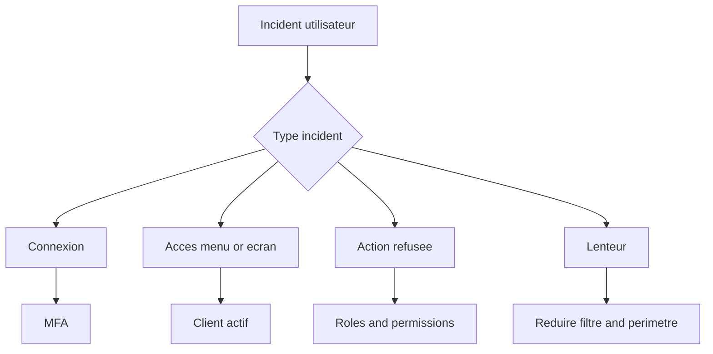

# Manuel utilisateur — 90 Dépannage opérationnel

## 1) Objectif

Résoudre vite les incidents sans passer en debug technique complet.

---

## 2) Arbre de diagnostic rapide



---

## 3) Incident: impossible de se connecter

### Vérifier

1. Email correct.
2. Mot de passe correct.
3. Méthode de connexion adaptée (SSO ou password).
4. Horloge machine (MFA).

### Faire

1. Réessayer via Microsoft si compte SSO.
2. Utiliser fallback MFA email.
3. Utiliser recovery code.
4. Demander reset MFA à un admin.

---

## 4) Incident: pas de client sélectionnable

### Symptôme

Écran `/select-client` sans client exploitable.

### Faire

1. Vérifier rattachement utilisateur.
2. Vérifier statut `ACTIVE`.
3. Se reconnecter.

---

## 5) Incident: menu ou écran absent

### Causes principales

- mauvais client actif;
- rôle insuffisant;
- permission absente;
- module désactivé.

### Procédure

1. Vérifier client actif affiché.
2. Vérifier rôle utilisateur.
3. Vérifier permissions du rôle.
4. Vérifier activation module.
5. Forcer reconnexion.

---

## 6) Incident: erreur 403 sur action

### Procédure

1. Identifier la route exacte.
2. Contrôler l'autorisation attendue.
3. Vérifier droits du compte.
4. Tester avec compte admin du même client.

---

## 7) Incident: rôle impossible à supprimer

### Causes

- rôle système;
- rôle encore assigné.

### Procédure

1. Ouvrir la fiche rôle.
2. Contrôler statut système.
3. Retirer assignations utilisateurs.
4. Refaire suppression.

---

## 8) Incident: import budget en erreur

### Procédure

1. Vérifier mapping colonnes.
2. Contrôler format des valeurs.
3. Vérifier exercice/budget cible.
4. Rejouer import sur un petit échantillon.

---

## 9) Incident: lenteur

### Actions immédiates

1. Réduire filtres.
2. Limiter plage de données.
3. Utiliser pagination.
4. Fermer onglets lourds.

### Escalade support

Envoyer:

- URL;
- client actif;
- heure;
- action;
- fréquence;
- capture d'écran si possible.

---

## 10) Template ticket support

- Contexte: qui, quel client, quel rôle.
- Incident: quoi, où, quand.
- Attendu vs obtenu.
- Étapes de reproduction.
- Impact métier.

---

## 11) Doublon utilisateur après sync annuaire / SSO impossible

### Symptômes

- Connexion Microsoft : `/login?status=error&reason=email_ambiguous` ou `email_unknown`.
- Deux comptes Starium pour la même personne (email perso + email pro).

### Diagnostic SQL (prod, lecture seule)

```sql
SELECT id, email, "passwordLoginEnabled", "createdAt"
FROM users WHERE email ILIKE '%<fragment>%';

SELECT uei.*, u.email AS primary_email
FROM user_email_identities uei
JOIN users u ON u.id = uei."userId"
WHERE uei."emailNormalized" ILIKE '%<fragment>%';

SELECT cu.id, cu.status, cu.role, u.email
FROM client_users cu JOIN users u ON u.id = cu."userId"
WHERE u.email ILIKE '%<fragment>%';

SELECT id, "userId", email, username, "externalDirectoryId", status
FROM collaborators
WHERE email ILIKE '%<fragment>%' OR username ILIKE '%<fragment>%';
```

Logs : `security_logs` avec `event = 'auth.microsoft_sso.failure'`.

### Actions

1. **Ne pas relancer** la sync annuaire avant réconciliation.
2. Snapshot DB.
3. Dry-run : `pnpm --filter @starium-orchestra/api exec ts-node scripts/reconcile-directory-duplicate-users.ts --dry-run --client-id=<uuid>`.
4. Rattachement manuel si `USER_LINK_REQUIRED` : admin client → `POST /api/collaborators/:id/link-platform-user`.
5. Réconciliation scriptée avec `--canonical-user-id` et `--duplicate-user-id` après validation humaine.

---

## 12) Références

- `docs/API.md`
- `docs/modules/client-rbac.md`
