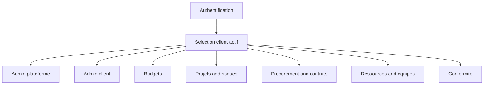

# Manuel utilisateur Starium Orchestra (web + admin)

## 1) Positionnement

Ce manuel décrit l'utilisation opérationnelle de l'application web Starium Orchestra pour:

- utilisateurs métiers;
- administrateurs client;
- administrateurs plateforme.

La documentation couvre les flux réellement implémentés et distingue explicitement les zones partielles/placeholders.

Chaque guide modulaire est rédigé en format **manuel terrain**:

- explication fonctionnelle;
- procédure clic par clic;
- cas d'usage;
- schémas de flux Mermaid.

---

## 2) Comment utiliser ce manuel

### Lecture rapide (par rôle)

- `PLATFORM_ADMIN`: commencer par `MANUEL-00-DEMARRAGE.md` puis `MANUEL-10-ADMIN-PLATEFORME.md`.
- `CLIENT_ADMIN`: commencer par `MANUEL-00-DEMARRAGE.md` puis `MANUEL-20-ADMIN-CLIENT.md`.
- Utilisateur métier: commencer par `MANUEL-00-DEMARRAGE.md` puis le module fonctionnel concerné.

### Lecture complète (exhaustive)

1. `MANUEL-00-DEMARRAGE.md`
2. `MANUEL-10-ADMIN-PLATEFORME.md`
3. `MANUEL-20-ADMIN-CLIENT.md`
4. `MANUEL-30-BUDGETS.md`
5. `MANUEL-40-PROJETS-RISQUES-ACTIONS.md`
6. `MANUEL-50-FOURNISSEURS-CONTRATS.md`
7. `MANUEL-60-RESSOURCES-EQUIPES.md`
8. `MANUEL-70-CONFORMITE.md`
9. `MANUEL-90-DEPANNAGE.md`

---

## 3) Fondamentaux communs

### 3.1 Authentification

- login mot de passe;
- Microsoft SSO;
- MFA TOTP/email/recovery;
- refresh de session via refresh token.

### 3.2 Multi-client

- un client actif est requis pour la majorité des pages métier;
- les données sont scoppées sur le client actif;
- sans client actif: blocage utilisateur standard (`/no-client`) ou accès admin plateforme si applicable.

### 3.3 Visibilité des écrans

Les écrans affichés dépendent de la combinaison:

- rôle plateforme (`PLATFORM_ADMIN` ou non);
- rôle dans le client actif (`CLIENT_ADMIN` / `CLIENT_USER`);
- permissions RBAC;
- activation des modules.

### 3.4 Règle UI sur les valeurs

Les formulaires et listes affichent des libellés métier (`name`, `title`, `code`, `label`) et non des IDs bruts.

---

## 4) Schéma global d'utilisation

---

## 5) Cartographie consolidée des domaines

### Administration plateforme

- dashboard global;
- gestion clients;
- gestion utilisateurs;
- rôles système;
- audit;
- paramètres globaux (badges, Microsoft, storage, upload, snapshots).

Référence: `MANUEL-10-ADMIN-PLATEFORME.md`.

### Administration client

- membres client;
- rôles métier et permissions;
- assignation des rôles;
- Microsoft 365 client;
- team sync;
- taxonomie risques;
- badges client.

Référence: `MANUEL-20-ADMIN-CLIENT.md`.

### Budgets

- exercices;
- budgets;
- cockpit budget;
- enveloppes/lignes;
- imports;
- snapshots;
- reporting et comparaisons;
- paramétrages module.

Référence: `MANUEL-30-BUDGETS.md`.

### Projets, risques, plans d'action

- portefeuille projets;
- fiches projet/planning;
- scénarios et cockpit scénario;
- registre des risques;
- plans d'action.
- parcours détaillés "avec scénario" et "sans scénario";
- mode opératoire diagrammes de présentation (Gantt, cockpit comparatif, vue portefeuille).

Référence: `MANUEL-40-PROJETS-RISQUES-ACTIONS.md`.

### Procurement et contrats

- fournisseurs;
- contacts;
- commandes;
- factures;
- contrats;
- types de contrats.

Référence: `MANUEL-50-FOURNISSEURS-CONTRATS.md`.

### Ressources et équipes

- ressources et rôles;
- compétences;
- collaborateurs;
- structure d'équipes;
- scopes managers;
- feuilles de temps.

Référence: `MANUEL-60-RESSOURCES-EQUIPES.md`.

### Conformité

- dashboard conformité;
- frameworks;
- exigences;
- preuves et suivi.

Référence: `MANUEL-70-CONFORMITE.md`.

---

## 6) Index des routes principales

### Session et global

- `/login`
- `/select-client`
- `/no-client`
- `/account`
- `/dashboard` (partiel)

### Admin plateforme

- `/admin/dashboard`
- `/admin/clients`
- `/admin/users`
- `/admin/system-roles`
- `/admin/audit`
- `/admin/ui-badges`
- `/admin/microsoft-settings`
- `/admin/procurement-storage`
- `/admin/upload-settings`
- `/admin/snapshot-occasion-types`

### Admin client

- `/client/administration`
- `/client/members`
- `/client/roles`
- `/client/roles/new`
- `/client/roles/[id]`
- `/client/administration/microsoft-365`
- `/client/administration/team-sync`
- `/client/administration/risk-taxonomy`
- `/client/administration/badges`

### Budgets

- `/budgets`
- `/budgets/dashboard`
- `/budgets/new`
- `/budgets/configuration`
- `/budgets/imports`
- `/budgets/cockpit-settings`
- `/budgets/workflow-settings`
- `/budgets/snapshot-occasion-types`
- `/budgets/exercises`
- `/budgets/exercises/new`
- `/budgets/exercises/[id]`
- `/budgets/exercises/[id]/edit`
- `/budgets/[budgetId]`
- `/budgets/[budgetId]/edit`
- `/budgets/[budgetId]/import`
- `/budgets/[budgetId]/lines` (placeholder)
- `/budgets/[budgetId]/lines/new`
- `/budgets/[budgetId]/reporting`
- `/budgets/[budgetId]/versions` (placeholder)
- `/budgets/[budgetId]/reallocations` (placeholder)
- `/budgets/[budgetId]/snapshots`
- `/budgets/[budgetId]/snapshots/[snapshotId]`
- `/budgets/[budgetId]/envelopes/new`
- `/budget-lines/[lineId]/edit`
- `/budget-envelopes/[envelopeId]`
- `/budget-envelopes/[envelopeId]/edit`

### Projets / risques / actions

- `/projects`
- `/projects/new`
- `/projects/options`
- `/projects/portfolio-gantt`
- `/projects/[projectId]`
- `/projects/[projectId]/sheet` (partiel)
- `/projects/[projectId]/planning`
- `/projects/[projectId]/options`
- `/projects/[projectId]/risks`
- `/projects/[projectId]/scenarios`
- `/projects/[projectId]/scenarios/[scenarioId]`
- `/projects/[projectId]/scenarios/cockpit`
- `/action-plans`
- `/action-plans/[actionPlanId]`
- `/risks`

### Procurement / contrats

- `/suppliers/dashboard`
- `/suppliers`
- `/suppliers/[supplierId]`
- `/suppliers/contacts`
- `/suppliers/purchase-orders`
- `/suppliers/purchase-orders/[id]`
- `/suppliers/invoices`
- `/suppliers/invoices/[id]`
- `/contracts`
- `/contracts/[id]`
- `/contracts/kind-types`

### Ressources / équipes

- `/resources`
- `/resources/new`
- `/resources/[id]`
- `/resources/roles`
- `/teams/skills`
- `/teams/collaborators`
- `/teams/collaborators/[collaboratorId]`
- `/teams/time-entries`
- `/teams/time-entries/options`
- `/teams/structure/teams`
- `/teams/structure/teams/[teamId]`
- `/teams/structure/manager-scopes`

### Conformité

- `/compliance/dashboard`
- `/compliance/frameworks`
- `/compliance/requirements`
- `/compliance/requirements/[id]`

---

## 7) Gouvernance documentaire

Ce document consolidé est aligné avec les guides modulaires:

- `MANUEL-00-DEMARRAGE.md`
- `MANUEL-10-ADMIN-PLATEFORME.md`
- `MANUEL-20-ADMIN-CLIENT.md`
- `MANUEL-30-BUDGETS.md`
- `MANUEL-40-PROJETS-RISQUES-ACTIONS.md`
- `MANUEL-50-FOURNISSEURS-CONTRATS.md`
- `MANUEL-60-RESSOURCES-EQUIPES.md`
- `MANUEL-70-CONFORMITE.md`
- `MANUEL-90-DEPANNAGE.md`

En cas de divergence, corriger le guide modulaire concerné puis répercuter ici.

---

## 8) Références structurantes

- `docs/VISION_PRODUIT.md`
- `docs/ARCHITECTURE.md`
- `docs/FRONTEND_ARCHITECTURE.md`
- `docs/FRONTEND_UI-UX.md`
- `docs/API.md`
- `docs/default-profiles.md`
- `docs/modules/client-rbac.md`
