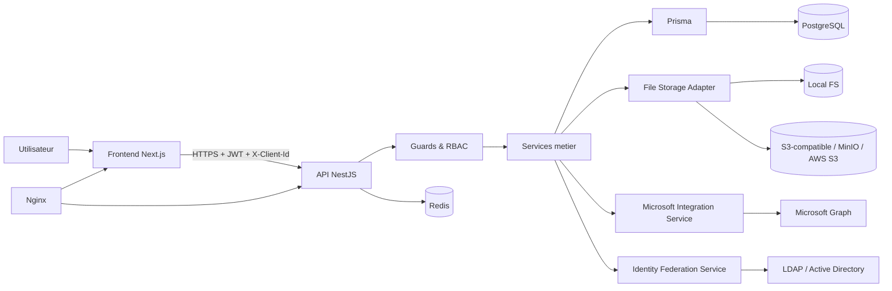
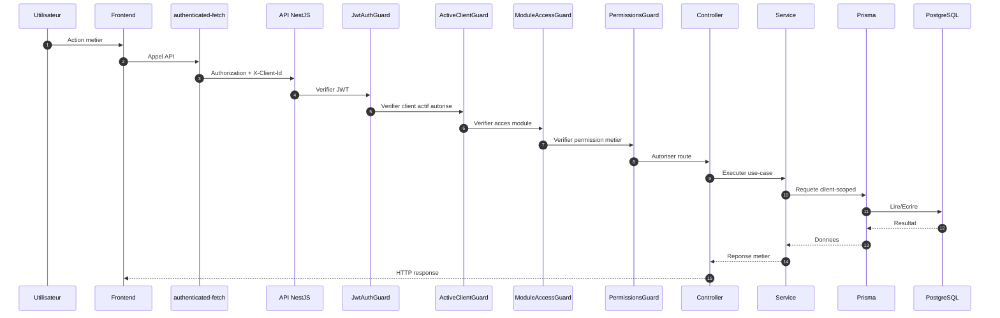

# RFC-ARCH-TECH-001 — Architecture technique complète Starium Orchestra

## Statut

Draft (référence d'architecture)

## Priorité

Critique - document socle pour la cohérence technique des futures RFC d'implémentation et des contributions Cursor.

## 1) Objectif de l'architecture

Cette architecture formalise un cadre unique pour Starium Orchestra, SaaS multi-tenant de pilotage opérationnel:

- **API-first**: toute capacité métier est exposée via API backend documentée.
- **Backend source de vérité**: règles métier, sécurité, RBAC, validations et audit sont centralisés côté API.
- **Frontend cockpit**: l'interface web orchestre l'expérience utilisateur, sans contenir de logique métier critique.
- **Multi-client strict**: aucune donnée métier n'est lue ou mutée hors du client actif autorisé.
- **Modularité métier**: chaque domaine (budgets, procurement, projets, etc.) reste indépendant et composable.

## 2) Vue d'ensemble technique

### Schéma texte global

```text
[Frontend Next.js]
        |
        v
[API NestJS]
        |
        v
[Prisma ORM]
        |
        v
[PostgreSQL]
        |
        +--> [Stockage fichiers: local | S3-compatible]
        |
        +--> [Services externes: Microsoft 365 / Graph, LDAP/AD]
```

## 3) Structure du monorepo

```text
starium-Orchestra/
├─ apps/
│  ├─ api/                        # NestJS (controllers, services, guards, dto, modules)
│  └─ web/                        # Next.js (app shell, features, providers, api-client)
├─ packages/                      # librairies partagées (types, utils, design tokens, sdk interne)
├─ prisma/                        # schéma global (si centralisé) et assets ORM partagés
├─ docs/                          # RFC, architecture, manuels, standards produit/tech
├─ docker/                        # définitions d'exécution locale/serveur (compose, images, env templates)
└─ apps/api/prisma/migrations/    # migrations PostgreSQL (source de changement DB)
```

### Règles d'organisation

- `apps/api` porte toute logique de sécurité et de validation métier.
- `apps/web` consomme strictement les APIs; pas d'accès direct à la base.
- `packages` mutualise ce qui doit rester sans dépendance circulaire métier.
- `docs` contient les décisions d'architecture et leurs évolutions (RFC).
- `docker` encapsule l'exécution locale/intégration de l'ensemble plateforme.
- `prisma/migrations` représente l'historique autorisé des évolutions de données.

## 4) Architecture frontend

### Principes

- Frontend conçu comme **cockpit décisionnel** et non comme moteur métier.
- Toutes les données proviennent d'un **api-client central**.
- Toute requête métier est **tenant-aware** (client actif injecté côté transport + query keys).

### Composants structurants

- **App Shell**: cadre global de navigation, session, notifications et layout.
- **Sidebar**: navigation module-aware (plateforme vs client scope).
- **Workspace Header**: contexte courant (client actif, filtres globaux, actions transverses).
- **Workspace**: zone de travail métier, pages et vues domain-driven.
- **Providers**:
  - **ActiveClientProvider**: stocke/synchronise le client actif de l'utilisateur.
  - **AuthProvider**: état d'authentification, tokens session, refresh.
  - **QueryProvider**: configuration TanStack Query (cache, retries, invalidation).

### API client central

- Gestion unifiée de `Authorization` (JWT) et `X-Client-Id`.
- Encapsulation des erreurs HTTP et mapping des erreurs métier.
- Contrat stable pour les hooks/features frontend.

### Query keys tenant-aware

Toutes les clés de cache métier incluent le client actif:

```text
['projects', clientId, filters]
['purchase-orders', clientId, period]
['budget-lines', clientId, exerciseId]
```

### Séparation plateforme vs client

- **Scope plateforme**: administration globale (ex. clients, abonnements, supervision), réservé aux rôles plateforme.
- **Scope client**: opérations métier de l'organisation active, filtrées par `clientId`.
- Aucun écran métier ne mélange des données multi-clients sans endpoint explicitement plateforme et autorisé.

## 5) Architecture backend

### Couches

- **Controllers**: HTTP in/out, binding DTO, orchestration simple.
- **Services**: règles métier, transaction, validation de cohérence.
- **DTO**: validation stricte des payloads entrants (class-validator / class-transformer).
- **Guards**: authentification + autorisation + scoping client.
- **PrismaService**: unique point ORM PostgreSQL.
- **Modules NestJS**: découpage par domaine, dépendances explicites.

### Principes non négociables

- Validation métier **uniquement backend**.
- Aucun accès DB depuis controller.
- Toute mutation sensible génère un **audit log**.
- Toute lecture/écriture métier est filtrée par `clientId` autorisé.

## 6) Pipeline de sécurité

### Chaîne d'exécution stricte

```text
Utilisateur
→ Frontend
→ authenticated-fetch
→ Authorization + X-Client-Id
→ JwtAuthGuard
→ ActiveClientGuard
→ ModuleAccessGuard
→ PermissionsGuard
→ Controller
→ Service
→ Prisma
→ PostgreSQL
```

### Notes d'exécution

- `JwtAuthGuard`: authentifie l'identité.
- `ActiveClientGuard`: valide l'appartenance utilisateur ↔ client actif.
- `ModuleAccessGuard`: vérifie activation/accès module.
- `PermissionsGuard`: applique RBAC fin par action métier.

## 7) Modèle multi-tenant

- Un **User** peut appartenir à plusieurs **Clients**.
- **ClientUser** porte le rôle d'un user dans un client donné.
- Le client actif est transmis via `X-Client-Id`.
- `clientId` n'est **jamais** pris depuis un body métier.
- Toutes les données métier sont filtrées par `clientId` côté backend.
- Le frontend ne contient **aucune** logique de sécurité de confiance.

## 8) Modèle RBAC

- `User.platformRole` gère les privilèges plateforme (ex. `PLATFORM_ADMIN`).
- `ClientUser.role` gère les privilèges opérationnels client (ex. `CLIENT_ADMIN`, `CLIENT_USER`).
- Les permissions métier sont évaluées via rôles et capacités associées.
- `CLIENT_ADMIN` ne confère pas automatiquement toutes les permissions métier fines.
- `PLATFORM_ADMIN` n'implique pas automatiquement le rôle d'admin dans chaque client.

## 9) Modules backend (catalogue cible)

- **auth**: login, refresh, MFA, session, tokens.
- **clients**: gestion des organisations clientes.
- **users**: gestion des utilisateurs et profils.
- **roles / permissions**: moteur RBAC plateforme + client.
- **audit-logs**: traçabilité des actions sensibles.
- **budget-management**: cycle de vie budgétaire.
- **financial-core**: allocations, événements financiers, consolidations.
- **budget-reporting**: indicateurs, écarts, agrégations.
- **budget-reallocation**: transferts et arbitrages budgétaires.
- **budget-import**: import de données financières.
- **budget-versioning**: versions/exercices et snapshots.
- **procurement**: commandes, factures, fournisseurs, pièces.
- **contracts**: contrats fournisseurs et liens métier.
- **projects**: portefeuille projets, jalons, suivi.
- **project-budget**: articulation projets et enveloppes budgétaires.
- **microsoft**: OAuth et synchronisation Microsoft Graph.
- **collaborators**: référentiel collaborateurs.
- **skills**: compétences et taxonomie.
- **work-teams**: équipes de travail et affectations.
- **activity-types**: typologie d'activités.
- **resource-time-entries**: saisies de temps et consommation.
- **future licenses / applications**: gouvernance parc applicatif/licences (module évolutif).

## 10) Modèle de données global (schémas texte)

### 10.1 User / Client / ClientUser

```text
User (id, email, platformRole, ...)
  1 --- * ClientUser (id, userId, clientId, role, status, ...)
Client (id, name, slug, ...)
  1 --- * ClientUser
```

### 10.2 BudgetExercise / Budget / BudgetEnvelope / BudgetLine

```text
BudgetExercise (id, clientId, year, status)
  1 --- * Budget (id, exerciseId, ownerScope, ...)
Budget
  1 --- * BudgetEnvelope (id, budgetId, label, capAmount, ...)
BudgetEnvelope
  1 --- * BudgetLine (id, envelopeId, category, plannedAmount, ...)
```

### 10.3 BudgetLine / FinancialAllocation / FinancialEvent / PurchaseOrder / Invoice

```text
BudgetLine
  1 --- * FinancialAllocation (id, budgetLineId, sourceType, sourceId, allocatedAmount)
FinancialAllocation
  1 --- * FinancialEvent (id, allocationId, eventType, amount, occurredAt)
PurchaseOrder (id, clientId, supplierId, totalAmount, status, ...)
Invoice (id, clientId, purchaseOrderId?, totalAmount, status, ...)
FinancialEvent peut référencer PurchaseOrder/Invoice selon sourceType/sourceId
```

### 10.4 Supplier / PurchaseOrder / Invoice / SupplierContract

```text
Supplier (id, clientId, legalName, ...)
  1 --- * PurchaseOrder (supplierId)
PurchaseOrder
  1 --- * Invoice (purchaseOrderId)
Supplier
  1 --- * SupplierContract (supplierId, startDate, endDate, ...)
```

### 10.5 Project / Tasks / Risks / Reviews / Documents / BudgetLinks / MicrosoftLink

```text
Project (id, clientId, name, status, ...)
  1 --- * Task
  1 --- * Risk
  1 --- * Review
  1 --- * Document
  1 --- * ProjectBudgetLink (projectId, budgetLineId/envelopeId)
  0..1 --- 1 MicrosoftLink (plannerId/teamId/sharepointRef...)
```

### 10.6 Resource HUMAN / Skills / WorkTeams / TimeEntries

```text
ResourceHuman (id, clientId, collaboratorId, availability, ...)
  * --- * Skill (via ResourceSkill)
ResourceHuman
  * --- * WorkTeam (via WorkTeamMember)
ResourceHuman
  1 --- * TimeEntry (date, hours, activityTypeId, projectId?)
```

## 11) Flux métiers techniques

### 11.1 Login

1. L'utilisateur soumet ses credentials au backend.
2. Backend authentifie + applique MFA si actif.
3. Retour access token (court) + refresh token (rotation).
4. Frontend initialise session (`AuthProvider`).

### 11.2 Sélection client actif

1. Frontend charge les clients autorisés de l'utilisateur.
2. L'utilisateur sélectionne le client actif.
3. Frontend persiste ce contexte (state + stockage session si prévu).
4. Chaque requête métier envoie `X-Client-Id`.

### 11.3 Chargement page métier

1. Page déclenche requêtes TanStack Query tenant-aware.
2. API passe la chaîne de guards.
3. Service applique filtres `clientId`.
4. Réponse normalisée affichée dans le cockpit.

### 11.4 Création commande (Purchase Order)

1. Frontend envoie DTO sans `clientId` métier.
2. Backend dérive le scope client depuis le contexte auth.
3. Service valide fournisseur/budget dans le même client.
4. Création PO + audit log si sensible.

### 11.5 Création facture

1. Frontend soumet facture liée à PO (si applicable).
2. Backend valide droits + cohérence montants/statut.
3. Écriture transactionnelle facture + événements financiers.
4. Journalisation audit des changements structurants.

### 11.6 Réallocation budgétaire

1. Demande de transfert entre lignes/enveloppes.
2. Backend vérifie permissions, plafonds, règles d'exercice.
3. Écrit allocations/événements en transaction atomique.
4. Trace audit complète (avant/après).

### 11.7 Synchronisation Microsoft

1. OAuth Microsoft déclenché côté backend.
2. Token stocké côté serveur (jamais exposé brut au frontend).
3. Tâches de sync Graph (Planner/Teams/Documents) lancées.
4. Données mappées dans les modules client-scopés.

### 11.8 Upload document (local ou S3)

1. Frontend envoie fichier via API métier authentifiée.
2. Backend valide autorisation, type, taille, contexte client.
3. Backend stocke dans backend local ou S3-compatible.
4. Le fichier est servi uniquement via endpoint API autorisé.

## 12) Intégrations externes

- **Microsoft 365 OAuth**: consentement et délégation contrôlée côté backend.
- **Microsoft Graph**: accès Planner, Teams, documents, calendriers selon permissions.
- **Planner / Teams / Documents**: synchronisation bidirectionnelle ciblée par module.
- **LDAP / AD**: fédération identité/attributs (provisioning, mapping rôles à encadrer).
- **S3-compatible / MinIO / AWS S3**: abstraction stockage objet sans dépendance fournisseur forte.

## 13) Infrastructure

### Composants

- **Docker**: packaging et exécution homogène (dev/test/prod).
- **PostgreSQL**: base transactionnelle principale.
- **Redis**: cache, sessions techniques, jobs/queues selon besoins.
- **Nginx**: reverse proxy, routage, terminaison TLS, en-têtes.
- **Backend API (NestJS)**: logique métier et sécurité.
- **Frontend web (Next.js)**: cockpit utilisateur.
- **Stockage fichiers**: filesystem local ou objet S3-compatible.

### Variables d'environnement critiques

- Auth/JWT: `JWT_SECRET`, `JWT_EXPIRES_IN`, `REFRESH_TOKEN_SECRET`, `REFRESH_TOKEN_EXPIRES_IN`.
- DB: `DATABASE_URL`.
- Redis: `REDIS_URL`.
- CORS/URLs: `WEB_APP_URL`, `API_BASE_URL`.
- Microsoft: `MS_CLIENT_ID`, `MS_CLIENT_SECRET`, `MS_TENANT_ID`, `MS_REDIRECT_URI`.
- LDAP/AD: `LDAP_URL`, `LDAP_BIND_DN`, `LDAP_BIND_PASSWORD`, `LDAP_BASE_DN`.
- Stockage: `STORAGE_BACKEND`, `S3_ENDPOINT`, `S3_REGION`, `S3_BUCKET`, `S3_ACCESS_KEY`, `S3_SECRET_KEY`.

## 14) Sécurité et conformité

- **JWT**: authentification API signée avec durée courte.
- **MFA**: second facteur pour comptes sensibles/administrateurs.
- **Refresh token**: rotation/invalidations contrôlées côté backend.
- **Validation DTO**: aucun payload métier non validé.
- **RBAC**: contrôle d'accès par rôle + permission fine.
- **Audit logs**: traçabilité des opérations sensibles et administratives.
- **Isolation tenant**: contrôle systématique par client actif autorisé.
- **Tokens Microsoft non exposés au frontend**: uniquement côté backend.
- **Fichiers servis via API métier**: pas d'accès direct anonyme au storage.

## 15) Règles d'implémentation

- Pas de logique métier critique dans le frontend.
- Toutes les mutations sensibles doivent être auditées.
- Toute route métier doit enchaîner les guards adaptés.
- Chaque query frontend métier intègre `clientId` dans sa `queryKey`.
- Aucune route métier n'accepte `clientId` dans le body.
- Chaque module reste indépendant (faible couplage, API interne claire).

## 16) Diagrammes Mermaid

### 16.1 Diagramme technique global



### 16.2 Diagramme pipeline sécurité



## Conclusion

Cette RFC définit l'architecture de référence de Starium Orchestra: backend souverain sur la logique et la sécurité, frontend cockpit tenant-aware, isolation multi-client stricte, et modularité métier orientée extension. Toute RFC d'implémentation ultérieure doit s'y aligner explicitement.
