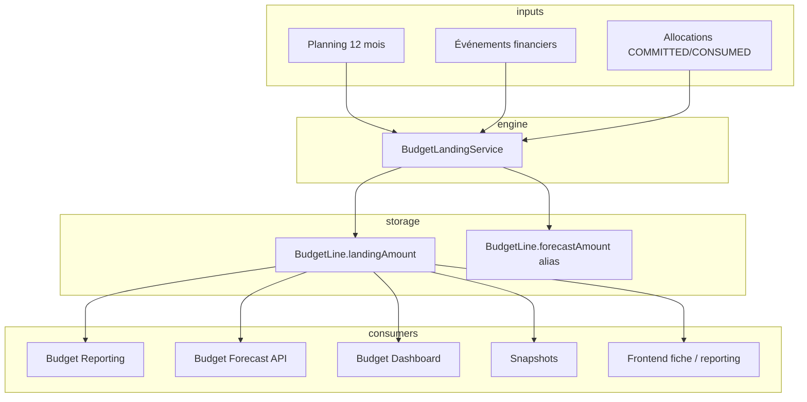

# RFC-BUD-040 — Unification atterrissage, prévision et forecast

## Statut

✅ **Implémenté** (2026-08-28) — lots A à E livrés sur branche feature ; migration `20260828140000_rfc_bud_040_landing_amount` + backfill lignes live (`apps/api/prisma/backfill-landing-amounts.ts`). Snapshots historiques : `landingAmount` reste `null` (D4).

**Déploiement distant** : après `prisma migrate deploy`, exécuter le backfill one-shot sur chaque environnement avec des `BudgetLine` existantes (voir §16).

## Priorité

🔥 Haute — dette métier **et** simplification UX : en production, un client n’utilise pas le module budget car jugé **trop compliqué** (vocabulaire redondant, écrans dupliqués). Cette RFC vise **un chiffre, un libellé, un écran** avant tout refactor technique.

## Décisions produit validées (2026-08-28)

| # | Décision | Choix retenu |
|---|----------|--------------|
| **D1** | Libellé onglet grille 12 mois | **Conserver « Prévisionnel »** (pas de renommage « Plan annuel ») |
| **D2** | Page `/budgets/[id]/reporting` | **Fusionner** dans la fiche budget (onglet Comparaisons) ; redirect 302 sur l’ancienne URL |
| **D3** | Alias API `forecast*` → `landing*` | **OK** — transition technique 2 releases (invisible utilisateur) |
| **D4** | Recalcul rétroactif des snapshots historiques | **Non** — seuls le budget **live** et les **nouveaux** snapshots utilisent le moteur unifié |

## Dépendances

* RFC-015-1B — Financial Core
* RFC-016 — Budget Reporting API
* RFC-023 — Budget Prévisionnel (Planning & Atterrissage)
* RFC-024 — Budget UI / Budget Line Planning Engine
* RFC-030 — Budget Forecast & Comparaison (à **amender**)
* RFC-022 — Budget Dashboard API
* RFC-031 / RFC-033 — Snapshots & versions figées
* RFC-FE-BUD-030 — Forecast & Comparaison UI
* RFC-FE-BUD-032 — Fiche budget cockpit
* RFC-032 — Historisation décisions budgétaires

## Remplace / clarifie

Cette RFC **ne supprime pas** le planning mensuel ni les comparaisons snapshot. Elle **unifie la sémantique** et **une seule chaîne de calcul** pour l’atterrissage, puis aligne API, reporting, dashboard et UI sur cette vérité.

---

# 1. Analyse de l'existant

## 1.1 Problème constaté

Aujourd’hui, **plusieurs notions** répondent à la même question métier (*« combien vais-je dépenser en fin d’exercice ? »*) avec **des moteurs différents** :

| Concept UI / doc | Source technique actuelle | Formule réelle |
|----------------|---------------------------|----------------|
| **Forecast** (anglais, certains écrans) | `BudgetLine.forecastAmount` via `FinancialAllocation` type `FORECAST` | `SUM(allocations FORECAST)` |
| **Prévision** (`BUDGET_LABELS.forecast`) | Même champ + parfois `planningTotalAmount` | Incohérent |
| **Atterrissage** (`landing`, RFC-023) | `GET /api/budget-lines/:id/planning` | `consommé + engagé + prévision restante` |
| **Plan 12 mois** | `planningTotalAmount` | `SUM(months[1..12])` |

### Incohérences prouvées dans le code

1. **`budget-line-planning.service.ts`** — à la sauvegarde du planning, écrit `forecastAmount = planningTotalAmount` (somme des 12 mois), **sans** appliquer la formule d’atterrissage.
2. **`budget-line-amounts.aggregate.ts`** — le recalcul financial-core recalcule `forecastAmount` uniquement depuis les allocations `FORECAST`, **écrasant** potentiellement la valeur posée par le planning.
3. **`budget-forecast` (RFC-030)** — lit `forecastAmount` / reporting comme « forecast », alors que le métier parle d’**atterrissage**.
4. **UI** — `BUDGET_LABELS.forecast = 'Prévision'` mais des composants affichent encore « Forecast » (`budget-envelope-summary-cards.tsx`, drawer ligne, etc.) ; écran `/reporting` et onglet Prévisionnel dupliquent des KPI proches de la bande fiche budget (déjà retirés une fois pour doublon, RFC-FE-BUD-032).

## 1.2 Ce qui fonctionne et doit être conservé

* **Planning mensuel** (RFC-023) : saisie 12 mois, modes `MANUAL`, `ANNUAL_SPREAD`, etc.
* **Noyau financier** : engagé / consommé / restant, dénouement engagé à la facturation (RFC-FE-BUD-032).
* **Comparaisons** snapshot / version (RFC-030, RFC-033) — seulement les **champs comparés** doivent être harmonisés.
* **Vocabulaire cible déjà amorcé** : `apps/web/src/features/budgets/lib/budget-display-labels.ts`.

## 1.3 Impact si on ne corrige pas

* Deux chiffres « fin d’exercice » divergents sur une même ligne → perte de confiance CODIR.
* Alertes `overForecast` (RFC-030) déclenchées sur une base différente de l’atterrissage affiché dans le prévisionnel.
* Comparaisons snapshot / live faussées si le snapshot fige un `forecastAmount` non aligné sur `landing`.
* Coût de maintenance : chaque nouvel écran doit « deviner » quel montant afficher.

---

# 2. Hypothèses

| # | Hypothèse | Impact si fausse |
|---|-----------|------------------|
| H1 | L’**atterrissage** (RFC-023) est la **seule** projection de fin d’exercice pour le pilotage | Revoir la formule avec le métier DAF |
| H2 | Le **plan 12 mois** (`planningTotalAmount`) reste un objet distinct (répartition temporelle), pas un KPI de fin d’exercice | Fusionner plan et atterrissage en un seul concept |
| H3 | Les saisies manuelles d’allocations `FORECAST` hors planning sont **rares ou héritage seed** | Prévoir une migration de données + période de compat API |
| H4 | Pas de changement du calcul **restant** (`base effective − engagé − consommé`) | RFC dédiée noyau financier |
| H5 | Les snapshots existants ne sont **pas recalculés rétroactivement** ; seuls les nouveaux captures et la lecture « live » utilisent le moteur unifié | Job de recalcul optionnel phase 2 |

---

# 3. Décisions métier — glossaire unique

## 3.1 Termes canoniques (français UI)

| Terme UI | Clé technique | Définition |
|----------|---------------|------------|
| **Budget** | `effectiveBudgetBase` | `initialAmount` (+ réaffectations `REALLOCATION_DONE`) — plafond de pilotage |
| **Total prévisionnel** (sous-ensemble onglet **Prévisionnel**) | `planningTotalAmount` | Somme des 12 mois saisis / calculés — **répartition**, pas l’atterrissage |
| **Prévision restante** | `remainingPlanning` | Somme des mois **strictement après** la date de référence (RFC-023, package `budget-exercise-calendar`) |
| **Atterrissage** | `landingAmount` | `consumedAmount + committedAmount + remainingPlanning` |
| **Écart d’atterrissage** | `landingVariance` | `landingAmount − effectiveBudgetBase` (base = révisé + réallocations, pas seulement `initialAmount`) |
| **Engagé** | `committedAmount` | Inchangé (noyau financier) |
| **Consommé** | `consumedAmount` | Inchangé |
| **Restant** | `remainingAmount` | Inchangé |

## 3.2 Termes dépréciés

| Ancien terme | Traitement |
|--------------|------------|
| **Forecast** (UI anglais) | Supprimé — remplacé par **Atterrissage** |
| **Prévision** (pour fin d’exercice) | Réservé à **Prévision restante** ou renommé en contexte ; le KPI global = **Atterrissage** |
| `forecastAmount` (champ Prisma / API) | **Alias de transition** de `landingAmount` — même valeur, dépréciation documentée |
| `FinancialAllocation` type `FORECAST` (saisie manuelle) | **Interdit en écriture** API publique ; valeur dérivée en interne si nécessaire pour le recalcul legacy |

## 3.3 Règle d’or

> **Une seule projection de fin d’exercice par ligne** : l’**atterrissage**, recalculée par le backend à chaque événement financier ou modification du planning.

L’onglet **Prévisionnel** (grille 12 mois) reste le lieu de saisie de la répartition mensuelle ; il **alimente** `remainingPlanning`, donc l’atterrissage, mais le **total prévisionnel** n’est **pas** le KPI de fin d’exercice affiché en bandeau.

---

# 4. Architecture cible

## 4.1 Moteur unique

Nouveau service partagé :

```
apps/api/src/modules/budget-landing/
  budget-landing.module.ts
  budget-landing.service.ts          # calcul + persistance landingAmount
  budget-landing.calculator.ts       # formule pure (testable)
  budget-landing.types.ts
```

**Responsabilités** :

1. Calculer `remainingPlanning` (délègue à `@starium-orchestra/budget-exercise-calendar`).
2. Calculer `landingAmount`, `landingVariance`, `planningTotalAmount`.
3. Persister `landingAmount` sur `BudgetLine` (+ alias `forecastAmount` en transition).
4. Être appelé par :
   * `BudgetLineCalculatorService` (après événement / allocation),
   * `BudgetLinePlanningService` (après toute mutation planning),
   * job de **backfill** (optionnel),
   * capture snapshot (lecture à date).

**Interdit** : recalcul d’atterrissage côté frontend.

## 4.2 Flux de données



## 4.3 Correction formule budget de référence

**Bug actuel** : `composePlanningDto` utilise `initialAmount` pour `landingVariance`.  
**Cible** : base = `effectiveBudgetBase` (révisé + delta réallocations), aligné sur le noyau financier.

---

# 5. Modifications Prisma

## 5.1 Schéma

```prisma
model BudgetLine {
  // ... existant ...
  planningTotalAmount  Decimal?  @db.Decimal(18, 2)
  landingAmount        Decimal?  @db.Decimal(18, 2)  // NOUVEAU — atterrissage canonique
  landingComputedAt    DateTime?                     // NOUVEAU — traçabilité recalcul
  forecastAmount       Decimal   @db.Decimal(18, 2) // CONSERVÉ — alias sync = landingAmount
}
```

## 5.2 Migration

1. Ajouter `landingAmount`, `landingComputedAt` (nullable).
2. Script backfill : pour chaque ligne, recalcul via `BudgetLandingService` (referenceDate = now).
3. Copier `landingAmount` → `forecastAmount` où divergent.
4. Index optionnel : `(clientId, budgetId)` inchangé — pas d’index sur `landingAmount`.

## 5.3 Snapshots

* Les snapshots **figent** `landingAmount` (et conservent `forecastAmount` en alias pour compat lecture).
* Pas de recalcul rétroactif des snapshots historiques (H5).

---

# 6. Backend — implémentation

## 6.1 Module `budget-landing`

### `calculateLanding(input)`

```typescript
type LandingInput = {
  effectiveBudgetBase: Decimal;
  consumedAmount: Decimal;
  committedAmount: Decimal;
  exerciseStart: Date;
  exerciseEnd: Date;
  referenceDate: Date;
  planningMonths: { monthIndex: number; amount: Decimal }[];
};

type LandingResult = {
  planningTotalAmount: Decimal;
  remainingPlanning: Decimal;
  landingAmount: Decimal;
  landingVariance: Decimal;
  planningDelta: Decimal; // planningTotal - effectiveBudgetBase
};
```

### `recalculateAndPersist(clientId, budgetLineId, referenceDate?)`

* Transaction : lecture ligne + mois + événements/allocs si besoin base effective.
* Écrit `landingAmount`, `landingComputedAt`, `forecastAmount = landingAmount`, `planningTotalAmount`.
* **Ne crée plus** d’allocation `FORECAST` manuelle sauf si flag legacy `BUDGET_LANDING_LEGACY_FORECAST_ALLOC=true` (défaut `false`).

## 6.2 Points d’accroche (fichiers à modifier)

| Fichier | Changement |
|---------|------------|
| `financial-core/budget-line-calculator.service.ts` | Après recalcul engagé/consommé/restant → appeler `BudgetLandingService` |
| `budget-management/.../budget-line-planning.service.ts` | Supprimer écriture directe `forecastAmount = total` ; appeler landing service |
| `budget-forecast/budget-forecast.service.ts` | Lire `landingAmount` ; renommer champs réponse (alias) |
| `budget-forecast/calculators/variance.calculator.ts` | `computeVarianceLanding` ; alias `computeVarianceForecast` |
| `budget-reporting/budget-reporting.service.ts` | Agrégats `totalLandingAmount` (+ alias `totalForecastAmount`) |
| `budget-dashboard/budget-dashboard.service.ts` | KPI atterrissage depuis `landingAmount` |
| `budget-snapshots/*` | Capturer `landingAmount` ; comparaisons utilisent landing |
| `financial-core/allocations/financial-allocations.service.ts` | Rejeter `allocationType: FORECAST` en POST (400 `forecast_allocation_deprecated`) |

## 6.3 API — évolutions

### Nouveau (canonique)

| Méthode | Route | Description |
|---------|-------|-------------|
| `GET` | `/api/budget-lines/:id/landing` | Atterrissage ligne + détail (`remainingPlanning`, `planningTotalAmount`, variances) ; query `referenceDate?` |
| `GET` | `/api/budget-landing/budgets/:id` | Agrégat budget (remplace sémantiquement `/api/budget-forecast/budgets/:id`) |
| `GET` | `/api/budget-landing/envelopes/:id` | Idem enveloppe |
| `GET` | `/api/budget-landing/envelopes/:id/lines` | Liste lignes + statut dérive |

Permissions : `budgets.read`. Audit : `budget.landing.viewed`.

### Alias de transition (maintenus 2 versions)

| Ancienne route | Comportement |
|----------------|--------------|
| `GET /api/budget-forecast/*` | **Proxy** vers `budget-landing` ; champs JSON inchangés + nouveaux champs `landing*` ; header dépréciation `Deprecation: true` |
| `GET /api/budget-lines/:id/planning` | Conserve planning ; champs `landing` / `landingVariance` **alignés** sur le moteur unique (plus de calcul local divergent) |

### DTO — champs canoniques (extrait)

```typescript
// BudgetLineLandingResponse
{
  budgetLineId: string;
  currency: string;
  effectiveBudgetBase: number;
  planningTotalAmount: number;
  remainingPlanning: number;
  landingAmount: number;
  landingVariance: number;
  committedAmount: number;
  consumedAmount: number;
  remainingAmount: number;
  landingRate: number;        // landing / base
  status: 'OK' | 'WARNING' | 'CRITICAL';
  // Alias transition (suppression CHANGELOG +2 versions)
  forecastAmount: number;
  varianceForecast: number;
}
```

## 6.4 Comparaisons (RFC-030)

* `ComparisonLineAmounts.forecastAmount` → alimenté par `landingAmount`.
* Documentation : **« forecast » dans l’API = atterrissage** jusqu’à suppression alias.

---

# 7. Frontend — implémentation

## 7.1 Vocabulaire unique

Étendre `budget-display-labels.ts` :

```typescript
export const BUDGET_LABELS = {
  budget: 'Budget',
  planningTab: 'Prévisionnel',            // onglet fiche — inchangé (D1)
  planningTotal: 'Total prévisionnel',    // sous-KPI dans l'onglet Prévisionnel
  remainingPlanning: 'Prévision restante',
  landing: 'Atterrissage',               // KPI bandeau — remplace forecast fin d'exercice
  landingGap: 'Écart d\'atterrissage',    // NOUVEAU
  committed: 'Engagé',
  consumed: 'Consommé',
  remaining: 'Restant',
  // Déprécié — mapper vers landing en interne
  /** @deprecated Utiliser `landing` */
  forecast: 'Atterrissage',
  /** @deprecated Utiliser `landingGap` */
  forecastGap: 'Écart d\'atterrissage',
  snapshot: 'Version figée',
  revision: 'Révision',
} as const;
```

**Règle** : `pnpm audit:ui-ids` + revue grep — **aucune** chaîne UI « Forecast » / « Prévision » pour l’atterrissage hors clés dépréciées.

## 7.2 Fusion écrans / suppression redondances

| Zone | Avant | Après |
|------|-------|-------|
| Bande KPI fiche budget | Budget / Prévision / Engagé / … | Budget / **Atterrissage** / Engagé / Consommé / Restant / Écart atterrissage |
| `/budgets/[id]/reporting` | Page « Forecast » dédiée | **Supprimée** — contenu absorbé par onglet **Comparaisons** ; redirect 302 (D2) |
| Onglet **Prévisionnel** fiche (D1) | Grille 12 mois + colonnes atterrissage | **Inchangé** (nom conservé) — grille 12 mois + carte récap **Atterrissage** (lecture API landing), sans doublon KPI bandeau |
| Cockpit `/budgets/dashboard` | KPI `forecast` | KPI **Atterrissage** (même source API) |
| Drawer ligne | KPI « Forecast » | **Atterrissage** + hint « Consommé + engagé + prévision restante » |
| Enveloppe summary cards | « Forecast », « Écart forecast » | **Atterrissage**, **Écart d'atterrissage** |
| Portefeuille `/budgets` | `totalForecastAmount` | Afficher **Atterrissage** (`totalLandingAmount` ou alias) |

## 7.3 Fichiers frontend principaux

| Fichier | Action |
|---------|--------|
| `lib/budget-display-labels.ts` | Glossaire §7.1 |
| `api/budget-landing.api.ts` | **Créer** — client canonique |
| `api/budget-forecast.api.ts` | Wrapper déprécié → landing |
| `hooks/use-budget-landing.ts` | **Créer** |
| `forecast/*` | Renommer progressivement `landing/*` ou réexporter avec alias |
| `components/budget-detail/budget-detail-kpi-strip.tsx` | Atterrissage |
| `components/budget-envelope-summary-cards.tsx` | Libellés + hints |
| `components/budget-line-drawer/budget-line-kpi-strip.tsx` | Idem |
| `forecast/budget-reporting-forecast-page.tsx` | **Déprécier** — panneaux migrés vers onglet Comparaisons fiche ; redirect route App Router |
| `app/(protected)/budgets/[budgetId]/reporting/page.tsx` | Redirect 302 → `/budgets/[budgetId]?tab=comparisons` (D2) |
| `dashboard/components/budget-kpi-grid.tsx` | Atterrissage |
| `lib/budget-dashboard-format.ts` | Clé `landing` |
| Tests `budget-display-labels.spec.ts`, `budget-detail-export.spec.ts` | Mettre à jour |

## 7.4 UX — aide contextuelle

Sous le KPI **Atterrissage**, hint fixe (RGAA) :

> « Estimation de fin d'exercice : consommé + engagé + prévision restante sur les mois à venir. »

Lien « Voir le détail » → onglet **Prévisionnel** de la ligne ou drawer planning.

---

# 8. Plan d'implémentation par lots

| Lot | Périmètre | Livrable |
|-----|-----------|----------|
| **A — Moteur** | `budget-landing` module, hook planning + financial-core, migration Prisma, backfill **lignes live** uniquement (pas snapshots — D4) | Atterrissage cohérent en base ; tests unitaires calculateur |
| **B — API** | Routes landing + proxy forecast + reporting/dashboard/snapshots | `docs/API.md` § mis à jour ; tests intégration isolation client |
| **C — UI fiche** | KPI strip, drawer, enveloppe, labels | Zéro « Forecast » visible ; `audit:ui-ids` vert |
| **D — UI reporting & dashboard** | Fusion `/reporting` → fiche Comparaisons (D2), suppression doublons KPI | **Un seul écran** budget ; parcours simplifié |
| **E — Dépréciation** | Bloquer POST FORECAST, CHANGELOG, retirer alias API après 2 releases | Dette fermée |

Estimation : **8–12 j** (1 dev full-stack), lots A–B bloquants.

---

# 9. Tests

## 9.1 Backend

* **Unit** `budget-landing.calculator.spec.ts` : mois partiels, exercice chevauchant deux années calendaires, base effective avec réallocations.
* **Unit** : `landingVariance` utilise `effectiveBudgetBase`, pas `initialAmount` seul.
* **Intégration** : mutation planning → `landingAmount` mis à jour ; puis événement `CONSUMPTION_REGISTERED` → atterrissage recalculé.
* **Intégration** : POST allocation `FORECAST` → 400 après lot E.
* **Isolation client** : ligne autre client → 404.
* **Régression** : snapshot capture inclut `landingAmount` identique au live à `snapshotDate`.

## 9.2 Frontend

* Vitest : labels, formatters, export CSV (colonnes « Atterrissage »).
* Test e2e manuel : même montant fiche budget / reporting / dashboard / drawer ligne.

## 9.3 Commandes

```bash
pnpm --filter @starium-orchestra/api test -- budget-landing
pnpm --filter @starium-orchestra/web test -- budget-display
pnpm audit:ui-ids
pnpm typecheck
```

---

# 10. Récapitulatif final

| Domaine | Action |
|---------|--------|
| **Métier** | Un glossaire ; une formule d’atterrissage ; plan annuel distinct |
| **Backend** | Moteur `BudgetLandingService` ; `landingAmount` canonique ; `forecastAmount` alias |
| **API** | Routes `/api/budget-landing/*` ; proxies dépréciés ; planning aligné |
| **Frontend** | UI 100 % français métier ; suppression doublons KPI ; une source API |
| **Données** | Migration + backfill ; snapshots historiques inchangés |

**Hors périmètre** (RFC futures) :

* Run-rate automatique (RFC-030 phase 2 avancée).
* Scénarios bas / central / haut (RFC-FE-BUD-033 évoquée).
* Recalcul rétroactif massif des snapshots.

---

# 11. Points de vigilance

1. **Régressions BI / exports** — les colonnes `forecast*` restent en alias ; documenter la migration vers `landing*`.
2. **Seeds** (`seed-budget-cockpit-complete.ts`) — aligner sur landing, retirer allocations FORECAST manuelles.
3. **Performance** — recalcul landing sur chaque événement : acceptable ligne à ligne ; pour import massif, batch recalcul en fin de transaction.
4. **Date de référence** — exposer `referenceDate` partout (défaut : jour UTC) pour éviter écarts fin de mois.
5. **RFC-030 Draft** — mettre à jour le statut et la sémantique « forecast = atterrissage » pour éviter deux specs contradictoires.
6. **Ne pas affaiblir** le dénouement engagé/consommé (RFC-FE-BUD-032) lors du recalcul.

---

# 12. Conformité by design

## RGPD

* **DCP** : aucune nouvelle ; les montants ne sont pas des DCP.
* **Finalité** : pilotage budgétaire interne client — inchangée.
* **Minimisation** : pas de log des montants ligne par ligne en debug prod ; audit `budget.landing.viewed` sans payload financier détaillé.
* **Rétention** : alignée sur données budget existantes.
* **Scope client** : tout calcul filtré `clientId` ; backfill par client.

## RGAA

* Libellés français explicites (« Atterrissage », pas d’anglicisme seul).
* Hint sous KPI relié par `aria-describedby`.
* Alertes dérive : texte + icône, `aria-live="polite"` sur mise à jour KPI.
* Onglets fiche : conserver `role="tablist"` ; **onglet « Prévisionnel » conservé** (D1).
* Navigation clavier inchangée ; focus-visible sur liens détail.

## Design System

* Réutiliser `KpiCard`, `BudgetKpiCard`, tokens existants.
* Pas de nouvelle couleur ; statuts OK/WARNING/CRITICAL via badges existants.
* États loading/error sur nouveaux hooks `useBudgetLanding`.
* `displayLabel()` pour libellés ligne — jamais d’ID technique.

## Sécurité

* `budgets.read` sur toutes les routes landing.
* DTO `referenceDate` validé (`IsOptional`, `IsISO8601`).
* Pas d’exposition de lignes hors scope ACL — réutiliser `filterReadableResourceIds` sur listes enveloppe.
* Audit lecture agrégats sensibles CODIR.

## Interface mobile

* Bande KPI : 2 colonnes `sm`, ordre Budget → Atterrissage → Engagé → Consommé.
* Page reporting : tableaux via `StariumTableWrap` ; colonne Atterrissage prioritaire, scroll horizontal contrôlé.
* Hints tronqués avec tooltip au focus/clic — pas hover seul.

---

# 13. Amendements RFC liées

| RFC | Amendment |
|-----|-----------|
| RFC-030 | Forecast = atterrissage ; phase 2 run-rate **étend** le moteur landing, ne crée pas un 3ᵉ champ |
| RFC-023 | `landing` documenté comme champ canonique persisté ; `forecastAmount` = alias |
| RFC-024 | Colonnes « Écart prév. » → « Écart atterrissage » ; onglet **Prévisionnel** conservé (D1) |
| RFC-FE-BUD-030 | Page reporting = comparaisons ; KPI depuis `budget-landing` |
| RFC-FE-BUD-032 | §11.3 clos : atterrissage unifié par RFC-BUD-040 |
| RFC-016 / RFC-022 | Agrégats `totalLandingAmount` documentés dans API.md |

---

# 14. Décisions produit — validées (2026-08-28)

| # | Question | Décision |
|---|----------|----------|
| **D1** | Renommer onglet « Prévisionnel » ? | **Non** — conserver **Prévisionnel** ; lever l’ambiguïté via le KPI bandeau **Atterrissage** + hints, pas via renommage d’onglet |
| **D2** | Route `/reporting` ? | **Fusion** dans fiche (onglet Comparaisons) + redirect 302 |
| **D3** | Alias API `forecast*` | **2 releases** puis suppression — détail technique, sans impact utilisateur |
| **D4** | Backfill snapshots historiques ? | **Non** — snapshots passés inchangés ; moteur unifié sur live + nouvelles captures |

### Parcours utilisateur cible (simplification)

| Ce qu’il voit | Question |
|---------------|----------|
| **Budget** | Combien j’ai le droit de dépenser ? |
| **Engagé / Consommé / Restant** | Où j’en suis ? |
| **Atterrissage** (bandeau KPI) | Où je finis l’année ? (**un seul chiffre**) |
| **Onglet Prévisionnel** | Comment je répartis sur les mois ? (détail, pas le KPI principal) |
| **Onglet Comparaisons** | Comment ça évolue vs une version figée ? (ex-`/reporting`) |

**Un écran principal** : `/budgets/[budgetId]` — plus de page reporting parallèle.

---

# 16. Implémentation livrée (2026-08-28)

## Backend

| Élément | Emplacement |
|---------|-------------|
| Module NestJS | `apps/api/src/modules/budget-landing/` |
| Migration Prisma | `apps/api/prisma/migrations/20260828140000_rfc_bud_040_landing_amount/` — `BudgetLine.landingAmount`, `landingComputedAt` ; `BudgetSnapshotLine.landingAmount` |
| Backfill lignes live | `apps/api/prisma/backfill-landing-amounts.ts` (one-shot post-migrate) |
| Chaîne recalcul | `BudgetLineCalculatorService` → `BudgetLandingService.recalculateAndPersist` ; planning / import en fin de transaction |
| Blocage FORECAST | `financial-allocations.service.ts` → `400 forecast_allocation_deprecated` |
| API canonique | `GET /api/budget-landing/*`, `GET /api/budget-lines/:id/landing` |
| API dépréciée | `/api/budget-forecast/*` — header `Deprecation: true`, délégation landing |
| Reporting / dashboard | `totalLandingAmount`, `landingGapAmount` ; coalesce `landingAmount ?? forecastAmount` |

## Frontend

| Élément | Emplacement |
|---------|-------------|
| Glossaire | `budget-display-labels.ts` — **Atterrissage**, **Écart d'atterrissage** ; onglet **Prévisionnel** conservé (D1) |
| Client API | `api/budget-landing.api.ts` ; `budget-forecast.api.ts` = wrapper déprécié |
| Hooks canoniques | `use-budget-landing`, `use-envelope-landing`, `use-envelope-landing-lines`, `use-envelope-summary` |
| KPI fiche | `budget-detail-kpi-strip.tsx` — reporting `totalLandingAmount` |
| KPI drawer / snapshot | `budget-line-kpi-strip.tsx`, `budget-snapshot-kpi-strip.tsx` — 6 cellules + hints |
| KPI enveloppe | `budget-envelope-summary-cards.tsx` — `useEnvelopeSummary` (reporting) |
| Redirect D2 | `/budgets/[budgetId]/reporting` → `?onglet=comparaisons` |

## Déploiement

1. `pnpm --filter @starium-orchestra/api prisma:migrate`
2. `pnpm --filter @starium-orchestra/api exec tsx prisma/backfill-landing-amounts.ts` (si lignes live existantes)
3. Smoke : bandeau Atterrissage fiche budget, redirect reporting, POST `FORECAST` → 400

## Dette résiduelle (non bloquante)

* `budget-landing.service.spec.ts` (isolation client) à compléter avant gate PR stricte.
* `aggregateLinesToKpi` : `totalLandingAmount` encore alias de la somme `forecastAmount` après coalesce ligne — à expliciter dans le mapper.
* Catalogue audit : action `budget.landing.viewed` documentée dans `docs/API.md`.
* Amendements cross-RFC (RFC-030, RFC-FE-BUD-030) : renvoi RFC-BUD-040 ajouté ; détail dans §13.

# 15. Références code actuelles

* `apps/api/src/modules/budget-landing/` — moteur canonique (`BudgetLandingService`, `BudgetLandingReadService`, controllers)
* `apps/api/src/modules/financial-core/budget-line-amounts.aggregate.ts` — `computeEffectiveBudgetBase` ; plus de `forecastAmount` depuis allocations `FORECAST`
* `apps/api/src/modules/budget-management/budget-lines/budget-line-planning.service.ts`
* `apps/api/src/modules/budget-forecast/budget-forecast.service.ts` — proxy déprécié vers landing
* `apps/web/src/features/budgets/api/budget-landing.api.ts`
* `apps/web/src/features/budgets/hooks/use-budget-landing.ts`, `use-envelope-landing.ts`, `use-envelope-summary.ts`
* `apps/web/src/features/budgets/lib/budget-display-labels.ts`
* `docs/API.md` §15–16 (routes landing, rejet `FORECAST`)
* `docs/RFC/RFC-023 — Budget Prévisionnel (Planning & Atterrissage.md` §6.2
