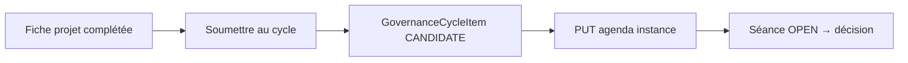
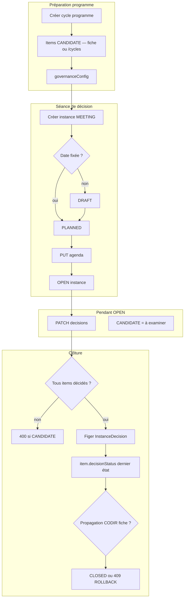
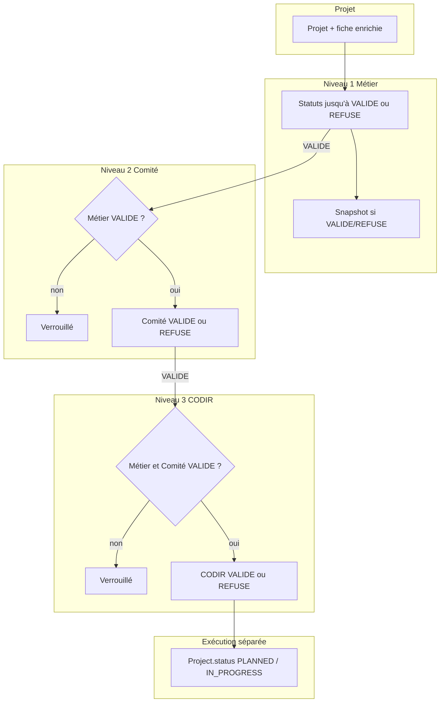
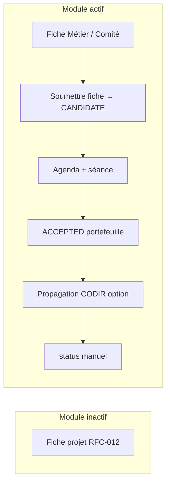

# RFC-PROJ-CYCLE-003 — Governance Cycle Instances and Configurable Propagation

## Statut

**Implémenté** — 2026-06-01 (lots **003-A** à **003-F** livrés ; **003-G** décideurs nommés hors scope).  
**Dernière synchro doc ↔ code** : 2026-06-01 (préparation séance FE, règles agenda candidats, `PATCH` instance `DRAFT`→`PLANNED`).  
Évolution V2 du module cycles de pilotage : instances de décision + propagation paramétrable.

**Référence code** : `apps/api/src/modules/governance-cycles/` (`governance-cycle-instances.service.ts`, `governance-cycle-propagation.service.ts`, `governance-cycle-readiness.service.ts`, `lib/governance-cycle-config.schema.ts`, `lib/governance-cycle-agenda.util.ts`, `lib/governance-cycle-item-status.util.ts`) ; migrations `20260601120000_governance_cycle_instances`, `20260601130000_budget_governance_decision` ; UI `apps/web/src/features/governance-cycles/` (`governance-cycle-instances-tab.tsx`, `instance-decision-panel.tsx`, `instance-session-preparation.tsx`, `lib/governance-cycle-agenda-candidates.ts`, candidature fiche) ; **92** tests Jest module API.

**Prérequis** : [RFC-PROJ-CYCLE-001](./RFC-PROJ-CYCLE-001%20%E2%80%94%20Governance%20Cycles%20Core%20Backend.md) (B1–B9 livrés), [RFC-FE-PROJ-CYCLE-001](./RFC-FE-PROJ-CYCLE-001%20%E2%80%94%20Governance%20Cycles%20Frontend%20UI.md), [RFC-PROJ-CYCLE-002](./RFC-PROJ-CYCLE-002%20%E2%80%94%20Project%20Integration%20for%20Governance%20Cycles.md).

**Plan d’exécution** : [_Plan de développement - Cycles de pilotage.md](./_Plan%20de%20d%C3%A9veloppement%20-%20Cycles%20de%20pilotage.md) (§4.6).

**Dépend de** : [RFC-PROJ-001](./RFC-PROJ-001%20%E2%80%94%20Cadrage%20fonctionnel%20du%20module%20Projets.md), [RFC-013](./RFC-013%20%E2%80%94%20Audit%20logs.md), [RFC-011](./RFC-011-roles-permissions-modules.md), [RFC-PROJ-012](./RFC-PROJ-012%20%E2%80%94%20Project%20Sheet.md), [RFC-015-2](./RFC-015-2%20%E2%80%94%20Budget%20Management%20Backend.md) (trace `BudgetGovernanceDecision` — lot **003-E**).

**Phasage implémentation** (voir §4.10) : livraison **minimale** = **003-A + 003-B + 003-C** ; livraison **projet complète** = + **003-D** (config, readiness, propagation) ; **003-E** (budget), **003-F** (génération), **003-G** (décideurs nommés) = optionnels, ne bloquent pas le socle.

**Cas de référence produit** : programme « CODIR Projets & Budget 2026 » → candidature fiche (`CANDIDATE`) → instances par période (`periodLabel` T1…T4, `scheduledDecisionAt` = date de séance) → `GovernanceCycleInstanceDecision` figées à la clôture → `item.decisionStatus` = **dernière décision connue** → propagation **optionnelle** vers `arbitrationCodirStatus` uniquement si `WRITE_ARBITRATION_CODIR` — **jamais** `Project.status` ni `Budget.status`.

---

## 1) Analyse de l’existant

### 1.1 V1 livrée (RFC-PROJ-CYCLE-001 / FE-001 / 002)

- `**GovernanceCycle`** : un dossier unique par période (nom, `cadence`, `startDate`/`endDate`, `status` global).
- `**GovernanceCycleItem**` : candidats (projet, budget, manuel…) avec `decisionStatus` et scores ; **pas de rattachement à une date de comité**.
- **Pas de sync** vers `Project` ni `Budget` (règle V1 explicite).
- **UI** `/cycles` : matrice d’arbitrage continue ; fiche projet : bloc lecture `by-project`.

### 1.2 Limites métier identifiées


| Besoin utilisateur                                  | V1                                                                                                             |
| --------------------------------------------------- | -------------------------------------------------------------------------------------------------------------- |
| Cadre réutilisable (ex. trimestre projets + budget) | Un cycle manuel par trimestre, ré-inscription des items                                                        |
| Date d’**instance** de décision                     | Dates optionnelles au niveau cycle seulement                                                                   |
| Décision à une séance / un moment                   | `decisionStatus` flottant sur tout le cycle ; libellé item `TO_ARBITRATE` peu clair vs **candidat à examiner** |
| Retour d’info projet / budget après validation      | Absent                                                                                                         |
| Paramétrage client (périmètre, propagation)         | Enum cadence + RBAC fixe                                                                                       |


### 1.3 Actifs réutilisables

- **Items** : `sourceType`, FK, scoring, `@@unique([cycleId, projectId])` — conservés au niveau **cycle** (portefeuille stable).
- `**ProjectReview`** (RFC-PROJ-013) : pattern date + participants + finalize — inspiration pour mode **réunion** (sans coupler au module projet).
- **Arbitrage fiche projet** : `arbitrationMetierStatus` / `arbitrationComiteStatus` / `arbitrationCodirStatus` — cible possible de propagation **configurable** (éviter double saisie manuelle).

---

## 2) Hypothèses eventuelles

- **Cycle = programme** : conteneur de longue durée (ex. « CODIR Projets & Budget 2026 », cadence trimestrielle). Les **instances** portent les moments de décision (T1, T2…).
- **Items au niveau cycle** ; **décisions au niveau instance** : chaque arbitrage daté produit une ligne `**GovernanceCycleInstanceDecision`** (source de vérité **historique**). `GovernanceCycleItem.decisionStatus` n’est **jamais** l’historique — uniquement le **dernier état connu** pour listes / matrice / `by-project`. Item **pas encore tranché** : `**CANDIDATE`** uniquement (pas `TO_ARBITRATE` — voir lexique §4.1).
- **Paramétrable** : périmètre (`allowedSourceTypes`), mode d’instance par défaut, règles de propagation — stockées sur le cycle (V2.0) puis évoluant vers admin studio (V2.1).
- **Propagation désactivée par défaut** (`NONE`) pour les clients qui ne veulent que la trace CODIR.
- **Pas de moteur BPM**, **pas de vote avancé**, **pas de `WRITE_PROJECT_STATUS`** ni sync `Budget.status` (§4.10 — hors plan).
- **Candidature fiche** (flux C) et **séances** (flux A) sont des actions distinctes de l’arbitrage 3 niveaux (flux B).
- **Compatibilité V1** : cycles existants sans instance = comportement actuel jusqu’à migration optionnelle (« instance implicite unique » hors scope MVP — documenter en migration manuelle si besoin).
- Multi-client inchangé : `clientId` jamais en body write ; toutes les FK vérifiées.

---

## 3) Liste des fichiers à créer / modifier

**Règle** : une PR = **un lot** (§4.10). Ne pas mélanger candidature (003-C), décision (003-B), propagation (003-D), budget (003-E) ni décideurs (003-G) dans la même livraison.

### Lot 003-A — instances + agenda

**Backend** : migration Prisma instances/agenda ; `governance-cycle-instances.*` ; DTO create/update instance ; `governance-cycle-instance-labels.util.ts`.

**Frontend** : `governance-cycle-instances-tab.tsx` (création séance inline, liste, sélection auto première séance), `instance-decision-panel.tsx`, `instance-session-preparation.tsx`, API/hooks `governance-cycle-instances.*` ; extension `governance-cycle-detail-page.tsx` (onglet Séances, lien vers Arbitrage).

### Lot 003-B — décisions + clôture (sans propagation)

**Backend** : `upsert-instance-item-decisions.dto.ts` ; extension `close` (figement `InstanceDecision`, MAJ `item.decisionStatus`) ; **pas** de `governance-cycle-propagation.service.ts` dans ce lot.

**Frontend** : `instance-decision-panel.tsx` (préparation ODJ + décisions OPEN + clôture).

### Lot 003-C — candidature fiche uniquement

**Backend** :

- `apps/api/prisma/seed.ts` — permission `**governance_cycles.propose`**
- `dto/submit-project-to-cycle.dto.ts`
- route handler `POST …/candidacies` (+ spec)
- helper `isGovernanceCyclesModuleActive(clientId)` si absent

**Frontend** :

- bouton **« Soumettre au cycle de pilotage »** dans `project-sheet-view.tsx` (visible si `propose` + module actif)

**Interdit dans 003-C** : `governanceConfig`, `readinessRules`, propagation, `InstanceDecision`, modification `arbitrationCodirStatus` / `Project.status`, UI séances complète, décideurs.

### Lot 003-D — config + readiness + propagation projet

**Backend** : `governance-cycle-config.schema.ts`, `governance-cycle-readiness.service.ts`, `governance-cycle-propagation.service.ts` ; extension `POST …/close` (readiness + `WRITE_ARBITRATION_CODIR`) ; `update-governance-cycle-config.dto.ts`.

**Frontend** : panneau config cycle (minimal) ; pas obligatoire pour valider 003-D côté API.

### Lot 003-E — budget (optionnel)

**Backend** : migration `BudgetGovernanceDecision` **séparée** ; propagation budget dans `close`.

### Lot 003-F — génération instances (optionnel)

**Backend** : `POST …/instances/generate` ; consommation `instanceSchedule` (§4.2).

### Lot 003-G / RFC séparée — décideurs nommés

**Hors fichiers de cette RFC** pour les lots A–F — voir §4.12.

### Modifier (commun)

- `apps/api/prisma/schema.prisma` — modèles §4.4 (sans tables décideurs)
- `apps/api/src/modules/governance-cycles/governance-cycles.module.ts`, `governance-cycles.service.ts`, `governance-cycles.types.ts`, specs
- `docs/API.md` §5.8
- `project-governance-cycles-presence-block.tsx` — enrichissement lecture (peut suivre 003-A ou 003-D, pas bloquant 003-C)

### Documentation

- `docs/RFC/_Plan de développement - Cycles de pilotage.md`
- `docs/RFC/_RFC Liste.md`
- `docs/ARCHITECTURE.md` (§ module governance-cycles)

---

## 4) Implémentation complète

### 4.0 Synthèse normative — checklist avant implémentation

Cette section consolide les règles **non ambiguës** entre fiche projet, candidature, séance et propagation. Le détail technique est dans les § suivants.


| #     | Règle produit                                                                                                                                                                   | Norme RFC          | Réf. détail |
| ----- | ------------------------------------------------------------------------------------------------------------------------------------------------------------------------------- | ------------------ | ----------- |
| **1** | **Candidature depuis la fiche** : fiche complétée → **« Soumettre au cycle de pilotage »** → upsert item `CANDIDATE` → **non décidé** → agenda = action **séparée**             | Lot **003-C** seul | §4.11.1     |
| **2** | **Quatre objets distincts** (programme / séance / historique figé / dernière décision connue)                                                                                   | Normatif           | §4.1        |
| **3** | `**periodLabel`** ≠ `**scheduledDecisionAt**`                                                                                                                                   | Normatif           | §4.4, §4.6  |
| **4** | Fiche prépare ; cycle décide ; **pas** de lancement auto projet ; `arbitrationCodir` **uniquement** si `WRITE_ARBITRATION_CODIR` à la clôture (**003-D**)                       | Normatif           | §4.2, §4.8  |
| **5** | Pas de double CODIR                                                                                                                                                             | Normatif           | §4.8.1      |
| **6** | Phasage : **A+B+C** minimal → **+D** projet complet → E/F/G optionnels                                                                                                          | §4.10              |             |
| **7** | Hors plan : `WRITE_PROJECT_STATUS`, `Budget.status` auto, vote, BPM, 4ᵉ niveau fiche                                                                                            | Interdit           | §4.10       |
| **8** | Clôture **003-B** : étapes 1–6 (OPEN → agenda → pas de `CANDIDATE` → décisions finales → `item.decisionStatus` → `CLOSED`) ; **003-D/E** : échec readiness/propagation → `OPEN` | Normatif           | §4.6        |
| **9** | Libellés UI (Candidat, Dernière décision connue, Séance, etc.)                                                                                                                  | Normatif           | §4.9        |


```text
[Fiche] ──003-C Soumettre──► Item CANDIDATE ──003-A agenda──► Séance OPEN
         ──003-B close──► InstanceDecision + dernière décision connue
         ──003-D (option) propagation──► arbitrationCodir
         ✗ Project.status (jamais auto)
```

### 4.1 Modèle métier cible

```text
GovernanceCycle (programme de pilotage — longue durée)
  ├── governanceConfig
  ├── items[] : candidats au programme (inscription portefeuille)
  │     └── decisionStatus : Dernière décision connue (miroir — pas l’historique)
  └── instances[] (séances / moments de décision)
        ├── periodLabel (+ periodStartDate / periodEndDate optionnels) — période pilotée
        ├── scheduledDecisionAt — date/heure de la séance uniquement
        ├── mode, status
        └── decisions[] : GovernanceCycleInstanceDecision — historique figé par séance
```

#### Distinction normative des objets (à ne pas confondre)


| Objet                                    | Rôle métier                                                                                      | Analogie                             | Historique ?                                             |
| ---------------------------------------- | ------------------------------------------------------------------------------------------------ | ------------------------------------ | -------------------------------------------------------- |
| `**GovernanceCycle**`                    | **Programme** de pilotage (ex. « CODIR Projets & Budget 2026 ») — cadre, items candidats, config | Portefeuille annuel                  | Non (état global programme : `GovernanceCycle.status`)   |
| `**GovernanceCycleInstance`**            | **Séance de décision** datée — ordre du jour, arbitrage à un moment T                            | « CODIR du 15 avril » / « T2 2026 »  | Non — statut séance (`DRAFT`…`CLOSED`)                   |
| `**GovernanceCycleInstanceDecision`**    | Décision **figée** pour un item **dans** une instance clôturée                                   | PV de séance par projet              | **Oui** — source de vérité historique portefeuille CODIR |
| `**GovernanceCycleItem.decisionStatus`** | **Dernière décision connue** pour l’affichage (matrice, KPI, fiche, `by-project`)                | Badge « Retenu » sur le portefeuille | **Non** — dérivé de la dernière instance `CLOSED`        |


**Chaîne causale** : programme → item **candidat** (`CANDIDATE`) → inscription **agenda** d’une instance → décisions brouillon (`OPEN`) → figement (`InstanceDecision` + MAJ `item.decisionStatus`) à la **clôture**.

#### Règle de source de vérité (normative)


| Donnée                                         | Rôle                                                           | Écriture                                                                                                                                                  | Lecture historique                                          |
| ---------------------------------------------- | -------------------------------------------------------------- | --------------------------------------------------------------------------------------------------------------------------------------------------------- | ----------------------------------------------------------- |
| `**GovernanceCycleInstanceDecision`**          | Décision **portefeuille CODIR** pour un item dans une instance | Brouillon pendant `OPEN` (`PATCH …/decisions`) ; **figée** à la clôture (**003-B**+) avec `decidedAt` / `decidedByUserId`                                 | **Oui** — seule source pour l’historique CODIR portefeuille |
| `**GovernanceCycleItem.decisionStatus`**       | **Dernière décision connue** (affichage uniquement)            | À la clôture : copie de la décision figée de **cette** instance ; si plusieurs instances clôturées : reflète l’instance la plus récente (`closedAt` desc) | **Non** — libellé UI : *Dernière décision connue*           |
| `**Project.arbitrationCodirStatus`**           | Reflet **optionnel** fiche (flux B, niveau Sponsor/CODIR)      | **Uniquement** via propagation à la clôture si `propagation.project = WRITE_ARBITRATION_CODIR` (**003-D**) ; **jamais** en candidature (**003-C**)        | Snapshots fiche pour le dossier interne                     |
| `**BudgetGovernanceDecision`** (lot **003-E**) | Trace budget                                                   | Créée à la clôture si `propagation.budget = WRITE_BUDGET_GOVERNANCE_DECISION`                                                                             | **Oui** pour le budget                                      |


**Interdictions** :

- Ne jamais déduire l’historique depuis `GovernanceCycleItem.decisionStatus` seul.
- Ne jamais exposer `GovernanceCycleItem.decisionStatus` comme « historique des CODIR » — libellé UI : **Dernière décision connue** ; historique = `GovernanceCycleInstanceDecision`.
- Ne jamais modifier une `GovernanceCycleInstanceDecision` dont l’instance est `CLOSED` (sauf correction admin hors scope MVP).
- **Double décision CODIR** (§4.8.1) : interdire deux sources concurrentes pour la retenue portefeuille.

#### Lexique `GovernanceCycleItemDecisionStatus` (parcours instances — RFC-003)


| Valeur                                               | Rôle dans le cycle de pilotage                                                                         | UI (libellé FR cible)       |
| ---------------------------------------------------- | ------------------------------------------------------------------------------------------------------ | --------------------------- |
| `**CANDIDATE`**                                      | Inscrit au **programme** comme candidat — **pas encore décidé** (peut être hors agenda d’une instance) | **Candidat** / *À examiner* |
| `**ACCEPTED`**, `**DEFERRED**`, `**REJECTED**`, etc. | Décision **après** examen (clôture instance)                                                           | Retenu, Différé, Refusé…    |


`**TO_ARBITRATE` (item)** — enum conservé en base pour **compatibilité V1** (matrice `/cycles` historique) :

- **Ne plus utiliser** dans les écritures du parcours instances (create item, `PATCH …/decisions`, agenda) : préférer `**CANDIDATE`** pour tout item « pas encore décidé ».
- Le libellé legacy « À arbitrer » prête à confusion avec la transition de **cycle** `GovernanceCycleStatus.TO_ARBITRATE` (validation CODIR du **programme**) — ce sont deux objets différents.
- **Lecture / garde-fous** : si un item en base a encore `TO_ARBITRATE`, le service le traite comme `**CANDIDATE`** (normalisation à la lecture et pour la clôture d’instance).

**Distinction** : `GovernanceCycleStatus.TO_ARBITRATE` sur le **cycle** (programme) ≠ `GovernanceCycleItemDecisionStatus` sur l’**item** — ne pas renommer le statut de cycle.

**Rôles métier** : matrice détaillée des permissions §4.3 (proposer ≠ valider / refuser).

### 4.2 Configuration paramétrable (`governanceConfig` sur `GovernanceCycle`)

Colonne `**governanceConfig`** (`Json?` en base) — **stockage uniquement**. Lot **003-D** pour écriture validée ; colonne nullable dès **003-A** si besoin. Toute lecture / écriture passe par `**parseAndNormalizeGovernanceConfig()`** (`governance-cycle-config.schema.ts`) :

1. **Valider** le schéma (whitelist stricte).
2. **Appliquer les défauts** manquants.
3. **Persister la forme normalisée** (pas le payload brut utilisateur).
4. **Refuser** toute config invalide : `**400 Bad Request`** avec code stable `GOVERNANCE_CYCLE_CONFIG_INVALID` et détail champ (`allowedSourceTypes`, `propagation.budget`, etc.).

**Ne jamais** : lire `governanceConfig` depuis Prisma et l’exposer / l’utiliser sans normalisation.

```ts
/** Version du schéma — incrémenter si breaking change */
const GOVERNANCE_CYCLE_CONFIG_VERSION = 1;

type GovernanceCycleConfig = {
  version: 1;
  allowedSourceTypes: GovernanceCycleItemSourceType[]; // min 1, valeurs enum connues
  defaultInstanceMode?: GovernanceCycleInstanceMode; // défaut MEETING
  instanceSchedule?: {
    enabled: boolean;
    count?: number; // 1..12 si enabled
    firstDecisionAt?: string; // ISO date-time, requis si enabled
    stepMonths?: number; // 1..12, défaut 3
  };
  propagation: {
    project: 'NONE' | 'WRITE_ARBITRATION_CODIR';
    budget: 'NONE' | 'WRITE_BUDGET_GOVERNANCE_DECISION';
  };
  /** Lot 003-D — readiness à la clôture uniquement (pas en candidature 003-C) */
  readinessRules?: {
    enforceOnInstanceClose: boolean; // défaut false
    onAcceptedDecision?: {
      requireProjectSheetCockpitComplete?: boolean;
      requireArbitrationMetierValide?: boolean;
      requireArbitrationComiteValide?: boolean;
      requireSponsorOnProjectTeam?: boolean;
    };
  };
};
```

**Valeurs par défaut** (création cycle ou `governanceConfig` absent en base) :

```json
{
  "version": 1,
  "allowedSourceTypes": ["PROJECT", "BUDGET", "MANUAL"],
  "defaultInstanceMode": "MEETING",
  "propagation": { "project": "NONE", "budget": "NONE" }
}
```

**Hors MVP — ne pas implémenter** : `WRITE_PROJECT_STATUS` (ni enum Prisma, ni branche service, ni case dans le validateur). Toute valeur `propagation.project` autre que `NONE` | `WRITE_ARBITRATION_CODIR` → **400**. RFC ultérieure dédiée si besoin.

`instanceSchedule` : consommé uniquement par lot **003-F** (`POST …/instances/generate`).

**Propagation budget (lot 003-E — optionnel)** :

- `**NONE`** (défaut) : aucune trace budget.
- `**WRITE_BUDGET_GOVERNANCE_DECISION**` : création de lignes `**BudgetGovernanceDecision**` à la clôture — **sans** modification de `Budget.status` ni de versions budget figées.
- Pas d’autre mode budget en MVP.

**Rapport fiche projet ↔ cycle (normatif)** :


| Responsabilité                                       | Porteur                                                                                                                 |
| ---------------------------------------------------- | ----------------------------------------------------------------------------------------------------------------------- |
| Préparer le dossier (cockpit, Métier, Comité)        | **Fiche projet** ([RFC-PROJ-012](./RFC-PROJ-012%20%E2%80%94%20Project%20Sheet.md))                                      |
| Mettre en **candidature** au programme               | **Fiche projet** → §4.11.1 (**003-C**) → `GovernanceCycleItem` `CANDIDATE` — **sans** propagation ni `InstanceDecision` |
| Décider la **retenue portefeuille**                  | **Instance** → `GovernanceCycleInstanceDecision`                                                                        |
| Reflet CODIR sur la fiche (`arbitrationCodirStatus`) | **Uniquement** si `propagation.project = WRITE_ARBITRATION_CODIR` à la clôture — **aucune** écriture fiche si `NONE`    |
| Décision cycle **ne lance pas** le projet            | `ACCEPTED` portefeuille ≠ `Project.status` ; pas de `WRITE_PROJECT_STATUS`                                              |
| Lancer l’exécution                                   | `**Project.status`** — action manuelle séparée ; **jamais** automatique depuis le cycle                                 |


**Propagation ≠ candidature** : la candidature (**003-C**) rend le projet **candidat** uniquement. La propagation projet s’exécute **uniquement** dans `POST …/close` (**003-D**), après validation du flux **003-A + 003-B + 003-C**.

**Mapping décision → effet projet** (si et seulement si `WRITE_ARBITRATION_CODIR`, lot **003-D**) — enum `ProjectArbitrationLevelStatus` : `BROUILLON`, `EN_COURS`, `SOUMIS_VALIDATION`, `VALIDE`, `REFUSE` :


| `decisionStatus` instance | `arbitrationCodirStatus` | Note                                                                                 |
| ------------------------- | ------------------------ | ------------------------------------------------------------------------------------ |
| `ACCEPTED`                | `VALIDE`                 | —                                                                                    |
| `REJECTED`                | `REFUSE`                 | —                                                                                    |
| `DEFERRED`                | `BROUILLON`              | + `decisionReason` obligatoire recommandé                                            |
| `NEEDS_INFORMATION`       | `EN_COURS`               | —                                                                                    |
| `CANDIDATE`               | —                        | **Pas de propagation** — clôture d’instance interdite tant que l’item reste candidat |
| `ACCEPTED_WITH_RESERVE`   | `VALIDE`                 | + mention dans `decisionReason` / note COPIL si besoin                               |


Recalcul de `arbitrationStatus` dérivé : réutiliser la logique existante fiche projet (`ProjectSheetService`).

Si `propagation.project = NONE` : la clôture **ne modifie aucun** champ `arbitration*` sur `Project` — la décision portefeuille reste uniquement dans `GovernanceCycleInstanceDecision` + `item.decisionStatus`.

**API `PATCH /api/governance-cycles/:id`** : champ optionnel `governanceConfig` ; réponse cycle inclut toujours la config **normalisée** (pas le JSON brut DB si divergent).

### 4.3 RBAC — Qui peut proposer, valider ou refuser

**Principe** : le module `governance_cycles` est **restreint par permissions RBAC** ([RFC-011](./RFC-011-roles-permissions-modules.md), [RFC-PROJ-CYCLE-001](./RFC-PROJ-CYCLE-001%20%E2%80%94%20Governance%20Cycles%20Core%20Backend.md)). **Tout le monde ne peut pas** proposer un candidat ni trancher au CODIR. Guards sur **chaque** route ; UI masque les actions sans permission.

#### Permissions (catalogue V2)


| Permission                    | Sens métier                                                                                                   | Qui typiquement (profil client)                  |
| ----------------------------- | ------------------------------------------------------------------------------------------------------------- | ------------------------------------------------ |
| `governance_cycles.read`      | Consulter programmes, séances, matrice, bloc fiche (lecture seule)                                            | Direction, CODIR invité, CP, PMO                 |
| `governance_cycles.create`    | Créer un **programme** (`GovernanceCycle`)                                                                    | PMO / gestionnaire portefeuille                  |
| `governance_cycles.propose`   | **Proposer** — inscrire un candidat au programme (projet, budget, manuel) **sans** décider                    | Chef de projet, PMO, responsable budget          |
| `governance_cycles.update`    | **Préparer** — modifier programme, instances, agenda, scores, config ; **pas** de décision finale séance      | Gestionnaire cycles / PMO                        |
| `governance_cycles.arbitrate` | **Valider / refuser / différer** — décisions en séance `OPEN`, **clôture** instance, propagation à la clôture | Membres CODIR, DSI, DAF selon gouvernance client |
| `governance_cycles.delete`    | Archiver programme ou ressources admin                                                                        | Admin client / PMO senior                        |


**Lot 003-C** : ajoute `**governance_cycles.propose`** (seed + route candidature + bouton fiche). `**arbitrate**` reste en **003-B** / **003-D** (clôture). Un chef de projet peut **soumettre** sans clôturer ni propager.

#### Matrice action → permission (normative)


| Action utilisateur                                                      | Permission requise                                                                                       | **Interdit** sans elle                                                                                            |
| ----------------------------------------------------------------------- | -------------------------------------------------------------------------------------------------------- | ----------------------------------------------------------------------------------------------------------------- |
| Voir `/cycles`, bloc fiche, `by-project`                                | `read`                                                                                                   | **403** ; UI masquée                                                                                              |
| Créer programme                                                         | `create`                                                                                                 | **403**                                                                                                           |
| **Soumettre au cycle** (fiche, §4.11.1)                                 | `**propose`**                                                                                            | **403** `GOVERNANCE_CYCLES_PROPOSE_FORBIDDEN`                                                                     |
| Ajouter item projet/budget (`POST …/items`)                             | `**propose`** ou `create`                                                                                | **403** — préférer `**propose`** pour items métier ; `create` réservé création programme + premier peuplement PMO |
| Modifier titre/scores item (hors décision)                              | `update`                                                                                                 | **403**                                                                                                           |
| Créer / modifier séance, `PUT agenda`, `open`                           | `update`                                                                                                 | **403**                                                                                                           |
| Saisir décision séance (`PATCH …/decisions`) : Retenu, Refusé, Différé… | `**arbitrate`**                                                                                          | **403**                                                                                                           |
| **Clôturer** séance (`POST …/close`)                                    | `**arbitrate`**                                                                                          | **403**                                                                                                           |
| Propagation projet/budget (à la clôture)                                | `**arbitrate`** (même handler `close`)                                                                   | pas de clôture                                                                                                    |
| Modifier `governanceConfig`                                             | `update`                                                                                                 | **403**                                                                                                           |
| Archiver programme                                                      | `delete`                                                                                                 | **403**                                                                                                           |
| Transition programme V1 `TO_ARBITRATE` / `CLOSED` (cycle parent)        | `arbitrate` **ou** `update` selon politique — **défaut RFC** : `arbitrate` pour verrouiller le programme | **403** si lecture seule                                                                                          |


**Valider / invalider** (vocabulaire produit) :


| Verbe UI                              | Effet technique                                                          | Permission  |
| ------------------------------------- | ------------------------------------------------------------------------ | ----------- |
| **Valider** (retenir)                 | `ACCEPTED` / `ACCEPTED_WITH_RESERVE` sur `InstanceDecision` puis clôture | `arbitrate` |
| **Refuser** (invalider)               | `REJECTED`                                                               | `arbitrate` |
| **Différer**                          | `DEFERRED`                                                               | `arbitrate` |
| **Proposer** (mettre au portefeuille) | Item `CANDIDATE` — **pas** une validation CODIR                          | `propose`   |


#### Règles d’enforcement backend

1. `**RequirePermissions`** (ou équivalent) sur chaque route §4.5 — jamais se fier au masquage UI.
2. **Séparation PATCH item V1** (RFC-001) : champs `decisionStatus` / `decisionReason` sur item → `**arbitrate`** uniquement ; champs édition → `**update**`. Pendant une instance `**OPEN**`, si l’item est à l’**agenda**, les décisions passent par `**PATCH …/instances/…/decisions`** (`arbitrate`) — **interdit** de court-circuiter via `PATCH …/items/:id` (**400** `GOVERNANCE_CYCLE_ITEM_DECISION_LOCKED_BY_INSTANCE`).
3. `**POST …/candidacies`** : `**propose**` uniquement (retirer le cumul `create`  `update` pour les chefs de projet).
4. **Scope client** : inchangé — permissions évaluées dans le **client actif** ; `platform_admin` hors scope métier sauf écran plateforme dédié.
5. **Pas de permission implicite** : `arbitrate` **n’implique pas** `propose` ; `update` **n’implique pas** `arbitrate`.
6. **Audit** (RFC-013) : `decidedByUserId` / `closedByUserId` = utilisateur authentifié ayant `**arbitrate`** ; candidature = audit `governance_cycle.candidacy.submitted` avec auteur `**propose**`.

#### Profils recommandés (seed / admin client)


| Profil                        | read | create | propose | update | arbitrate | delete |
| ----------------------------- | ---- | ------ | ------- | ------ | --------- | ------ |
| **Lecture CODIR**             | ✓    |        |         |        |           |        |
| **Chef de projet**            | ✓    |        | ✓       |        |           |        |
| **Gestionnaire cycles (PMO)** | ✓    | ✓      | ✓       | ✓      |           | ✓      |
| **Membre CODIR / arbitrage**  | ✓    |        |         |        | ✓         |        |
| **DSI / admin portefeuille**  | ✓    | ✓      | ✓       | ✓      | ✓         | ✓      |


Les profils sont **configurables** par le admin client (RFC-011) ; le tableau ci-dessus est la **cible produit par défaut** au seed.

#### Frontend (par lot)

- **003-C** : bouton **« Soumettre au cycle de pilotage »** si `propose` + module actif (§4.11.1).
- **003-B** : panneau décisions / **Clôturer** si `arbitrate` et instance `OPEN`.
- **003-A** : onglet séances, agenda — pas de clôture ni candidature fiche dans ce lot.

### 4.4 Modifications Prisma

#### Enums

```prisma
enum GovernanceCycleInstanceMode {
  MEETING           // réunion CODIR — PV, participants optionnels MVP
  DECISION_RECORD   // décision hors séance (circulaire, async)
  VOTE              // hors MVP — placeholder ; pas de scrutin (§4.8)
}

enum GovernanceCycleInstanceStatus {
  DRAFT      // préparation : periodLabel et scheduledDecisionAt encore optionnels
  PLANNED    // séance programmée : periodLabel + scheduledDecisionAt obligatoires
  OPEN       // séance / arbitrage en cours
  CLOSED     // décisions figées (lot 003-B+)
  CANCELLED  // annulée sans effet
  ARCHIVED   // masquée (depuis CLOSED) — pas de suppression physique
}
```

**Période pilotée vs date de séance** (champs distincts sur `GovernanceCycleInstance`) :


| Champ                                       | Rôle                                                                 | Contrainte                                                              |
| ------------------------------------------- | -------------------------------------------------------------------- | ----------------------------------------------------------------------- |
| `**periodLabel`**                           | **Période arbitrée** — ex. `T1 2026`, `T2 2026`, `Budget 2026`       | **Obligatoire** dès `status` ≥ `PLANNED`                                |
| `**periodStartDate`** / `**periodEndDate**` | Bornes calendaires de la période pilotée (reporting, filtres)        | Optionnels                                                              |
| `**scheduledDecisionAt**`                   | **Date de décision** — jour/heure de la séance CODIR                 | Obligatoire si `status` ≥ `PLANNED` ; **ne remplace pas** `periodLabel` |
| `**label`**                                 | Libellé court optionnel de la séance (ex. « CODIR projets — avril ») | Optionnel ; distinct de `periodLabel`                                   |


**Pourquoi `DRAFT` et pas seulement `PLANNED` ?**  
`PLANNED` engage `periodLabel`, la date de séance et l’affichage calendrier. `DRAFT` permet de préparer mode, agenda provisoire et période **sans** engagement officiel.

**Pourquoi `ARCHIVED` sur l’instance ?**  
Le cycle parent peut rester actif (`IN_EXECUTION`) alors que d’anciennes instances clôturées doivent disparaître des listes par défaut sans perdre l’historique `InstanceDecision`. L’archivage du **cycle** (`GovernanceCycle.status = ARCHIVED`) reste la fin de programme ; l’archivage d’**instance** est un masquage granulaire.

#### Modèles

```prisma
model GovernanceCycleInstance {
  id                   String                        @id @default(cuid())
  clientId             String
  cycleId              String
  periodLabel          String?                       // période arbitrée — obligatoire si status >= PLANNED
  periodStartDate      DateTime?                     @db.Date
  periodEndDate        DateTime?                     @db.Date
  label                String?                       // libellé séance optionnel (≠ periodLabel)
  scheduledDecisionAt  DateTime?                     // date/heure de la séance — obligatoire si status >= PLANNED
  endsAt               DateTime?
  mode                 GovernanceCycleInstanceMode   @default(MEETING)
  status               GovernanceCycleInstanceStatus @default(DRAFT)
  locationLabel        String?
  meetingUrl           String?
  decisionSummary      String?
  openedAt             DateTime?
  closedAt             DateTime?
  closedByUserId       String?
  createdAt            DateTime                      @default(now())
  updatedAt            DateTime                      @updatedAt

  client   Client          @relation(...)
  cycle    GovernanceCycle @relation(...)
  closedBy User?           @relation(...)
  decisions GovernanceCycleInstanceDecision[]
  agendaItems GovernanceCycleInstanceAgendaItem[]

  @@index([clientId])
  @@index([cycleId])
  @@index([clientId, cycleId, scheduledDecisionAt])
}

model GovernanceCycleInstanceDecision {
  id               String                            @id @default(cuid())
  clientId         String
  instanceId       String
  itemId           String
  decisionStatus   GovernanceCycleItemDecisionStatus
  decisionReason   String?
  decidedAt        DateTime?
  decidedByUserId  String?
  createdAt        DateTime                          @default(now())
  updatedAt        DateTime                          @updatedAt

  instance GovernanceCycleInstance @relation(...)
  item     GovernanceCycleItem     @relation(...)
  decidedBy User? @relation(...)

  @@unique([instanceId, itemId])
  @@index([clientId])
  @@index([itemId])
}

// MVP agenda : quels items sont à l'ordre du jour de cette instance
model GovernanceCycleInstanceAgendaItem {
  id         String @id @default(cuid())
  clientId   String
  instanceId String
  itemId     String
  sortOrder  Int    @default(0)

  instance GovernanceCycleInstance @relation(...)
  item     GovernanceCycleItem     @relation(...)

  @@unique([instanceId, itemId])
}
```

**Hors migration lots 003-A / 003-B / 003-C / 003-D** : le modèle budget ci-dessous est livré **uniquement** en **003-E** (fichier SQL séparé). Les lots A–D ne référencent **aucune** FK ni import Prisma vers `BudgetGovernanceDecision`.

#### Modèle budget (lot **003-E** uniquement — migration séparée)

```prisma
/// Lot 003-E — trace décisionnelle budget (MVP). Ne modifie pas Budget.status.
model BudgetGovernanceDecision {
  id              String                            @id @default(cuid())
  clientId        String
  budgetId        String
  instanceId      String
  itemId          String                            // GovernanceCycleItem (sourceType BUDGET)
  decisionId      String                            // GovernanceCycleInstanceDecision.id
  decisionStatus  GovernanceCycleItemDecisionStatus
  decisionReason  String?
  decidedAt       DateTime
  decidedByUserId String?
  createdAt       DateTime                          @default(now())

  client   Client                            @relation(...)
  budget   Budget                            @relation(...)
  instance GovernanceCycleInstance           @relation(...)
  item     GovernanceCycleItem               @relation(...)
  decision GovernanceCycleInstanceDecision   @relation(fields: [decisionId], references: [id], onDelete: Cascade)

  @@unique([decisionId])
  @@index([clientId, budgetId, decidedAt])
  @@index([instanceId])
  @@index([itemId])
}
```

**Extension `GovernanceCycle`** :

```prisma
governanceConfig Json? // forme normalisée — écriture validée lot 003-D (voir §4.2)
```

**Relation** : `GovernanceCycle.instances GovernanceCycleInstance[]`

**Hors schéma RFC-003 (lots A–F)** : tables décideurs nommés — §4.12.

`**GovernanceCycleItem.decisionStatus`** (rappel §4.1) :

- Reste le **dernier état connu** pour l’UI portefeuille.
- À la clôture d’instance (**003-B**) : pour chaque item de l’agenda, **upsert** `GovernanceCycleInstanceDecision` (historique) puis **assigner** `item.decisionStatus = decision.decisionStatus` de cette instance.
- En cas de plusieurs instances clôturées : `item.decisionStatus` reflète l’instance clôturée la plus récente (`closedAt` desc).

### 4.5 Endpoints API (sous `/api/governance-cycles`)

Tous : guards standards + module `governance_cycles`. Déclarer routes `**instances` avant routes ambiguës** si nécessaire.


| Méthode | Route                                       | Permission           | Description                                                                                                                                                             |
| ------- | ------------------------------------------- | -------------------- | ----------------------------------------------------------------------------------------------------------------------------------------------------------------------- |
| `GET`   | `/:cycleId/instances`                       | `read`               | Liste instances (tri `scheduledDecisionAt` ; exclut `ARCHIVED` sauf `includeArchived=true`)                                                                             |
| `POST`  | `/:cycleId/instances`                       | `create` ou `update` | Créer instance (programmation rapide)                                                                                                                                   |
| `POST`  | `/:cycleId/instances/generate`              | `update`             | **003-F** — Générer N instances depuis `instanceSchedule`                                                                                                               |
| `GET`   | `/:cycleId/instances/:instanceId`           | `read`               | Détail + agenda ; `decisions[]` = `**GovernanceCycleInstanceDecision`** ; champ dérivé `itemCurrentDecisionStatus` = lecture `GovernanceCycleItem` (dernier état connu) |
| `PATCH` | `/:cycleId/instances/:instanceId`           | `update`             | Modifier `periodLabel`, dates période, `label`, `scheduledDecisionAt`, mode, lieu si `DRAFT` ou `PLANNED`                                                               |
| `POST`  | `/:cycleId/instances/:instanceId/open`      | `update`             | `PLANNED` → `OPEN` (`DRAFT` → **400** tant que `scheduledDecisionAt` absent)                                                                                            |
| `POST`  | `/:cycleId/instances/:instanceId/close`     | `arbitrate`          | **003-B** (étapes 1–6) ; **003-D** (+ readiness/propagation) — voir §4.6 ; **003-A** : route absente ou **501**                                                         |
| `POST`  | `/:cycleId/instances/:instanceId/archive`   | `update`             | `CLOSED` → `ARCHIVED`                                                                                                                                                   |
| `PUT`   | `/:cycleId/instances/:instanceId/agenda`    | `update`             | Remplacer liste `itemId[]` (ordre) — **003-A**                                                                                                                          |
| `PATCH` | `/:cycleId/instances/:instanceId/decisions` | `arbitrate`          | **003-B** — brouillon `InstanceDecision` pendant `OPEN`                                                                                                                 |
| `POST`  | `/:cycleId/candidacies`                     | `**propose`**        | **003-C** — §4.11.1 ; body `{ projectId }`                                                                                                                              |
| `PATCH` | `/:cycleId`                                 | `update`             | **003-D** — `governanceConfig` validé §4.2                                                                                                                              |


**Réponse instance (extrait)** :

```json
{
  "id": "…",
  "periodLabel": "T2 2026",
  "periodStartDate": "2026-04-01",
  "periodEndDate": "2026-06-30",
  "label": "CODIR projets — avril",
  "scheduledDecisionAt": "2026-04-15T14:00:00.000Z",
  "mode": "MEETING",
  "status": "PLANNED",
  "agendaCount": 12,
  "decidedCount": 0
}
```

`**GET …/by-project/:projectId**` (RFC-002 étendu) : `decisionStatus` = **dernière décision connue** (`GovernanceCycleItem`) ; ajouter `lastInstancePeriodLabel`, `lastInstanceScheduledDecisionAt`, `lastInstanceId` depuis la `**GovernanceCycleInstanceDecision`** la plus récente (instance `CLOSED`, pas `ARCHIVED`).

### 4.6 Règles métier instances

**Création rapide** (`POST instances`, **003-A**) :

- Requis en `DRAFT` : aucun (tous champs période/date optionnels).
- Pour créer directement en `PLANNED` : `periodLabel` + `scheduledDecisionAt` obligatoires ; optionnels : `periodStartDate`, `periodEndDate`, `label`, `mode` (défaut config).
- Statut initial : `DRAFT` si `periodLabel` ou `scheduledDecisionAt` absent ; sinon `PLANNED`.
- **Préremplissage agenda** (`seedInstanceAgendaFromCycleItems`, **003-A**) : à la création (`POST instances`) et à la génération trimestrielle (**003-F**), tous les items du cycle **éligibles** (voir ci-dessous) sont ajoutés à l’ODJ, triés par `priorityScore` desc. L’utilisateur peut ensuite restreindre via `PUT agenda`.

**Éligibilité ODJ** (agenda + UI préparation) :

- `sourceType` ∈ `{ PROJECT, BUDGET }` uniquement (pas `MANUAL`, etc.).
- `decisionStatus` « non décidé » : `CANDIDATE` ; legacy `TO_ARBITRATE` **lu** comme `CANDIDATE` (`normalizeItemDecisionStatusForRead`).
- `PUT …/agenda` : **400** si un `itemId` n’est pas éligible.
- Changement de statut item hors candidat (`PATCH …/items/:id` arbitrage) : retrait automatique de l’item des agendas des instances `DRAFT` / `PLANNED` / `OPEN` (`pruneItemFromMutableInstanceAgendas`).

**Passage `DRAFT` → `PLANNED`** (`PATCH`, **003-A**) : dès que `periodLabel` **et** `scheduledDecisionAt` sont renseignés sur une instance `DRAFT`, le service passe le statut à `PLANNED` (pas de transition dédiée côté API).

**Ouverture** (`OPEN`, **003-A**) :

- Cycle parent non `ARCHIVED`.
- Transition autorisée : `PLANNED` → `OPEN` uniquement.
- `periodLabel` et `scheduledDecisionAt` obligatoires.

**Arbitrage pendant `OPEN`** (**003-B**, `PATCH …/decisions`) :

- Upsert brouillon `**GovernanceCycleInstanceDecision`** (agenda uniquement, sinon **400**).
- **Ne pas** mettre à jour `GovernanceCycleItem.decisionStatus` tant que l’instance n’est pas `CLOSED`.
- Body mixte édition item cycle / décision instance → **400** (règle V1).

#### Règles de clôture (normatif — point 8 checklist §4.0)

1. **Impossible de clôturer** si un item à l’agenda est encore `**CANDIDATE`** (ou legacy `TO_ARBITRATE` lu comme candidat) → **400**.
2. Les décisions **acceptées / refusées / différées** (et autres statuts finaux §4.6 étape 3) sont **figées** dans `**GovernanceCycleInstanceDecision`** (`decidedAt`, `decidedByUserId`) — pas de clôture sans lignes complètes.
3. La clôture est **atomique** : une transaction ; pas de mi-clôture.
4. **Échec propagation** (**003-D** / **003-E**) → **ROLLBACK** intégral ; instance reste `**OPEN`** ; **409** — jamais `CLOSED` avec propagation partielle.

**Clôture** (`POST …/close`) — **transaction Prisma unique** :

**Lot 003-B** — étapes 1 à 6 uniquement (pas de propagation, pas de readiness config) :

```text
BEGIN
  1. Garde-fous : instance OPEN ; agenda non vide
  2. Impossible de clôturer si un item à l’agenda est encore CANDIDATE → 400
  3. Chaque item agenda : InstanceDecision finale
     ∈ { ACCEPTED, DEFERRED, REJECTED, NEEDS_INFORMATION, ACCEPTED_WITH_RESERVE }
  4. Figement : decidedAt / decidedByUserId sur chaque InstanceDecision
  5. item.decisionStatus := décision figée (dernière décision connue)
  6. instance.status := CLOSED ; closedAt ; closedByUserId
COMMIT
```

**Lot 003-D** — étend la même transaction **après** validation **003-A+B+C** en recette :

```text
  7. (option) readinessRules.enforceOnInstanceClose — §4.2
  8. (option) propagation projet WRITE_ARBITRATION_CODIR — §4.8
  9. Audits
  — échec étape 7 ou 8 → ROLLBACK ; instance reste OPEN ; 409
```

**Lot 003-E** — étend la transaction de clôture **après** les étapes 1–6 (003-B) : propagation budget + création `BudgetGovernanceDecision` (migration **003-E** séparée — §4.4).

**Politique transactionnelle (normative)** :


| Lot       | Comportement                                                                                         |
| --------- | ---------------------------------------------------------------------------------------------------- |
| **003-B** | Clôture **sans** propagation ni readiness — étapes 1–6 seules.                                       |
| **003-D** | Clôture **atomique** avec readiness + propagation projet si configuré — échec → `**OPEN`**, **409**. |
| **003-E** | Idem pour budget — **ne bloque pas** A/B/C/D.                                                        |


Idempotence : seconde clôture sur instance `CLOSED` → **409**.

**Annulation** : `CANCELLED` depuis `DRAFT` / `PLANNED` / `OPEN` — sans `InstanceDecision` figée ni propagation.

**Archivage instance** : `CLOSED` → `ARCHIVED` (**003-A** route archive) ; masquée des listes par défaut (`includeArchived=false`).

**Cycle parent** : clôture programme (`GovernanceCycle.status = CLOSED`) exige que toutes les instances soient `CLOSED`, `CANCELLED` ou `ARCHIVED` (pas de `OPEN` / `PLANNED` / `DRAFT` actifs).

### 4.8 Propagation aval (service dédié — lots **003-D** / **003-E**)

Exécutée **uniquement** à l’intérieur de `POST …/close` (**003-D** projet, **003-E** budget), **après** figement des `InstanceDecision` (étapes 003-B), dans la **même transaction**. **Jamais** lors de `POST …/candidacies` (**003-C**).

```ts
// governance-cycle-propagation.service.ts — appelé par closeInstance(), pas en async détaché
async applyInTransaction(
  tx: Prisma.TransactionClient,
  clientId: string,
  instanceId: string,
  config: NormalizedGovernanceCycleConfig,
  context: AuditContext,
): Promise<void>
```

**Projet** (`propagation.project = WRITE_ARBITRATION_CODIR`, **003-D**) :

- Pour chaque `GovernanceCycleInstanceDecision` dont l’item a `sourceType = PROJECT` :
  - Vérifier `projectId`, projet dans client.
  - Appliquer mapping §4.2 sur `arbitrationCodirStatus` ; recalcul `arbitrationStatus` via logique fiche projet.
  - Audit `governance_cycle.propagation.project` (avant / après).
- **Ne pas** modifier `Project.status` en MVP.

**Budget** (`propagation.budget = WRITE_BUDGET_GOVERNANCE_DECISION`, **003-E** optionnel) :

- Pour chaque décision dont l’item a `sourceType = BUDGET` :
  - Créer `**BudgetGovernanceDecision`** (trace dédiée) liée à `decisionId`, `budgetId`, `instanceId`.
  - **Interdit** : mutation de `Budget.status`, lignes versionnées figées, montants engagés.
  - Audit `governance_cycle.propagation.budget` (référence `BudgetGovernanceDecision.id`).

`**propagation.* = NONE`** : aucun appel propagation ; clôture = **étapes 1–6 du lot 003-B** uniquement, sans readiness ni propagation.

`**propagation.project = WRITE_ARBITRATION_CODIR` (003-D)** ou `**propagation.budget = WRITE_BUDGET_GOVERNANCE_DECISION` (003-E)** : la clôture exécute d’abord les étapes **1–6** (003-B), puis readiness/propagation ; **échec** → instance reste `**OPEN`** (§4.6). **Jamais** de propagation si instance ≠ `CLOSED`.

#### 4.8.1 Pas de double décision CODIR (portefeuille vs fiche) — checklist §4.0 point 5


| Question                                             | Réponse normative                                                                                                                                                                                                                                                                                              |
| ---------------------------------------------------- | -------------------------------------------------------------------------------------------------------------------------------------------------------------------------------------------------------------------------------------------------------------------------------------------------------------- |
| Source de vérité **historique CODIR portefeuille** ? | `**GovernanceCycleInstanceDecision`** uniquement                                                                                                                                                                                                                                                               |
| Qui décide la **retenue portefeuille** ?             | `**GovernanceCycleInstanceDecision`** (historique) + `**item.decisionStatus**` (dernière décision connue — **pas** l’historique)                                                                                                                                                                               |
| Rôle de `**arbitrationCodirStatus`** ?               | **Reflet optionnel** fiche — écrit **uniquement** par le cycle si `propagation.project = WRITE_ARBITRATION_CODIR` à la clôture ; **jamais** l’inverse (fiche ne crée pas `InstanceDecision`)                                                                                                                   |
| Saisie manuelle CODIR fiche après clôture cycle ?    | Autorisée pour le **dossier interne** (`projects.update`) mais **ne doit pas** être présentée comme décision portefeuille ; l’UI affiche la **dernière décision connue** cycle en priorité sur le bloc portefeuille                                                                                            |
| Conflit propagation vs fiche ?                       | Si propagation active : après clôture, `arbitrationCodirStatus` = mapping §4.2 ; toute modification manuelle ultérieure sur la fiche **n’écrase pas** `InstanceDecision` — pour corriger la retenue portefeuille, passer par une **nouvelle instance** ou correction admin hors MVP                            |
| Deux décisions contradictoires ?                     | **Interdit** côté produit : ne pas permettre `PATCH` direct sur `GovernanceCycleItem.decisionStatus` pour simuler une décision d’instance ; ne pas exposer deux badges « Retenu » / « Refusé » de sources différentes sans hiérarchie (priorité : **InstanceDecision clôturée** > fiche si propagation `NONE`) |


### 4.9 Frontend et libellés UI

**Onglet « Séances de décision »** sur `/cycles/[cycleId]` (`governance-cycle-instances-tab.tsx`) :

- **Colonne gauche** : formulaire inline **« Nouvelle séance »** (`periodLabel`, `datetime-local` date de décision) ; hint : période + date → séance **programmée** avec ODJ prérempli côté API ; bouton **« Générer le trimestre »** si `governanceConfig.instanceSchedule.enabled` ; liste des séances (libellé période, statut, date, `agendaCount`).
- **Colonne droite** (`instance-decision-panel.tsx` + `instance-session-preparation.tsx`) :
  - **Brouillon** : bloc « Programmer la séance » (`PATCH` instance : période + date → `PLANNED`).
  - **Préparation** (`DRAFT` / `PLANNED` / `OPEN`, permission `update`) : tableau **tous** les projets/budgets du cycle (`GET …/items`, `limit` max **100**) ; colonne ODJ (checkbox) si statut **Candidat** ; action **« Remettre en candidat »** (`PATCH …/items/:id` arbitrage, permission `arbitrate`) sinon ; boutons **Tous les candidats**, **Enregistrer l’ordre du jour** (`PUT agenda`), lien **Matrice d’arbitrage**.
  - **ODJ enregistré** : liste ordonnée (libellés métier, badge statut).
  - **Programmée** : **Ouvrir la séance** (`POST open`, ODJ non vide).
  - **Ouverte** : panneau décisions finales + **Clôturer** (`arbitrate`).
- Permissions : masquer préparation sans `update` ; décisions/clôture sans `arbitrate`.
- Règles affichage : [FRONTEND_UI-UX.md](../FRONTEND_UI-UX.md) — jamais d’UUID comme libellé principal.

**Fiche projet** (003-C) : bouton **« Soumettre au cycle de pilotage »** (`submit-project-to-cycle-dialog.tsx`) — pas de clôture ni propagation dans ce lot.

**Hors scope FE livré** : panneau admin dédié `governanceConfig` ; dialog séance séparé (création inline) ; pagination items cycle au-delà de 100 lignes dans l’UI séances (prévoir extension si portefeuilles très larges).

#### Libellés UI (normatifs — FR)


| Concept technique                                | Libellé UI                                                               |
| ------------------------------------------------ | ------------------------------------------------------------------------ |
| `GovernanceCycleItemDecisionStatus.CANDIDATE`    | **Candidat** / *À examiner*                                              |
| `GovernanceCycleItem.decisionStatus` (affichage) | **Dernière décision connue**                                             |
| `GovernanceCycleInstance`                        | **Séance de décision**                                                   |
| `scheduledDecisionAt`                            | **Date de décision**                                                     |
| `periodLabel`                                    | **Période arbitrée**                                                     |
| `GovernanceCycle` (liste)                        | **Programme de pilotage** (ou « Cycle de pilotage » selon menu existant) |


Règles UI : [FRONTEND_UI-UX.md](../FRONTEND_UI-UX.md) — libellés métier, pas d’UUID en colonnes.

### 4.10 Phasage livraison (lots courts — une PR par lot)


| Lot       | Périmètre **strict**                                                                                                                                  | Interdit dans ce lot                                                        |
| --------- | ----------------------------------------------------------------------------------------------------------------------------------------------------- | --------------------------------------------------------------------------- |
| **003-A** | Prisma instances + agenda ; CRUD instances ; `PUT agenda` ; `open` ; `archive` ; FE onglet séances (lecture + agenda)                                 | `close`, décisions, candidature, `governanceConfig`, propagation, décideurs |
| **003-B** | `PATCH …/decisions` (OPEN) ; `POST close` étapes 1–6 ; figement `InstanceDecision` ; MAJ `item.decisionStatus` ; FE panneau décisions + clôture       | propagation, readiness, candidature, config                                 |
| **003-C** | Voir checklist **§4.11.1** (candidature fiche **uniquement**)                                                                                         | tout le reste                                                               |
| **003-D** | `governanceConfig` + `readinessRules` ; extension `close` (readiness + propagation `WRITE_ARBITRATION_CODIR`) ; services config/readiness/propagation | budget, génération, décideurs, candidature                                  |
| **003-E** | Migration `BudgetGovernanceDecision` ; propagation budget à la clôture                                                                                | ne bloque pas A–D                                                           |
| **003-F** | `POST …/instances/generate`                                                                                                                           | vote avancé, BPM                                                            |
| **003-G** | **Hors RFC-003** — RFC séparée décideurs nommés (§4.12)                                                                                               | aucun fichier deciders dans A–F                                             |


#### Livraisons attendues


| Jalón               | Lots                                                  | Exploitable en prod ?                                                                                 |
| ------------------- | ----------------------------------------------------- | ----------------------------------------------------------------------------------------------------- |
| **Minimale**        | **003-A + 003-B + 003-C**                             | Oui — programme, séances, décisions, candidature fiche ; **sans** propagation fiche ni config avancée |
| **Projet complète** | **+ 003-D**                                           | Oui — + config, readiness optionnelle, reflet `arbitrationCodir` à la clôture                         |
| **Optionnelles**    | 003-E (budget), 003-F (génération), 003-G (décideurs) | Ne **bloquent pas** la minimale ni la complète projet                                                 |


**Ordre obligatoire** : **A → B → C** → (recette) **D** → optionnellement **E**, **F**, **G**.

**Propagation** : livrée en **003-D** uniquement, **après** validation du flux candidature + instance + décision (A+B+C).

#### Hors périmètre de ce plan (ne pas implémenter — checklist §4.0 point 7)


| Interdit                                                | Alternative prévue                                     |
| ------------------------------------------------------- | ------------------------------------------------------ |
| `**WRITE_PROJECT_STATUS`** / sync auto `Project.status` | Passage manuel `PLANNED` / `IN_PROGRESS` hors cycle    |
| Modification auto `**Budget.status**`                   | `BudgetGovernanceDecision` (**003-E**) si besoin trace |
| **Vote avancé** / scrutin                               | Mode `VOTE` = placeholder UX seulement                 |
| **Moteur BPM**                                          | Séances + statuts instance                             |
| **4ᵉ niveau** arbitrage fiche « acceptation programme » | Flux C : `GovernanceCycleItem` `CANDIDATE` (§4.11.1)   |


**Indépendance des lots (ne pas bloquer 003-A/B/C)** :

- Migrations et code des lots **003-A**, **003-B**, **003-C** et **003-D** ne doivent **pas** dépendre de `BudgetGovernanceDecision`, ni des tables **décideurs** (**003-G**), ni du service de propagation budget.
- Migration `**BudgetGovernanceDecision`** : lot **003-E** uniquement — fichier SQL **séparé**, déployable après socle **003-A/B/C(+D)** ; tant que **003-E** n’est pas déployé, `propagation.budget` reste forcé à `NONE` (validateur §4.2).
- Livraison **minimale** et **projet complète** (A+B+C ou +D) : **aucune** référence Prisma ni import vers `BudgetGovernanceDecision`.

### 4.11 Flux décisionnels — Candidature, instance CODIR, fiche projet

Trois étapes **séparées** : (C) candidature au programme, (A) décision portefeuille en séance, (B) arbitrage dossier fiche. Propagation **uniquement** à la clôture (**003-D**), pas en candidature.

#### 4.11.1 Lot **003-C** — périmètre strict (candidature fiche uniquement)

**Une PR 003-C ne contient que** :


| #   | Livrable                                                                                  |
| --- | ----------------------------------------------------------------------------------------- |
| 1   | Seed permission `**governance_cycles.propose`**                                           |
| 2   | `**POST /api/governance-cycles/:cycleId/candidacies**` + `submit-project-to-cycle.dto.ts` |
| 3   | Contrôle **module actif** `governance_cycles`                                             |
| 4   | Upsert `**GovernanceCycleItem`** avec `**decisionStatus = CANDIDATE**`                    |
| 5   | Audit `**governance_cycle.candidacy.submitted**`                                          |
| 6   | Bouton FE **« Soumettre au cycle de pilotage »** (visible si `propose` + module actif)    |


**Interdictions explicites (003-C)** :

- Créer ou modifier `**GovernanceCycleInstanceDecision`**
- Modifier `**arbitrationCodirStatus**`, `**arbitrationStatus**`, `**Project.status**`
- Appeler `**governance-cycle-propagation.service**`
- Écrire `**governanceConfig**` / `**readinessRules**`
- Routes `**…/deciders**`, modèles `**GovernanceCycleDecider**`
- `**POST …/close**` avec propagation
- UI séances complète, config cycle, readiness

#### 4.11.2 Flux C — Mise en candidature depuis la fiche projet

**Condition** : module `governance_cycles` actif (§4.13.1).

**Flux métier explicite (checklist §4.0 — point 1)** :


| Étape | Comportement                                                                                                      |
| ----- | ----------------------------------------------------------------------------------------------------------------- |
| 1     | **Fiche projet** complétée (recommandation UX — garde-fous readiness en **003-D**, §4.13.3)                       |
| 2     | Action utilisateur : **« Soumettre au cycle de pilotage »** (choix du programme si plusieurs)                     |
| 3     | **Création ou mise à jour** d’un `GovernanceCycleItem` avec `**decisionStatus = CANDIDATE`**                      |
| 4     | Le projet devient **candidat** au cycle — **pas encore décidé** (pas de `InstanceDecision`)                       |
| 5     | **Ajout à une instance / agenda** : action **séparée**, `PUT …/agenda`, permission `**update`** — hors de ce flux |


**Parcours technique** :

1. Étapes 1–2 ci-dessus.
2. API : `POST /api/governance-cycles/:cycleId/candidacies` — body `{ projectId }` ; permission `**governance_cycles.propose`** uniquement (§4.3).
3. Service :
  - Vérifier `projectId` dans le client actif ;
  - **Upsert** `GovernanceCycleItem` (`@@unique([cycleId, projectId])`) avec `sourceType = PROJECT`, `**decisionStatus = CANDIDATE`** ;
  - Si l’item existait avec une décision antérieure : repasser en `**CANDIDATE**` uniquement si politique produit l’autorise (sinon **409** `GOVERNANCE_CYCLE_ITEM_ALREADY_DECIDED`) — MVP : autoriser re-soumission seulement si dernière décision connue ∈ `{ CANDIDATE, DEFERRED, NEEDS_INFORMATION }`.
4. **Interdictions** : pas de `InstanceDecision` ; pas de `arbitrationCodir` ; pas de `Project.status` ; pas d’ajout agenda automatique.
5. **Action séparée** (gestionnaire cycles, **003-A**) : `PUT …/instances/:id/agenda`.

**Interdictions** :

- La soumission **ne crée pas** de `GovernanceCycleInstanceDecision`.
- La soumission **ne modifie pas** `arbitrationCodirStatus` ni `Project.status`.
- La soumission **n’ouvre pas** une instance.

**Hors 003-C** : pas de `readinessRules` ni blocage API à la candidature — readiness uniquement en **003-D** à la clôture (§4.13.3–4.13.4).




|                                      | **Flux C — Candidature** | **Flux A — Séance**               | **Flux B — Fiche**                      |
| ------------------------------------ | ------------------------ | --------------------------------- | --------------------------------------- |
| **Déclencheur**                      | Bouton fiche projet      | Gestionnaire cycles + CODIR       | Valideurs Métier / Comité / CODIR fiche |
| **Objet écrit**                      | `GovernanceCycleItem`    | `GovernanceCycleInstanceDecision` | `arbitrationMetier/Comite/CodirStatus`  |
| **Statut typique**                   | `CANDIDATE`              | `ACCEPTED`, `DEFERRED`, …         | `VALIDE` / `REFUSE`                     |
| **Décide la retenue portefeuille ?** | Non                      | **Oui**                           | Non (dossier interne)                   |


---


|                               | **Flux A — Instance décision (CODIR portefeuille)**       | **Flux B — Décision projet (fiche)**                                  |
| ----------------------------- | --------------------------------------------------------- | --------------------------------------------------------------------- |
| **Où**                        | `/cycles` → instance (`mode` MEETING / DECISION_RECORD)   | Fiche projet → arbitrage 3 niveaux                                    |
| **Périmètre**                 | N projets / budgets sur une **date** de comité            | **1** projet, dossier Métier → Comité → Sponsor/CODIR                 |
| **Historique**                | `GovernanceCycleInstanceDecision`                         | `ProjectSheetDecisionSnapshot`                                        |
| **État affiché portefeuille** | `GovernanceCycleItem.decisionStatus` (dernier état connu) | `arbitrationMetier/Comite/CodirStatus` + `Project.status` (exécution) |
| **« Validé » signifie**       | **Retenu** (`ACCEPTED`) pour cette instance / période     | **VALIDE** au niveau concerné sur le **dossier**                      |
| **Lance le projet ?**         | **Non** par défaut (pas `WRITE_PROJECT_STATUS`)           | **Non** automatiquement — `IN_PROGRESS` = action séparée              |


#### Flux A — Instance de décision type CODIR (cycle de pilotage)

**Acteurs** : gestionnaire cycles (`update` — prépare séance) ; membres CODIR (`arbitrate` — valident/refusent) ; chefs de projet (`propose` — candidature uniquement) — §4.3.

**Objets** : `GovernanceCycle` (programme) → `GovernanceCycleInstance` → items `PROJECT` / `BUDGET` / …




**Décisions item (après examen)** :


| Décision                | Sens                                                  |
| ----------------------- | ----------------------------------------------------- |
| `CANDIDATE`             | À examiner — pas encore tranché au CODIR portefeuille |
| `ACCEPTED`              | Retenu pour la période                                |
| `DEFERRED`              | Pas maintenant                                        |
| `REJECTED`              | Refusé pour la période                                |
| `NEEDS_INFORMATION`     | Complément demandé                                    |
| `ACCEPTED_WITH_RESERVE` | Retenu sous réserve                                   |


---

#### Flux B — Décision projet (fiche décisionnelle)

**Acteurs** : chef de projet (dossier), valideurs Métier / Comité / CODIR (`projects.update`).

**Objets** : `Project` — `arbitrationMetierStatus`, `arbitrationComiteStatus`, `arbitrationCodirStatus`, `Project.status`.




**Règle** : niveau N+1 débloqué seulement si niveau N = `VALIDE`.

---

#### Les deux flux ensemble

```mermaid
sequenceDiagram
  participant PMO as Gestionnaire cycles
  participant Inst as Instance CODIR
  participant Fiche as Fiche projet
  participant Exec as Exécution

  Fiche->>Fiche: Compléter dossier Métier / Comité
  Fiche->>PMO: Soumettre au cycle → Item CANDIDATE
  PMO->>Inst: PUT agenda — séance programmée
  Inst->>Inst: OPEN → décisions → clôture ACCEPTED
  Inst->>Fiche: si WRITE_ARBITRATION_CODIR → arbitrationCodir VALIDE

  Exec->>Exec: Project.status manuel — jamais auto

  Note over Inst,Exec: Candidature ≠ décision ; ACCEPTED cycle ≠ lancement
```


**Ordre métier recommandé** : fiche + Métier/Comité → **soumission candidature** (flux C) → inscription agenda → séance OPEN → clôture (+ propagation optionnelle) → `Project.status` manuel.

> **Module actif** : affichage fiche, prérequis `ACCEPTED` et garde-fous — §4.10 (pas de 4ᵉ niveau arbitrage).

### 4.12 Extension future — décideurs nommés (lot **003-G** ou RFC séparée)

**Hors socle immédiat** (lots **003-A à 003-F**). Ne **pas** créer dans ces lots :

- Modèles Prisma `GovernanceCycleDecider`, `GovernanceCycleInstanceDecider`
- Routes `GET/PUT …/deciders`
- DTO / services / composants `governance-cycle-deciders*`
- Champ `governanceConfig.deciders` ni `enforceOnInstanceArbitration`

**Intention produit (documentaire)** : permettre de **nommer plusieurs décideurs** par programme et par séance, en complément de RBAC `arbitrate` et du traçage `decidedByUserId` / `closedByUserId`. Spec détaillée dans une **RFC dédiée** ou lot **003-G** après stabilisation A+B+C(+D).

**MVP sans 003-G** : seul `**governance_cycles.arbitrate`** + audit décideur effectif.

### 4.13 Intégration fiche projet — **uniquement si le cycle de pilotage est actif**

Les règles ci-dessous **ne s’appliquent pas** par défaut à tous les clients Projets. Elles sont conditionnées à l’**activation du module cycles de pilotage** pour le client courant.

#### 4.13.1 Condition « cycle de pilotage actif »


| Critère                                      | Source technique                                                                                                                                                          | Si inactif                                                                                                                                                                                                       |
| -------------------------------------------- | ------------------------------------------------------------------------------------------------------------------------------------------------------------------------- | ---------------------------------------------------------------------------------------------------------------------------------------------------------------------------------------------------------------- |
| Module client `**governance_cycles`** activé | Même règle que la navigation (`moduleCode: governance_cycles`, cf. [RFC-FE-PROJ-CYCLE-001](./RFC-FE-PROJ-CYCLE-001%20%E2%80%94%20Governance%20Cycles%20Frontend%20UI.md)) | Aucun bloc fiche / Synthèse lié au cycle ; pas d’appel `GET …/by-project` côté UI ; pas d’application de `readinessRules` ; fiche projet = [RFC-PROJ-012](./RFC-PROJ-012%20%E2%80%94%20Project%20Sheet.md) seule |
| Permission utilisateur                       | `governance_cycles.read` pour afficher les blocs lecture                                                                                                                  | Bloc masqué (comportement identique module inactif pour l’utilisateur)                                                                                                                                           |


**Helper backend recommandé** : `isGovernanceCyclesModuleActive(clientId): boolean` — réutilisé par `GovernanceCyclesService` (clôture, `by-project`) et documenté dans `docs/ARCHITECTURE.md`.

**Hors scope** : activer un 4ᵉ niveau d’arbitrage fiche (`arbitrationProgrammeStatus` ou équivalent). L’**acceptation portefeuille** reste portée par le **flux A** (`GovernanceCycleItem` / `GovernanceCycleInstanceDecision`), pas par une carte supplémentaire dans l’arbitrage 3 niveaux.

#### 4.13.2 UI fiche projet (module actif uniquement)

Sur le workspace projet (`/projects/[projectId]`, onglets Synthèse / **Fiche projet** / …) :


| Emplacement                               | Contenu                                                                                                                                      | Comportement                                                                                                                                                                                                                                      |
| ----------------------------------------- | -------------------------------------------------------------------------------------------------------------------------------------------- | ------------------------------------------------------------------------------------------------------------------------------------------------------------------------------------------------------------------------------------------------- |
| **Synthèse**                              | Bloc existant [RFC-PROJ-CYCLE-002](./RFC-PROJ-CYCLE-002%20%E2%80%94%20Project%20Integration%20for%20Governance%20Cycles.md) enrichi (003)    | Lecture seule : cycles non archivés, `periodLabel`, **dernier** `decisionStatus` item, libellé **instance** + `scheduledDecisionAt` de la dernière instance **clôturée** si connue ; lien vers `/cycles/[cycleId]` (valeur métier, pas UUID seul) |
| **Fiche projet** (`ProjectSheetView`)     | Bouton **« Soumettre au cycle de pilotage »** (**003-C**, §4.11.1) ; carte présence lecture (peut suivre **003-A** ou **003-D**, hors 003-C) | Soumission : `**propose`** uniquement                                                                                                                                                                                                             |
| **Arbitrage 3 niveaux** (section B fiche) | **Inchangé** — Métier → Comité → Sponsor/CODIR                                                                                               | Pas de 4ᵉ carte ; **pas** de saisie « retenu portefeuille » ici — c’est le flux A                                                                                                                                                                 |


**Règle affichage** : les libellés de décision portefeuille utilisent le lexique item §4.1 (**Candidat** / *À examiner* pour `CANDIDATE`, pas « À arbitrer »).

#### 4.13.3 Dossier projet — contenu attendu avant `ACCEPTED` (instance — lot **003-D** readiness)

Distinction obligatoire :


| Action                                                            | Objet                                   | Prérequis fiche (recommandation produit)                                       |
| ----------------------------------------------------------------- | --------------------------------------- | ------------------------------------------------------------------------------ |
| **Soumettre au cycle** (§4.11.1, `POST …/candidacies`, **003-C**) | Item `CANDIDATE`                        | Pas de readiness obligatoire en 003-C                                          |
| Inscrire au programme (`POST …/items` depuis `/cycles`)           | Item `CANDIDATE`                        | Équivalent gestionnaire — même statut                                          |
| Inscrire à l’**agenda** (`PUT agenda`)                            | `GovernanceCycleInstanceAgendaItem`     | Item déjà `CANDIDATE` au programme — **action séparée** de la soumission fiche |
| **Retenir** à la clôture (`ACCEPTED`)                             | `GovernanceCycleInstanceDecision` figée | Cockpit + Métier/Comité si `readinessRules` actifs                             |


**Cockpit complet** (aligné [RFC-PROJ-012](./RFC-PROJ-012%20%E2%80%94%20Project%20Sheet.md) et UI `cockpitMissingLinesFromForm`) — champs projet :

- `businessProblem` (objectif métier / pourquoi) renseigné ;
- `estimatedCost` présent ;
- `businessValueScore`, `strategicAlignment`, `urgencyScore` renseignés (1–5) ;
- `estimatedGain` : **optionnel** (parcours ROE sans ROI chiffré).

**Équipe** : le **Sponsor** (matrice équipe projet, rôle système) doit être affecté lorsque `readinessRules.onAcceptedDecision.requireSponsorOnProjectTeam = true`.

**Arbitrage fiche (flux B)** : lorsque la config l’exige, `arbitrationMetierStatus` et/ou `arbitrationComiteStatus` = `VALIDE` **avant** clôture instance avec décision `ACCEPTED` sur l’item. Le niveau **Sponsor/CODIR** fiche peut être alimenté **après** retenue portefeuille via propagation §4.2 (`WRITE_ARBITRATION_CODIR`) — ce n’est pas un doublon du 4ᵉ niveau.

#### 4.13.4 Garde-fous backend readiness (module actif + config — lot **003-D**)

Uniquement si `**isGovernanceCyclesModuleActive(clientId)`** et `governanceConfig.readinessRules.enforceOnInstanceClose === true` (**003-D**) :

- À `POST …/instances/:instanceId/close`, pour chaque item agenda avec décision finale `**ACCEPTED`** et `sourceType = PROJECT` :
  - Évaluer les flags `onAcceptedDecision.*` ;
  - Premier échec → **400** `GOVERNANCE_CYCLE_PROJECT_NOT_READY` avec détail structuré (`missing: ['COCKPIT', 'METIER', 'COMITE', 'SPONSOR']`) ;
  - **Pas** de clôture partielle ; instance reste `**OPEN`**.

Si `enforceOnInstanceClose === false` (défaut) : les prérequis §4.13.3 restent **recommandation UX** (alertes sur fiche / matrice), sans blocage API.

**Endpoint optionnel (003-D)** : `GET …/by-project/:projectId/readiness?cycleId=` — prévisualisation avant clôture.

#### 4.13.5 Schéma décisionnel (rappel)

```text
[Module governance_cycles INACTIF]
  → Fiche RFC-012 seule, pas de §4.13

[Module ACTIF]
  → Flux C : Soumettre → item CANDIDATE (candidature)
  → Flux A : agenda → séance → InstanceDecision (retenue portefeuille)
  → Flux B : Métier → Comité → CODIR fiche (dossier)
  → Propagation CODIR fiche : uniquement si WRITE_ARBITRATION_CODIR
  → Exécution : Project.status manuel
```




---

## 5) Modifications Prisma (récapitulatif)

- Migration additive (**003-A/B**) : `GovernanceCycleInstance` (`periodLabel`, `periodStartDate`, `periodEndDate`, `scheduledDecisionAt`, `label` optionnel), `GovernanceCycleInstanceDecision`, `GovernanceCycleInstanceAgendaItem` ; colonne `governanceConfig` (écriture validée **003-D** uniquement).
- **003-E uniquement** : `BudgetGovernanceDecision` — migration séparée, **après** socle 003-A/B/C(+D).
- **Hors lots A–F** : tables décideurs nommés — §4.12 (003-G ou RFC séparée).
- `periodLabel` obligatoire si `status` ≥ `PLANNED` ; `scheduledDecisionAt` idem.
- Index : `(cycleId, scheduledDecisionAt)`, `@@unique([instanceId, itemId])`.

---

## 6) Tests

> **Règle** : une suite de tests par **lot** ; ne pas mélanger candidature (003-C), clôture sans propagation (003-B), config/propagation (003-D), budget (003-E), décideurs (hors scope A–F).

### Backend — config (`governanceConfig`, lot **003-D**)

- Payload invalide (enum inconnu, `allowedSourceTypes` vide, `version` ≠ 1, `propagation.project = WRITE_PROJECT_STATUS`) → **400** `GOVERNANCE_CYCLE_CONFIG_INVALID`.
- Payload partiel → persistance **normalisée** avec défauts (relecture GET cycle identique).
- JSON brut en base non conforme → normalisation à la lecture ou rejet **400** sur usage métier.

### Backend — lexique item (lot **003-B**)

- Create / `PATCH …/decisions` avec `decisionStatus: TO_ARBITRATE` sur item → **400** (utiliser `**CANDIDATE`**).
- Item legacy en base `TO_ARBITRATE` : lecture et clôture le traitent comme `**CANDIDATE**`.

### Backend — source de vérité (lot **003-B**)

- Après clôture instance 1 puis instance 2 sur le même item : **deux** lignes `GovernanceCycleInstanceDecision` ; `item.decisionStatus` = décision instance **2** uniquement.
- `GET …/instances/:id` : `decisions[]` historiques ; ne pas confondre avec `item.decisionStatus` global.
- Tentative modification `InstanceDecision` après `CLOSED` → **400**.

### Backend — instances (lots **003-A** / **003-B**)

- CRUD client-scope ; **404** hors client.
- `DRAFT` sans date → `open` → **400** ; `DRAFT` + date → `PLANNED` → `open` → **200**.
- `POST close` absent ou **501** en **003-A** ; en **003-B** : double close → **409** ; item agenda encore `**CANDIDATE`** (ou legacy `TO_ARBITRATE` lu comme candidat) → **400**.
- Décision hors agenda → **400**.
- `CLOSED` → `archive` → `ARCHIVED` ; liste sans `includeArchived` exclut l’instance.

### Backend — clôture sans propagation (lot **003-B**)

- `POST close` : figement `InstanceDecision` + MAJ `item.decisionStatus` ; `**arbitrationCodirStatus` inchangé** (pas de service propagation dans ce lot).
- Agenda avec `CANDIDATE` → **400** ; échec métier étape 3 → instance reste `**OPEN`**.

### Backend — readiness fiche (lot **003-D**, §4.13.4)

- Module `governance_cycles` **inactif** : `readiness` / garde-fou close **non exposés** ; `by-project` → **404** ou `{ items: [] }` selon politique API (documenter dans `docs/API.md` — préférence **404** `GOVERNANCE_CYCLES_MODULE_INACTIVE` pour éviter fuite d’existence projet).
- Module actif, `enforceOnInstanceClose: false` : close `ACCEPTED` OK même fiche incomplète.
- Module actif, `enforceOnInstanceClose: true`, fiche sans coût : close → **400** `GOVERNANCE_CYCLE_PROJECT_NOT_READY`, instance `**OPEN`**.
- Métier non `VALIDE` avec `requireArbitrationMetierValide: true` : même **400**.

### Backend — clôture et propagation projet (lot **003-D**)

- `propagation.project = NONE` : close OK ; `InstanceDecision` + `item.decisionStatus` OK ; `**arbitrationCodirStatus` inchangé**.
- `WRITE_ARBITRATION_CODIR` + close OK : `arbitrationCodirStatus` mis à jour (ex. `ACCEPTED` → `VALIDE`) + audit `governance_cycle.propagation.project`.
- `WRITE_ARBITRATION_CODIR` + erreur propagation (projet hors client simulé) : **ROLLBACK** ; instance reste `**OPEN`** ; **409** `GOVERNANCE_CYCLE_INSTANCE_CLOSE_PROPAGATION_FAILED` ; `InstanceDecision` non figée ; **aucun** `item.decisionStatus` partiellement mis à jour.
- Close avec 3 items projet : si le 2ᵉ échoue en propagation, **0** des 3 projets mis à jour (pas de 1/3 silencieux).

### Backend — propagation budget (lot **003-E**, si livré)

- `propagation.budget = NONE` : aucune ligne `BudgetGovernanceDecision`.
- `WRITE_BUDGET_GOVERNANCE_DECISION` : ligne créée ; `**Budget.status` inchangé** ; pas de mutation version budget figée.
- Erreur création trace budget → même politique atomique que projet (**409**, instance reste `OPEN`).

### Backend — RBAC candidature (lot **003-C**, §4.3)

- Utilisateur sans `propose` → `POST …/candidacies` → **403**.
- Utilisateur avec `propose` sans `arbitrate` → candidature OK (pas de `close` dans ce lot).

### Backend — RBAC séance (lots **003-B** / **003-D**, §4.3)

- Utilisateur avec `propose` sans `arbitrate` → `POST …/close` → **403**.
- Utilisateur avec `arbitrate` sans `propose` → clôture OK ; `POST …/candidacies` → **403**.
- Item à l’agenda, instance `OPEN` : `PATCH …/items/:id` avec `decisionStatus` → **400** `GOVERNANCE_CYCLE_ITEM_DECISION_LOCKED_BY_INSTANCE`.

### Backend — candidature fiche (lot **003-C**, §4.11.1)

- Module inactif → `POST …/candidacies` → **404** `GOVERNANCE_CYCLES_MODULE_INACTIVE`.
- Soumission valide → item `CANDIDATE` ; **aucune** ligne agenda / `InstanceDecision` ; `**arbitrationCodirStatus` et `Project.status` inchangés**.
- Double soumission même `cycleId` + `projectId` → upsert idempotent `CANDIDATE`.
- Item déjà `ACCEPTED` (dernière décision connue) → **409** si re-soumission interdite.

### Backend — génération (lot **003-F**)

- `POST …/instances/generate` respecte `stepMonths` / `firstDecisionAt` ; préremplit `periodLabel` (ex. T1, T2…).

### Backend — décideurs nommés (**hors scope lots A–F**)

- Spec et tests dans **003-G** ou RFC séparée (§4.12) — ne pas bloquer le socle MVP.

### Backend — intégration

- `by-project` : `decisionStatus` = dernier état connu item ; métadonnées dernière instance clôturée.
- Isolation multi-client sur toutes jointures.

### Frontend

- Onglet Séances : création inline ; préparation ODJ (tableau projets/budgets, candidats, enregistrement agenda) ; transitions `DRAFT`→`PLANNED`→`OPEN`→clôture.
- Libellés FR mode/statut (`governance-cycle-labels.ts`).
- Onglet masqué sans `governance_cycles.read`.
- Clôture désactivée si décisions incomplètes ou ODJ vide.
- Bloc projet : pas d’ID brut dans le texte principal.
- **003-C** : module inactif → pas de bouton soumission ; module actif → soumission si `propose` (§4.11.1).
- **003-B** : clôture sans `arbitrate` masquée.
- **003-G** (hors MVP) : UI décideurs nommés — noms affichés, pas d’ID brut.

### Audit (RFC-013)

- `governance_cycle_instance.created|updated|opened|closed|cancelled`
- `governance_cycle_instance.decision_changed` (batch ou unitaire)
- `governance_cycle.propagation.project|budget`
- `governance_cycle_instance.close_failed` (propagation / rollback)
- `governance_cycle.config_updated`
- `governance_cycle.candidacy.submitted` (auteur avec `propose`)
- `governance_cycle.deciders.updated` | `governance_cycle_instance.deciders.updated` (**003-G** — hors scope A–F)

---

## 7) Récapitulatif final

Cette RFC transforme le cycle de pilotage en **programme** + **séances de décision** (`periodLabel` / date de séance distinctes), avec **candidature depuis la fiche** (flux C, lot **003-C** seul), **historique** `GovernanceCycleInstanceDecision` et **dernière décision connue** sur l’item. La clôture **003-B** fige sans propagation ; **003-D** ajoute readiness + reflet `arbitrationCodir` (échec → instance `OPEN`). `**Project.status`** reste manuel. **Livraison minimale** = **003-A + B + C** ; **projet complète** = **+ 003-D** ; **003-E/F/G** optionnels (budget, génération, décideurs nommés).

---

## 8) Points de vigilance

1. **Triple filière** : candidature (flux C) ≠ décision séance (flux A) ≠ arbitrage dossier (flux B) — voir §4.11 et §4.8.1 (pas de double CODIR).
2. **Double arbitrage (à éviter)** : historique portefeuille = `InstanceDecision` uniquement ; `item.decisionStatus` = dernière décision connue ; `arbitrationCodir` = reflet optionnel (**003-D** uniquement).
3. **Ne pas** exposer les instances sous `/api/projects/...` (candidature : `POST …/candidacies` — §4.11.1).
4. **Budget** : lot **003-E** après socle projet — jamais `Budget.status`.
5. **Performance** : clôture — propagation en batch.
6. **Migration V1** : cycles sans instances — matrice inchangée jusqu’à adoption.
7. **Votes / BPM** : hors plan (§4.8).
8. **Config JSON** : normalisation §4.2 obligatoire.
9. **Exécution** : `Project.status` jamais piloté par le cycle.
10. `**CANDIDATE` vs `TO_ARBITRATE`** : écritures 003 → `**CANDIDATE**` uniquement.
11. **Fiche §4.13** : module actif uniquement ; candidature = flux C (**003-C**), pas 4ᵉ niveau arbitrage.
12. `**periodLabel` vs `scheduledDecisionAt`** : ne pas fusionner période pilotée et date de séance.
13. **RBAC §4.3** : `propose` ≠ `arbitrate` ; pas de décision séance sans `arbitrate` ; pas de candidature fiche sans `propose`.
14. **Décideurs nommés §4.12** : extension **003-G** — hors lots A–F ; MVP = `arbitrate` + `decidedByUserId` / `closedByUserId`.

### 8.1 Garde-fous implémentation (Cursor / Agent)


| Règle                                    | Action attendue                                                                                                                                                                                                               |
| ---------------------------------------- | ----------------------------------------------------------------------------------------------------------------------------------------------------------------------------------------------------------------------------- |
| `**BudgetGovernanceDecision`**           | Lot **003-E** uniquement. **003-A/B/C/D** livrables sans cette table. Ne pas ajouter de FK budget dans les PR A–D.                                                                                                            |
| `**WRITE_PROJECT_STATUS`**               | **Hors MVP — ne pas coder.** Pas d’enum, pas de `switch`, pas de feature flag. Config avec cette valeur → **400**.                                                                                                            |
| **Clôture atomique**                     | Un seul `prisma.$transaction` par `close` ; **003-B** : étapes 1–6 sans propagation ; **003-D/E** : échec readiness/propagation = **ROLLBACK** intégral.                                                                      |
| `**GovernanceCycleItem.decisionStatus`** | **Uniquement le dernier état connu** (miroir de la dernière instance clôturée). **Jamais** l’historique. Historique = requêtes sur `GovernanceCycleInstanceDecision`. Libellé UI : **Candidat** / *À examiner* (`CANDIDATE`). |
| **Candidature 003-C**                    | Upsert `CANDIDATE` uniquement — **pas** propagation, **pas** `InstanceDecision`, **pas** `arbitrationCodir` / `Project.status`.                                                                                               |
| **§4.13 module actif**                   | Soumission fiche et blocs cycle — **uniquement** si module actif. Readiness clôture = **003-D**.                                                                                                                              |
| **§4.8.1 double CODIR**                  | `InstanceDecision` = vérité portefeuille ; `arbitrationCodir` = reflet si `WRITE_ARBITRATION_CODIR` à la clôture (**003-D**) uniquement.                                                                                      |
| **Clôture**                              | Agenda avec `CANDIDATE` → **400** ; décisions finales figées ; échec propagation (**003-D/E**) → **OPEN** + **409**.                                                                                                          |
| **RBAC §4.3**                            | `propose` / `arbitrate` / `update` sur routes dédiées ; verrou `PATCH item` si instance `OPEN`.                                                                                                                               |
| **Décideurs §4.12**                      | **Hors A–F** — ne pas coder `GovernanceCycleDecider` ni `enforceOnInstanceArbitration` dans le socle.                                                                                                                         |


