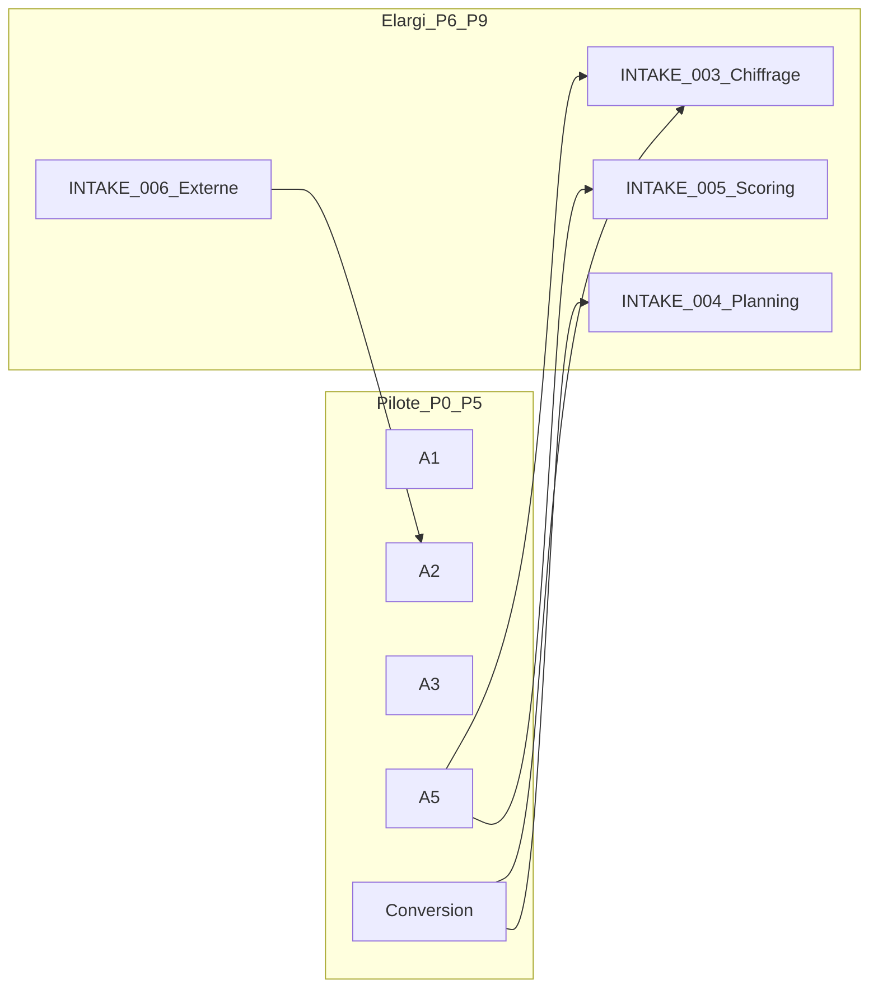

# RFC-PROJ-INTAKE-002 — CDC Demandes de projet (circuit configurable et fidélité visuelle)

| | |
| --- | --- |
| **Statut** | 🟢 Implémenté (pilote P0–P5) — recette manuelle PNG encore opérateur ; P6–P9 hors lot |
| **Date** | 2026-09-14 |
| **Parent** | [RFC-PROJ-INTAKE-001](./RFC-PROJ-INTAKE-001%20%E2%80%94%20Demandes%20projet%20et%20workflow%20de%20validation%20configurable.md) (MVP livré) |
| **Source produit** | [*Demandes de projet — Cahier des charges · Écrans*](./_sources/Design%20system%20et%20CDC/Demandes%20de%20projet%20-%20Cahier%20des%20charges.html) (13 p. A4 paysage, sept. 2026) |
| **Import Design** | Projet Claude Design `019e02e2-4e88-7dc4-aa25-b0b6a6a0ab23` via MCP `claude-design` (`get_project` / `list_files` / `read_file` / `render_preview`) |
| **Handoff** | [`design_handoff_demandes_projet/`](./_sources/Design%20system%20et%20CDC/design_handoff_demandes_projet/) — README + `reference-code/` + captures |
| **Captures** | [`screenshots/dp/`](./_sources/Design%20system%20et%20CDC/screenshots/dp/) — `list` · `form` · `fiche` · `config` · `instruction` · `odj` · `decision` |
| **Règle UX** | Fidélité CDC via styles `features/project-requests/styles/demandes.css` (classes `.dem-*`) + `StariumModal` ; toasts CDC. Recette visuelle PNG encore à valider opérateur (§4.5). |

---

## 1. Analyse de l’existant

### 1.1 Ce que INTAKE-001 a livré (MVP)

| Couche | État |
| --- | --- |
| Backend | `ProjectRequest`, `ProjectRequestWorkflowSettings`, routes `/api/project-requests`, settings client, conversion → `Project` (`DRAFT`), pool cycle optionnel, notifications RFC-038 |
| UI | Liste `/projects/requests`, création dialog, fiche `/projects/requests/[id]`, admin `/client/administration/project-request-workflow` |
| Gouvernance | Validateur **unique** désigné ; cible post-approbation **manuelle / fixe** (`defaultApprovedTarget`) — pas de seuils budgétaires |

### 1.2 Écarts structurants vs CDC (sept. 2026)

| Sujet | MVP INTAKE-001 | CDC INTAKE-002 |
| --- | --- | --- |
| Circuit | Soumission → 1 validateur → routage | Soumission → **N+1** (activable) → **Instruction PMO** (activable) → **Arbitrage COPIL/CODIR ou validation PMO** → création projet |
| Routage | Choix admin / validateur (`PILOTING_CYCLE` / `DRAFT_PROJECT` / backlog / manuel) | **Calculé** : `needsCycle = !exempt.includes(type) && budget >= seuilCopil` ; instance COPIL vs CODIR via `seuilCodir` |
| Statuts | `DRAFT` · `SUBMITTED` · `NEEDS_MORE_INFO` · `APPROVED` · `REJECTED` · `CANCELLED` · `CONVERTED_TO_PROJECT` | `brouillon` · `soumise` · `instruction` · `cycle` · `validee` · `projet` · `ajournee` · `refusee` |
| Config | Listes d’IDs validateurs / routeurs + mode sélection | Seuils €, délai instruction (j ouvrés), toggles N+1 / instruction / auto-projet, types exemptés |
| Formulaire | Modale courte | Page/formulaire CDC **A2** + aperçu circuit live |
| Liste | Tableau simple | KPI ×4, segments, colonne Circuit, encarts de règles (**A1**) |
| Fiche | Détail + décision | Stepper calculé, panneau décision, journal append-only, max 2 CTA (**A3**) |
| Modales | Settings page admin | Config circuit (**A4**), instruction (**A5**), ODJ (**A6**), décision comité (**A7**) — `StariumModal` |
| Journal | Partiel (decisionComment / audit) | Journal métier append-only affiché sur fiche (triplets libellé / auteur / date) |
| Types demande | Absents (texte libre) | 5 types : transformation · infra · reglementaire · produit · evolution |
| Liaisons | Cycle + projet | + séances Réunions, plan d’action cadrage, enveloppe Budget, badges annuaire |

**Principe CDC** : le circuit **n’est jamais stocké** ; il est recalculé depuis type + budget (retenu si instruction) + config. Changer un seuil ne réécrit pas l’historique ; seul le **circuit restant** change.

---

## 2. Hypothèses figées (non négociables pour P0–P5)

| # | Décision |
| --- | --- |
| H1 | On **évolue** le module `project_requests` (pas de second module). |
| H2 | `defaultApprovedTarget` MVP : **déprécié** après P1. Routage = calcul seuils + exempt. Champ conservé en DB lecture seule jusqu’à migration cleanup (P5+). |
| H3 | **N+1** = utilisateur avec `project_requests.validate` **et** appartenance à la direction demandeuse (annuaire / `Collaborator` direction). Si aucun N+1 résolu à la soumission → erreur métier `PROJECT_REQUEST_N1_REQUIRED` (sauf `requireN1Validation=false`). Fallback : intersection avec `authorizedValidatorUserIds` si non vide. |
| H4 | **Instruction / ODJ / décision / conversion** : permission **`project_requests.instruct`** (nouvelle). Config circuit : **`project_requests.settings.manage`** (pas de permission `configure` séparée) **ou** `CLIENT_ADMIN`. `project_requests.route` MVP → alias accepté avec `instruct`. |
| H5 | **Ajournement** = `POSTPONED` ; réouverture → `DRAFT` + journal append « Demande rouverte pour complément de dossier ». |
| H6 | **`referenceCode`** `DP-AAAA-NNN` unique par `clientId` ; `cuid` jamais en UI. |
| H7 | **Fidélité visuelle** zéro écart vs PNG ; `StariumModal` uniquement ; toasts = libellés CDC exacts. |
| H8 | **Doublon de besoin** : hors P0–P5 (flag CDC « À développer ») — backlog produit, pas bloquant. |
| H9 | Conversion projet : statut portefeuille **Cadrage**, progression 0 %, sous-ligne « Issu de la demande DP-… », plan d’action + action cadrage, enveloppe = `retainedBudget ?? estimatedBudget`. |
| H10 | Legacy `NEEDS_MORE_INFO` / `CANCELLED` : **masqués** des filtres CDC ; API les refuse en écriture nouvelle ; lecture seule pour historique MVP. |
| H11 | Chiffrage détaillé / planning / scoring / portail externe : **périmètre élargi P6–P9** (§12) — hors screenshots A1–A7, **dans** le programme Demandes. |

---

## 3. Liste des fichiers à créer / modifier

### Sources (déjà importées via MCP — 2026-09-14)

| Fichier | Rôle |
| --- | --- |
| `docs/RFC/_sources/Design system et CDC/Demandes de projet - Cahier des charges.html` | Spec écrans |
| `docs/RFC/_sources/Design system et CDC/doc-page.js` | Runtime CDC |
| `docs/RFC/_sources/Design system et CDC/screenshots/dp/*.png` | Captures A1–A7 |
| `docs/RFC/_sources/Design system et CDC/design_handoff_demandes_projet/**` | Handoff + reference-code |

### Doc / index

| Fichier | Action |
| --- | --- |
| `docs/RFC/RFC-PROJ-INTAKE-002 — ….md` | **Créé** (ce document) |
| `docs/RFC/RFC-PROJ-INTAKE-003…006` | Stubs P6–P9 (chiffrage, planning, scoring, portail externe) |
| `docs/RFC/_RFC Liste.md` | Indexer 31a-6 → 31a-10 |
| `docs/RFC/RFC-PROJ-INTAKE-001 — ….md` | Pointer vers INTAKE-002 comme source UX active |
| `docs/LIAISONS-MODULES.md` | Ponts `fut-intake-*` + `intake-project` → INTAKE-002 |
| `docs/liaisons/graphe-fonctionnel-modules.canvas.tsx` | Nœud portail ext. + liens futurs Demandes |

### Backend (implémentation ultérieure)

| Fichier | Action |
| --- | --- |
| `apps/api/prisma/schema.prisma` | Enums statut/type/avis ; champs demande ; settings seuils |
| `apps/api/src/modules/project-requests/**` | Machine à états, routage calculé, journal, endpoints A5–A7 |
| `apps/api/src/modules/clients/client-project-request-workflow-settings.*` | Config seuils / toggles / exempt |
| `apps/api/prisma/seed.ts` | `project_requests.instruct`, `project_requests.configure` (+ alias `route` déprécié) |

### Frontend (implémentation ultérieure)

| Fichier | Action |
| --- | --- |
| `apps/web/src/features/project-requests/components/*` | Refonte A1–A3 + modales A4–A7 |
| Routes `/projects/requests` | Aligner libellés / navigation « Pilotage › Demandes de projet » |

---

## 4. Spécification fonctionnelle (contrats CDC)

### 4.1 Circuit calculé

```text
needsCycle(d) = !exempt.includes(d.type) && budget(d) >= seuilCopil
instance(d)   = !needsCycle ? null : (budget(d) >= seuilCodir ? CODIR : COPIL)

étapes = [Soumission]
       + (n1    ? [Validation N+1] : [])
       + (instr ? [Instruction PMO] : [])
       + [ needsCycle ? Arbitrage <instance> : Validation PMO (hors cycle) ]
       + [Création du projet]   // manuelle ou autoProj
```

- `budget(d)` = budget retenu (instruction) si présent, sinon estimation demandeur.
- Soumission et création projet **jamais** désactivables (circuit minimal : soumission → validation PMO → création).
- Avis instruction **défavorable** → refus + `failedAtStep = INSTRUCTION`.

### 4.2 Machine à états (cible)

| Statut UI | Enum proposé | Acteur | Transitions |
| --- | --- | --- | --- |
| Brouillon | `DRAFT` | Demandeur | Soumettre → `SUBMITTED` (si n1) sinon `IN_REVIEW` sinon `IN_CYCLE` |
| Soumise | `SUBMITTED` | N+1 | Valider → suite · Refuser → `REJECTED` |
| En instruction | `IN_REVIEW` | PMO | A5 → `IN_CYCLE` / `APPROVED` / `REJECTED` |
| En cycle | `IN_CYCLE` | PMO puis comité | A6 inscription · A7 → `APPROVED` / `POSTPONED` / `REJECTED` |
| Validée | `APPROVED` | PMO | Créer projet → `CONVERTED_TO_PROJECT` (ou auto) |
| Projet créé | `CONVERTED_TO_PROJECT` | — | Terminal lecture seule |
| Ajournée | `POSTPONED` | PMO | Rouvrir → `DRAFT` |
| Refusée | `REJECTED` | PMO | Rouvrir → `DRAFT` |

Mapping MVP : `NEEDS_MORE_INFO` / `CANCELLED` → hors parcours CDC V1 (garder en API pour rétrocompat ; masquer en UI CDC ou mapper vers réouverture / refus).

### 4.3 Écrans

#### A1 — Liste (`screenshots/dp/list.png`)

- Zones : actions (Config + Nouvelle demande) · 4 KPI · recherche · rappel seuil · segments Toutes / En circuit / Terminées · tableau (Réf · Demande · Type · Demandeur · Budget · Circuit · Statut) · 3 encarts règles.
- KPI : à instruire · en cycle · validées à convertir · enveloppe en circuit (somme budgets des statuts non terminaux hors brouillon).
- Empty filtre : « Aucune demande ne correspond à ce filtre. »
- DoD : capture list.png + tokens ; badges type / circuit / statut / collaborateur (photo ou initiales).

#### A2 — Formulaire (`form.png`)

- Grille principale + panneau sticky « Circuit qui sera appliqué » recalculé live (type + budget).
- Sections : Nature (5 cartes type) · Identification · Besoin & objectifs · Cadrage · Priorité · pied Brouillon / Soumettre.
- Blocages soumission : intitulé, direction ; messages CDC exacts.
- DoD : bascule 49 k€ → 51 k€ ajoute « Arbitrage COPIL » ; type Réglementaire à 400 k€ = hors cycle.

#### A3 — Fiche (`fiche.png`)

- Hero + max 2 CTA contextuels · stepper calculé · dossier · cadrage · panneau décision · journal.
- Actions par statut : voir CDC / handoff README.
- DoD : échec rouge sur stepper si `failedAtStep` ; auteur comité sans badge personne.

#### A4 — Config circuit (modale, `config.png`)

- Seuils COPIL / CODIR · délai instruction · toggles n1 / instr / autoProj · types exemptés.
- Rien d’appliqué avant Enregistrer. Toast : « Configuration enregistrée · passage en cycle à partir de X k€ ».
- Droits : `project_requests.configure` **ou** `CLIENT_ADMIN`.

#### A5 — Instruction (`instruction.png`)

- Avis Favorable / Réservé / Défavorable · budget & charge retenus · synthèse · bandeau routage live.
- Messages : « Instruction conclue · arbitrage en CODIR requis » / « …validée hors cycle » / « …demande refusée ».

#### A6 — ODJ (`odj.png`)

- Select séances (Cycles + Réunions, instance requise en tête) · type de point · durée (défaut 15).
- Sans séance : option unique « Aucune séance planifiée », inscription impossible ; statut reste `IN_CYCLE` (« À inscrire · COPIL|CODIR »).

#### A7 — Décision (`decision.png`)

- Validée / Ajournée / Refusée · motivation (attendue si ajournement/refus).
- Écrit journal demande **et** registre décisions séance.

### 4.4 Messages exacts (toasts)

Reprendre tels quels le CDC § « Comportements et messages » (soumission, N+1, instruction, ODJ, arbitrage, ajournement, refus, création projet, validations bloquantes intitulé / direction).

### 4.5 Recette (32 critères CDC)

Annexes CDC dernière page — cases cochables (opérateur) ; gates auto déjà vertes en P5.

#### Circuit & configuration (1–10)

- [ ] 1. Seuil COPIL 50 k€ : budget 49 k€ → hors cycle
- [ ] 2. Budget 51 k€ → instance COPIL
- [ ] 3. Budget 251 k€ → instance CODIR
- [ ] 4. Type réglementaire exempt → hors cycle quel que soit le montant
- [ ] 5. Toggle N+1 off → soumission saute la validation direction
- [ ] 6. Toggle instruction PMO off → circuit raccourci
- [ ] 7. Aperçu circuit live (A2) suit type + budget
- [ ] 8. Config A4 : `codir > copil` refusé côté API
- [ ] 9. Auto-création projet à l’approbation (si toggle) crée le projet
- [ ] 10. Encarts règles liste (seuils / étapes / exemptions) cohérents settings

#### Parcours (11–22)

- [ ] 11. Brouillon absent du segment « Terminées »
- [ ] 12. Soumission exige intitulé + direction (messages CDC)
- [ ] 13. Journal append-only visible sur fiche
- [ ] 14. N+1 approve / reject + `failedAtStep=N1`
- [ ] 15. Instruction avis favorable → `IN_CYCLE` ou `APPROVED`
- [ ] 16. Instruction avis défavorable → `REJECTED`
- [ ] 17. Budget / charge retenus saisis en A5
- [ ] 18. ODJ A6 pose `meetingLabel` (empty « Aucune séance » si pas de liste)
- [ ] 19. Décision séance APPROVED / POSTPONED / REJECTED
- [ ] 20. Réouverture POSTPONED/REJECTED → DRAFT + journal
- [ ] 21. Toasts §4.4 exacts sur chaque transition
- [ ] 22. Permissions : instruct / validate / settings.manage respectées

#### Création projet & affichage (23–32)

- [ ] 23. CTA convertir uniquement si `APPROVED`
- [ ] 24. Projet créé avec sous-ligne « Issu de la demande DP-… »
- [ ] 25. Reprise intitulé / type / budget retenu / échéance / sponsor
- [ ] 26. Enveloppe budget sans lignes (P6 hors scope)
- [ ] 27. Fiche lecture seule après conversion
- [ ] 28. Badges type / circuit / statut (libellés métier, pas d’ID)
- [ ] 29. KPI A1 : à instruire / en cycle / validées / enveloppe
- [ ] 30. Segments Toutes / En circuit / Terminées
- [ ] 31. `pnpm audit:ui-ids` = 0
- [ ] 32. `pnpm audit:modals` = 0 (A4–A7 via `StariumModal`)

Jeu démo seed : 8 demandes `DP-2026-006…018` (`seed-project-requests-demo.ts`).

### 4.6 Matrice CDC ↔ API ↔ UI (DoD livrable)

| CDC | Capture | API | Fichier UI cible | Permission |
| --- | --- | --- | --- | --- |
| A1 Liste | `screenshots/dp/list.png` | `GET /api/project-requests` + `GET …/summary` (KPI) | `features/project-requests/components/project-requests-list-page.tsx` | `project_requests.read` |
| A2 Formulaire | `form.png` | `POST/PATCH /api/project-requests` · `POST …/submit` · `GET …/computed-circuit?type&budget` (ou champ dérivé) | Remplacer `create-project-request-dialog.tsx` par page/form CDC (route `/projects/requests/new` ou plein écran) | `create` / `update` |
| A3 Fiche | `fiche.png` | `GET …/:id` (dossier + `computedCircuit` + journal) | `project-request-detail-page.tsx` | `read` + actions selon statut |
| A4 Config | `config.png` | `GET\|PATCH /api/clients/active/project-request-workflow-settings` | Modale depuis liste (plus seule page admin) + garder admin sync | `configure` ou CLIENT_ADMIN |
| A5 Instruction | `instruction.png` | `POST …/:id/instruct` | Modale `StariumModal` sur fiche | `instruct` |
| A6 ODJ | `odj.png` | `POST …/:id/agenda` + lecture séances cycles/réunions | Modale `StariumModal` | `instruct` |
| A7 Décision | `decision.png` | `POST …/:id/committee-decide` | Modale `StariumModal` | `instruct` |
| N+1 | — | `POST …/:id/n1-decide` | CTA fiche statut Soumise | `validate` + scope direction |
| Conversion | — | `POST …/:id/convert` | CTA fiche Validée | `instruct` |
| Réouverture | — | `POST …/:id/reopen` | CTA Ajournée/Refusée | `instruct` |

**Gate livrable écran** : PNG CDC côte à côte + checklist zones numérotées + `pnpm audit:modals` + `pnpm audit:ui-ids` + messages toast exacts §4.4.

---

## 5. Modifications Prisma (cible)

### Enums (évolution)

```prisma
enum ProjectRequestStatus {
  DRAFT
  SUBMITTED
  IN_REVIEW          // instruction PMO (CDC)
  IN_CYCLE           // en cycle / à inscrire
  APPROVED           // validée, prête à convertir
  POSTPONED          // ajournée
  REJECTED
  CANCELLED          // legacy MVP
  NEEDS_MORE_INFO    // legacy MVP
  CONVERTED_TO_PROJECT
}

enum ProjectRequestType {
  TRANSFORMATION
  INFRASTRUCTURE
  REGULATORY
  PRODUCT
  EVOLUTION
}

enum ProjectRequestInstructionOpinion {
  FAVORABLE
  RESERVED
  UNFAVORABLE
}

enum ProjectRequestCircuitStep {
  SUBMISSION
  N1
  INSTRUCTION
  ARBITRATION
  PROJECT_CREATION
}
```

### `ProjectRequest` — champs additionnels

- `referenceCode` (unique par client, `DP-AAAA-NNN`)
- `type` (`ProjectRequestType`)
- `requestingDirection` (libellé métier ; FK org si dispo)
- `sponsorLabel` / `sponsorUserId?`
- `objectives` (`String[]` ou JSON)
- `estimatedEffortDays` (`Decimal?`)
- `desiredDeadline` (`DateTime?`)
- `priorityRequested` (HIGH/MEDIUM/LOW — distinct de `urgency` CRITICAL legacy)
- `retainedBudget` / `retainedEffortDays`
- `instructionOpinion` / `instructionSummary`
- `failedAtStep` (`ProjectRequestCircuitStep?`)
- `arbitrationInstance` (`COPIL`|`CODIR`|null) — **cache d’affichage**, recalculable
- `meetingRef` / `agendaItemId?` / `meetingLabel?`
- Journal : table `ProjectRequestJournalEntry { id, clientId, projectRequestId, label, authorLabel, authorUserId?, at }` append-only

### `ProjectRequestWorkflowSettings` — champs additionnels

- `copilThresholdAmount` (défaut 50000)
- `codirThresholdAmount` (défaut 250000)
- `instructionSlaBusinessDays` (défaut 10)
- `requireN1Validation` (défaut true)
- `requirePmoInstruction` (défaut true)
- `autoCreateProjectOnApproval` (défaut false)
- `exemptRequestTypes` (`ProjectRequestType[]`, défaut `[REGULATORY]`)
- `configUpdatedAt` / `configUpdatedByUserId` (traçabilité)

Index : `[clientId, status]`, `[clientId, referenceCode]` unique, `[clientId, type]`.

---

## 6. API (évolutions)

| Méthode | Route | Rôle |
| --- | --- | --- |
| GET/PATCH | `/api/clients/active/project-request-workflow-settings` | Étendre payload CDC A4 |
| GET | `/api/project-requests` | Filtres segments + KPI agrégés (ou endpoint `/summary`) |
| POST | `/api/project-requests` | Types / objectifs / direction / charge / échéance |
| POST | `…/:id/submit` | Soumission (existant ou explicite) |
| POST | `…/:id/n1-decide` | Valider / refuser N+1 |
| POST | `…/:id/instruct` | A5 |
| POST | `…/:id/agenda` | A6 |
| POST | `…/:id/committee-decide` | A7 |
| POST | `…/:id/convert` | Création projet (si !auto) |
| POST | `…/:id/reopen` | Ajournée / refusée → brouillon |

Toute écriture : `clientId` depuis scope · DTO class-validator · audit sensible · permissions module `project_requests`.

---

## 7. Tests

- Unitaires routage : matrices seuils × type exempt × toggles n1/instr/autoProj.
- Isolation multi-client sur CRUD + instruct + agenda.
- Transitions illégales refusées (ex. convert hors `APPROVED`).
- Journal append-only (pas d’update/delete métier).
- UI : messages exacts + `pnpm audit:ui-ids` + `pnpm audit:modals` sur A4–A7.
- Recette manuelle : PNG CDC vs screenshot écran (comme PROJ-013-10).

---

## 8. Plan d’implémentation (borné)

> Chaque phase pilote = code + tests + **revue visuelle vs PNG** + critères recette §4.5.  
> Gate : `pnpm audit:modals` · `pnpm audit:ui-ids` · typecheck workspace touché.

| Phase | Contenu | DoD | État |
| --- | --- | --- | --- |
| **P0** | Prisma + migration + settings A4 API + permission `instruct` | Seuils / toggles / exempt persistés ; seed permissions | ✅ |
| **P1** | Machine à états + journal + endpoints submit / n1 / instruct / agenda / committee / convert / reopen | Transitions CDC + tests | ✅ |
| **P2** | UI A1 + A2 + aperçu circuit live | Liste / form + KPI | ✅ |
| **P3** | UI A3 + stepper + modales A4–A7 | Fiche + `StariumModal` | ✅ |
| **P4** | Liaisons projet / enveloppe | « Issu de DP-… » + `retainedBudget` (plan PLA / ODJ Cycles : partiel) | ✅ partiel |
| **P5** | Seed démo 8 demandes + gates auto | `seed-project-requests-demo.ts` + jest / audits | ✅ |
| **P6** | Chiffrage détaillé | [INTAKE-003](./RFC-PROJ-INTAKE-003%20—%20Chiffrage%20détaillé%20depuis%20demande.md) | Hors lot |
| **P7** | Planning skeleton | [INTAKE-004](./RFC-PROJ-INTAKE-004%20—%20Planning%20skeleton%20depuis%20demande.md) | Hors lot |
| **P8** | Scoring multicritère | [INTAKE-005](./RFC-PROJ-INTAKE-005%20—%20Scoring%20multicritère%20demandes.md) | Hors lot |
| **P9** | Portail externe | [INTAKE-006](./RFC-PROJ-INTAKE-006%20—%20Portail%20externe%20demandes.md) | Hors lot |

### Avancement code (synchro doc 2026-09-14)

- [x] Migration `apps/api/prisma/migrations/20260914140000_rfc_proj_intake_002_circuit`
- [x] `project-request-circuit.ts` + `ProjectRequestCdcWorkflowService` + routes controller
- [x] UI `apps/web/src/features/project-requests/` + styles `styles/demandes.css`
- [x] Seed démo `seed-project-requests-demo.ts` (branché `runDemoSeed`)
- [x] Tests jest module `project-requests` ; `audit:ui-ids` / `audit:modals` verts
- [ ] Recette manuelle 32 critères §4.5 (opérateur vs PNG)
- [ ] `prisma migrate deploy` sur chaque environnement

### Écarts connus vs CDC (à traiter en polish / P4+)

| Sujet | Réalité code |
| --- | --- |
| Config | `project_requests.settings.manage` (pas `configure`) |
| ODJ A6 | Libellé séance texte (`meetingLabel`) ; pas encore select Cycles/Réunions live |
| Plan cadrage PLA | Non bloquant à la conversion ; TODO journalisé si module absent |
| N+1 direction | Permission `validate` ; scope direction strict H3 peut être assoupli selon données annuaire |

---

## 9. Récapitulatif (état)

- **Pilote P0–P5 livré** dans le module `project_requests` (pas de second module).
- Circuit **recalculé** (`computedCircuit`) ; journal append-only ; `referenceCode` `DP-AAAA-NNN`.
- UI A1–A7 sous `apps/web/src/features/project-requests/` + CSS CDC `styles/demandes.css`.
- RFCs filles 003–006 restent stubs (P6–P9).
- Reste opérateur : checklist §4.5 + `migrate deploy` envs.

---

## 10. Points de vigilance

- Ne pas casser les demandes MVP en vol : migration statut + défauts settings.
- Ne pas stocker le circuit — DTO `computedCircuit` recalculé serveur.
- IDs techniques jamais affichés ; `referenceCode` + `displayLabel`.
- Modales uniquement via `StariumModal`.
- Pas de graphique factice (KPI numériques seulement).
- ODJ : empty state CDC si aucune séance.
- P6–P9 **n’altèrent pas** la fidélité A1–A7 sans flag config explicite.

---

## 11. Conformité by design

### RGPD

- DCP : demandeur, N+1, PMO, sponsor (noms, userId, photo annuaire). Finalité : instruction / arbitrage / audit.
- Minimisation : champs CDC + extensions §12 uniquement.
- Journal / logs : pas d’email / token en clair.
- Effacement : anonymisation auteurs journal ; projet lié garde `DP-…` non nominatif.
- Scope : `clientId` partout. Portail externe (P9) : rétention comptes invités documentée dans INTAKE-006.

### RGAA

- Liste focusable (Entrée → fiche) ; labels ; `aria-invalid` ; toasts `aria-live` ; stepper non couleur seule ; focus trap modales.

### Design System

- Tokens / `.starium-*` / `KpiCard` / `StariumTableWrap` / loading·empty·error ; zéro UUID UI ; captures = vérité.

### Sécurité

- RBAC client-aware ; `configure` / `instruct` / `validate` séparés ; audit sur config, instruction, ODJ, décision, conversion, réouverture ; DTO validés.

### Interface mobile

- KPI adaptatifs ; tableau → cartes ; panneau circuit sous formulaire &lt; 1180px ; stepper scroll ; cibles ≥ 44px.

---

## 12. Périmètre élargi (intégré au programme Demandes)

Le CDC les excluait du **parcours A1–A7**. Ils sont **dans le programme** via RFCs filles P6–P9. Aucun de ces sujets ne casse le circuit calculé ni la règle « pas de tâche / pas de ligne de dépense au stade demandeur ».



### 12.1 Chiffrage détaillé — [RFC-PROJ-INTAKE-003](./RFC-PROJ-INTAKE-003%20—%20Chiffrage%20détaillé%20depuis%20demande.md)

- Demande : estimation macro + **ventilation optionnelle** CAPEX / OPEX / charge (`allowStructuredEstimate`).
- Conversion : enveloppe Budget projet **sans** lignes ; chiffrage fin = module Budget.
- Point d’UI : A3/A5 si flag ; sinon CDC inchangé.

### 12.2 Planning — [RFC-PROJ-INTAKE-004](./RFC-PROJ-INTAKE-004%20—%20Planning%20skeleton%20depuis%20demande.md)

- Interdit au demandeur (brouillon/soumission).
- À la conversion : plan cadrage (CDC) + option `seedPlanningSkeleton` (phase Cadrage + jalon « Chef de projet nommé »).
- Planning détaillé = module Projets ; lien lecture seule depuis la demande convertie.

### 12.3 Scoring multicritère — [RFC-PROJ-INTAKE-005](./RFC-PROJ-INTAKE-005%20—%20Scoring%20multicritère%20demandes.md)

- Priorité demandée reste déclarative.
- Axes client configurables ; saisie PMO en A5 ; affichage comité A3/A7.
- Score = **aide** à l’arbitrage, **jamais** auto-décision.
- Pattern scores aligné cycles (`GovernanceCycleItem`) ; tables dédiées demandes ; export optionnel vers item cycle à l’ODJ.

### 12.4 Portail externe — [RFC-PROJ-INTAKE-006](./RFC-PROJ-INTAKE-006%20—%20Portail%20externe%20demandes.md)

- Authentifié (invité / magic-link org) — **pas** d’anonyme public.
- `source=EXTERNAL` ; circuit identique ; pas de config circuit côté externe.
- Scope strict : ses demandes seulement ; PMO voit tout.

---

## Références

| Doc | Lien |
| --- | --- |
| MVP demandes | [RFC-PROJ-INTAKE-001](./RFC-PROJ-INTAKE-001%20%E2%80%94%20Demandes%20projet%20et%20workflow%20de%20validation%20configurable.md) |
| Chiffrage | [RFC-PROJ-INTAKE-003](./RFC-PROJ-INTAKE-003%20—%20Chiffrage%20détaillé%20depuis%20demande.md) |
| Planning | [RFC-PROJ-INTAKE-004](./RFC-PROJ-INTAKE-004%20—%20Planning%20skeleton%20depuis%20demande.md) |
| Scoring | [RFC-PROJ-INTAKE-005](./RFC-PROJ-INTAKE-005%20—%20Scoring%20multicritère%20demandes.md) |
| Portail externe | [RFC-PROJ-INTAKE-006](./RFC-PROJ-INTAKE-006%20—%20Portail%20externe%20demandes.md) |
| Cycles / ODJ | [RFC-PROJ-CYCLE-003](./RFC-PROJ-CYCLE-003%20%E2%80%94%20Governance%20Cycle%20Instances%20and%20Configurable%20Propagation.md), [013-10](./RFC-PROJ-013-10%20—%20CDC%20parcours%208%20écrans%20Points%20projet%20(fidélité%20visuelle).md) |
| Liaisons | [LIAISONS-MODULES.md](../LIAISONS-MODULES.md) |
| UI | [FRONTEND_UI-UX.md](../FRONTEND_UI-UX.md), [design-system/MODALES.md](../design-system/MODALES.md) |
| Design live | [CDC Demandes](https://claude.ai/design/p/019e02e2-4e88-7dc4-aa25-b0b6a6a0ab23?file=Demandes+de+projet+-+Cahier+des+charges.html) |
