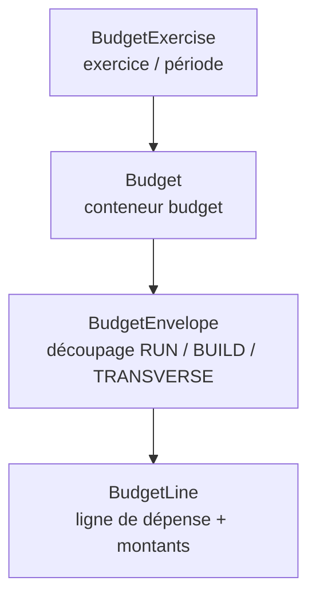
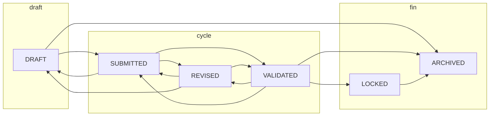
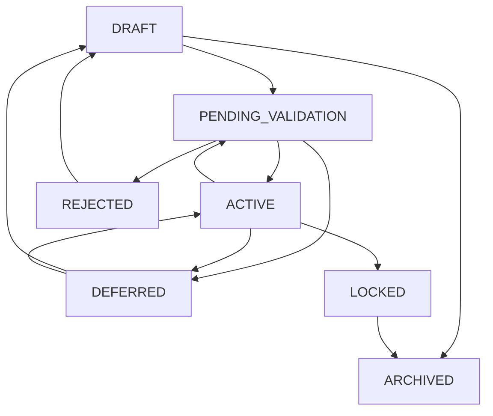

# Workflow budgétaire complet (Starium Orchestra)

Document de synthèse : **hiérarchie des entités**, **cycles de statuts** (alignés sur les politiques API `budget-*-status-transitions.ts`), **flux financiers** et **garde-fous**.  
Les transitions non listées sont **refusées** par l’API (`400`, code `invalid_status_transition`).

---

## 1. Hiérarchie métier

| Niveau | Rôle |
|--------|------|
| **BudgetExercise** | Cadre temporel (dates, code). Statut propre : `DRAFT` → `ACTIVE` → `CLOSED` → `ARCHIVED`. |
| **Budget** | Budget métier rattaché à un exercice (devise, fiscalité, versioning éventuel). **BudgetStatus** ci-dessous. |
| **BudgetEnvelope** | Sous-ensemble du budget (hiérarchie possible). **BudgetEnvelopeStatus** ci-dessous. |
| **BudgetLine** | Ligne avec montants (initial, révisé, prévision, engagé, consommé, reste) + axes analytiques. **BudgetLineStatus** ci-dessous. |

**Report hors exercice** : statut `DEFERRED` sur ligne ou enveloppe avec `deferredToExerciseId` (exercice cible obligatoire).

---

## 2. Cycle de vie du budget (`BudgetStatus`)

Chemin nominal documenté : **DRAFT → SUBMITTED → REVISED → VALIDATED → LOCKED → ARCHIVED**  
(l’ancien `ACTIVE` côté données a été migré vers **VALIDATED**.)

**Nomenclature métier (alignement vocabulaire / statut UI)** :

| Terme métier | Statut `BudgetStatus` | Libellé UI |
|--------------|------------------------|------------|
| **Budget initial** (première version soumise à l’arbitrage) | `SUBMITTED` | Soumis |
| **Budget révisé** (itérations après retours) | `REVISED` | Révisé |
| **Baseline** (référence de pilotage retenue) | `VALIDATED` | Validé |

Le **brouillon** (`DRAFT`) reste la phase de construction avant toute soumission.

### 2.1 Graphe des transitions autorisées

### 2.2 Liste des arêtes (de → vers)

| De | Vers autorisés |
|----|----------------|
| **DRAFT** | SUBMITTED, ARCHIVED |
| **SUBMITTED** | REVISED, VALIDATED, DRAFT |
| **REVISED** | VALIDATED, SUBMITTED, DRAFT |
| **VALIDATED** | LOCKED, REVISED, SUBMITTED, ARCHIVED |
| **LOCKED** | ARCHIVED |

Même statut = **no-op** accepté.

**Garde-fous API** : `PATCH` budget refusé si statut courant **LOCKED** ou **ARCHIVED** (hors périmètre de mise à jour défini dans le service).

---

## 3. Workflow enveloppe (`BudgetEnvelopeStatus`)

### 3.1 Graphe

### 3.2 Arêtes

| De | Vers |
|----|------|
| **DRAFT** | PENDING_VALIDATION, ARCHIVED |
| **PENDING_VALIDATION** | ACTIVE, REJECTED, DEFERRED |
| **REJECTED** | DRAFT |
| **DEFERRED** | DRAFT, ACTIVE |
| **ACTIVE** | PENDING_VALIDATION, LOCKED, DEFERRED |
| **LOCKED** | ARCHIVED |

**Contrainte** : mise à jour enveloppe refusée si le **budget parent** est LOCKED / ARCHIVED (ou version non éditable selon règles versioning).

---

## 4. Workflow ligne (`BudgetLineStatus`)

### 4.1 Graphe

### 4.2 Arêtes

| De | Vers |
|----|------|
| **DRAFT** | PENDING_VALIDATION, ARCHIVED |
| **PENDING_VALIDATION** | ACTIVE, REJECTED, DEFERRED |
| **REJECTED** | DRAFT |
| **DEFERRED** | DRAFT, ACTIVE |
| **ACTIVE** | PENDING_VALIDATION, CLOSED, DEFERRED |
| **CLOSED** | ARCHIVED |

---

## 5. Pilotage et agrégats (règle produit actuelle)

**Lignes incluses dans les totaux de pilotage** (`PILOTAGE_INCLUDED_LINE_STATUSES`, fichier `budget-aggregate-statuses.ts`) : uniquement  
**`ACTIVE`**, **`PENDING_VALIDATION`**, **`CLOSED`**.

**Exclues explicitement** des agrégats pilotage : **`DRAFT`**, **`REJECTED`**, **`DEFERRED`**, **`ARCHIVED`**.

**Usages** : reporting KPI, dashboard cockpit, **réallocation** (source et cible doivent être « pilotage »), filtres snapshots lignes, etc.

---

## 6. Flux financiers (hors statut)

| Flux | Rôle |
|------|------|
| **FinancialAllocation** | Rattache une source métier à une ligne avec un montant alloué. |
| **FinancialEvent** | Écrit les mouvements (consommation, réallocation, etc.) ; alimente engagé / consommé / reste. |
| **BudgetReallocation** | Transfert de montant entre deux lignes d’un même budget (règles selon statut budget / lignes). |

Ces flux **ne remplacent pas** les workflows de statut : ils s’appliquent sur des lignes **dans des états autorisés** par les services (ex. budgets non gelés selon cas).

**Réallocation** (`budget-reallocation.service.ts`) — conditions cumulatives :

- Source et cible **distinctes**.
- Les deux lignes existent et **clientId** correspond au client actif.
- **Même `budgetId`**, **même devise**.
- Statut des deux lignes ∈ **pilotage** (`ACTIVE` \| `PENDING_VALIDATION` \| `CLOSED`).
- Budget parent **ni** `LOCKED` **ni** `ARCHIVED`.
- Montant **≤** `remainingAmount` de la ligne source.

---

## 7. Ordre d’exécution typique (recommandation métier)

1. Créer / activer un **exercice**.  
2. Créer un **budget** en DRAFT, le faire progresser (soumission → révisions → validation).  
3. Structurer **enveloppes** et **lignes** ; faire valider au niveau ligne/enveloppe si besoin.  
4. Rattacher **allocations** et enregistrer **événements** ; utiliser **réallocation** si arbitrage interne.  
5. **Verrouiller** le budget quand la structure et les montants sont figés.  
6. **Archiver** en fin de vie ; **snapshots** / **versions** pour comparer dans le temps.

---

## 8. Ce qui n’est pas dans ce workflow

- **Processus humain imposé** (files d’attente DAF/DG, SLA, notifications de validation) : non codé comme orchestration ; les **statuts** et **transitions** permettent de refléter l’état, pas d’imposer un BPMN.  
- **Alignement UI** : formulaire budget en édition — select de statut filtré sur les transitions autorisées (`budget-status-transitions` côté web).

---

## 9. Règles métier détaillées (backend)

Multi-client : toutes les requêtes sont **scopées `clientId`** du client actif ; pas de `clientId` dans les body (dérivé du contexte).

### 9.1 Exercice budgétaire (`BudgetExercisesService`)

| Règle | Comportement |
|-------|----------------|
| Création | `endDate >= startDate` ; code **unique** par client (ou généré) |
| Mise à jour | **Interdite** si statut = **ARCHIVED** |
| Dates (update) | Cohérence `startDate` / `endDate` (croisements avec l’existant si un seul champ est modifié) |
| Code (update) | Unicité `(clientId, code)` |
| Bulk statut | Même logique que `update` par id (échecs isolés dans `failed`) |

### 9.2 Budget (`BudgetsService`)

| Règle | Comportement |
|-------|----------------|
| Création | `exerciseId` doit exister **et** appartenir au client |
| Propriétaire | Si `ownerUserId` : utilisateur **rattaché au client** via `clientUser` avec statut **ACTIVE** |
| Code | Unique `(clientId, code)` ou généré |
| Mise à jour | **Interdite** si budget **LOCKED** ou **ARCHIVED** |
| Versioning | **Interdite** si `versionStatus` ∈ **SUPERSEDED**, **ARCHIVED** |
| Statut | Transition soumise à `assertBudgetStatusTransition` |
| Validation (**→ `VALIDATED`**) | Par défaut : aucune enveloppe du budget ne doit être en **`DRAFT`** ; sinon `400` (toutes les enveloppes doivent avoir quitté le brouillon). **Configurable par client** via `GET|PATCH /api/clients/active/budget-workflow-settings` : si `resolved.requireEnvelopesNonDraftForBudgetValidated` est `false`, cette garde ne s’applique pas. |

### 9.3 Enveloppe (`BudgetEnvelopesService`)

| Règle | Comportement |
|-------|----------------|
| Création | Budget parent **ni** LOCKED **ni** ARCHIVED ; pas de création sur version **superseded/archived** |
| Hiérarchie | Si `parentId` : enveloppe parente **même budget** + même client |
| Code | Unique `(clientId, budgetId, code)` ou généré |
| Mise à jour | **Interdite** si enveloppe **ARCHIVED** |
| Enveloppe **LOCKED** | Seule transition autorisée : **`status`** → **ARCHIVED** (aucun autre champ) |
| Budget parent | Même règle que pour les lignes : pas de mise à jour si budget **LOCKED** / **ARCHIVED** / version non éditable |
| Statut | `assertBudgetEnvelopeStatusTransition` + résolution **`deferredToExerciseId`** (voir § 9.6) |

### 9.4 Ligne budgétaire (`BudgetLinesService`)

| Règle | Comportement |
|-------|----------------|
| Création | Budget **ni** LOCKED **ni** ARCHIVED ; pas sur version superseded/archived |
| Enveloppe | `envelopeId` = même **budget** que `budgetId` |
| Comptabilité | Si `Client.budgetAccountingEnabled` : **compte général obligatoire** à la création ; en update, **interdiction de retirer** le compte si la config l’exige |
| Périmètre analytique | **ENTERPRISE** : **0** splits ; **ANALYTICAL** : ≥ 1 split, somme des **% = 100** (tolérance 0,01), **pas de doublon** de centre de coûts |
| Références | Comptes GL / analytiques / centres de coûts validés **pour le client** |
| Code ligne | Unique `(clientId, budgetId, code)` ou généré |
| Ligne **ARCHIVED** | **Aucune** mise à jour |
| Ligne **CLOSED** | **Uniquement** passage à **ARCHIVED** (aucun autre champ) |
| Budget TTC | Création / révision : **taux TVA** requis (ligne → budget → client) pour convertir en **HT** stocké |
| `revisedAmount` (update) | **Reste** recalculé : `revised − engagé − consommé` (plancher 0) |
| Statut | `assertBudgetLineStatusTransition` + **`deferredToExerciseId`** (§ 9.6) |

### 9.5 Planification ligne (`BudgetLinePlanningService` — `ensureEditableLine`)

| Règle | Comportement |
|-------|----------------|
| Budget parent | **Ni** LOCKED **ni** ARCHIVED ; version **éditable** |
| Ligne | **Ni** ARCHIVED **ni** CLOSED |

### 9.6 Report (`DEFERRED`) — `deferred-exercise.helper.ts`

Ligne ou enveloppe :

| Règle | Comportement |
|-------|----------------|
| Cible | `deferredToExerciseId` **autorisé** seulement si statut (cible) = **DEFERRED** |
| Obligation | Si statut = **DEFERRED** : `deferredToExerciseId` **requis**, non vide |
| Exercice cible | Doit exister dans **`BudgetExercise`** pour le **même client** |

### 9.7 Événements financiers & recalculs

- Les montants **engagés / consommés / restants** sur les lignes sont **pilotés** par le **financial core** (événements, allocations, calculateur) après les règles ci-dessus ; pas de contournement des verrous budget dans les services budgétaires.

### 9.8 Import de données budget (`BudgetImportService`)

| Règle | Comportement |
|-------|----------------|
| Fichier | Obligatoire ; taille max configurée ; extensions **.csv** / **.xlsx** |
| Excel | Sélection d’onglet réservée au **.xlsx** ; onglet doit exister |
| Budget cible | **Pas d’import** si budget **LOCKED** ou **ARCHIVED** |
| Compte par défaut (RFC-021) | `defaultGeneralLedgerAccountId` valide pour le client, **ou** compte client code **999999** ; sinon erreur explicite |

---

## 10. Références code

| Élément | Fichier |
|---------|---------|
| Transitions budget | `apps/api/src/modules/budget-management/policies/budget-status-transitions.ts` |
| Transitions enveloppe | `apps/api/src/modules/budget-management/policies/budget-envelope-status-transitions.ts` |
| Transitions ligne | `apps/api/src/modules/budget-management/policies/budget-line-status-transitions.ts` |
| Agrégats pilotage | `apps/api/src/modules/budget-management/constants/budget-aggregate-statuses.ts` |
| Report DEFERRED | `apps/api/src/modules/budget-management/helpers/deferred-exercise.helper.ts` |
| Services | `budget-exercises.service.ts`, `budgets.service.ts`, `budget-envelopes.service.ts`, `budget-lines.service.ts`, `budget-line-planning.service.ts` |
| Config workflow budget (client, garde VALIDATED / enveloppes DRAFT) | `apps/api/src/modules/clients/budget-workflow-config.merge.ts`, `client-budget-workflow-settings.service.ts`, `client-budget-workflow-settings.controller.ts` ; consommé dans `budgets.service.ts` sur transition vers `VALIDATED` |
| Réallocation | `apps/api/src/modules/budget-reallocation/budget-reallocation.service.ts` |
| Import | `apps/api/src/modules/budget-import/budget-import.service.ts` |
| API | `docs/API.md` §4 (client actif — workflow budget) et §15 Structure budgétaire |
| Plan déploiement | `docs/RFC/_Plan de déploiment - Budget.md` |
